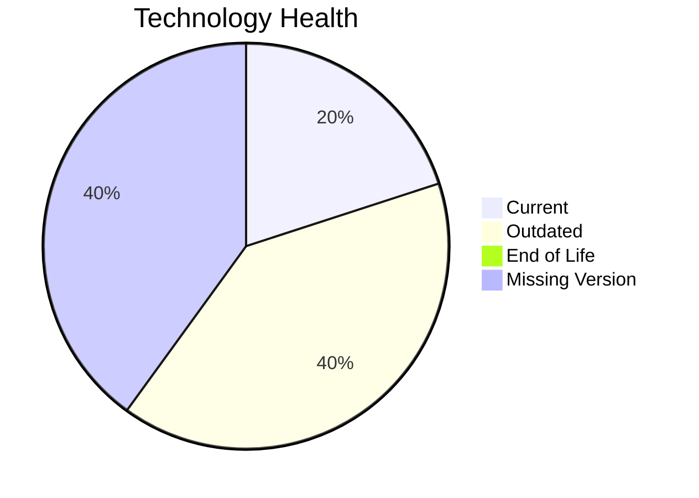

# Application Report: IoTSensorApp-012

**ID:** app012  
**Generated:** 2026-05-14

## Overview

| Attribute | Value |
|-----------|-------|
| Owner | unknown |
| Environment | AWS |
| Business Criticality | High |
| Users | 85 |
| Servers | sv15, sv16 |

## Technology Stack

| Component | Technology | Version | Status |
|-----------|-----------|---------|--------|
| os | Windows Server 2022 | 2022 | 🟡 OUTDATED |
| database | PostgreSQL 14 | 14 | 🟢 CURRENT_VERSION |
| language | Rust 1.70 | 1.70 | ⚪ NO_KNOWLEDGE |
| framework | Framework | unknown | ⚪ NO_KNOWLEDGE |
| app_server | Microsoft IIS 10.0 | 10.0 | 🟡 OUTDATED |

## Complexity Assessment

**Score:** 6/10 — **MEDIUM**  
**Confidence:** 8

**Reasoning:** Tech age 4/10 (0 EOL, 2 outdated components), integrations 8 interfaces and 0 dependencies, infrastructure 2 servers/2 environments, criticality High, architecture score 4/10, data score 7/10.

## Modernization Scenarios

### Applicable Scenarios

#### ✅ Operating System Update
- **Cost:** €1157 (one-time)
- **Savings:** €500/year
- **Reasoning:** Windows Server 2022 requires upgrade/security patching.
#### ✅ Switch to standard Linux Operating System
- **Cost:** €347 (one-time)
- **Savings:** €400/year
- **Reasoning:** Current OS (Windows Server 2022) is non-standard for Linux consolidation.
#### ✅ Switch to ARM-based CPU
- **Cost:** €5783 (one-time)
- **Savings:** €1000/year
- **Reasoning:** Cloud-hosted workload can be evaluated for ARM-based instances.
#### ✅ Applications Server replacement
- **Cost:** €11565 (one-time)
- **Savings:** €10800/year
- **Reasoning:** Application server Microsoft IIS 10.0 is outdated/EOL.
#### ✅ Application Refactoring and De-coupling
- **Cost:** €289133 (one-time)
- **Savings:** €135000/year
- **Reasoning:** Monolithic/tightly integrated footprint suggests refactoring benefits.

### Not Applicable / Other

| Scenario | Status | Reason |
|----------|--------|--------|
| Application Migration to Cloud Infrastructure (Lift & Shift) | FULFILLED | Application is already deployed in cloud. |
| Application Containerization | FULFILLED | Application is already containerized. |
| Upgrade Legacy Databases | FULFILLED | Database engine appears current. |
| Switch DB Engine to open-source database solution | FULFILLED | Application already uses open-source database engine. |
| Update outdated components | APPLICABLE | Outdated or EOL components identified in technology assessment. |

## Financial Summary

| Metric | Value |
|--------|-------|
| Total One-Time Cost | €307985 |
| Total Yearly Savings | €147700 |
| Break-Even | 2.1 years |
