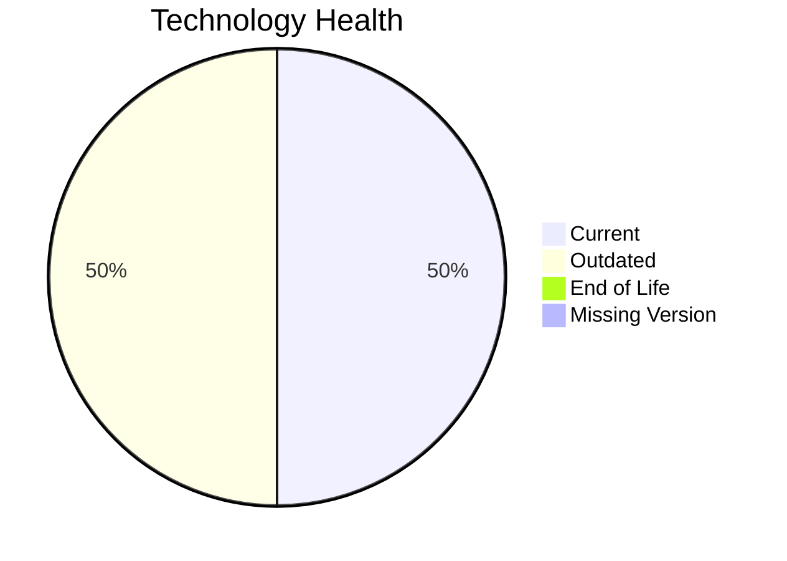

# Application Report: IoTSensorApp-012

**ID:** app012
**Generated:** 2026-05-07

## Overview

| Attribute | Value |
|-----------|-------|
| Owner | N/A |
| Environment | AWS |
| Business Criticality | High |
| Users | 85 |
| Servers | 2 |

## Technology Stack

| Component | Technology | Version | Status |
|-----------|-----------|---------|--------|
| Operating System | Windows Server | 2022 | 🟢 CURRENT_VERSION |
| Database | PostgreSQL | 14 | 🟡 OUTDATED |
| Language | Rust | 1.70 | 🟡 OUTDATED |
| Framework | N/A | N/A | ⚪ NO_KNOWLEDGE |
| App Server | IIS | 10.0 | 🟢 CURRENT_VERSION |

## Complexity Assessment

**Score:** 6/10 — **MEDIUM**
**Confidence:** 8

| Factor | Score | Notes |
|--------|-------|-------|
| Technology Age | 6/10 | 2 outdated components were found. |
| Integration | 8/10 | The application exposes 8 interfaces, indicating heavy integration. |
| Infrastructure | 5/10 | 2 servers and 2 environments indicate moderate infrastructure complexity. |
| Business Criticality | 8/10 | Criticality is 'High' with 85 users. |
| Architecture | 3/10 | A 2-tier architecture suggests some legacy coupling. Containerization lowers modernization friction. CI/CD lowers delivery risk. |
| Data | 5/10 | Database footprint (800 GB) indicates moderate data migration effort. |

## Modernization Scenarios

### Applicable Scenarios

#### ✅ Application Refactoring and De-coupling

- **Priority:** High
- **Effort:** High
- **Effects:** agility, cost, sustainability
- **Cost:** €289,133 (one-time)
- **Savings:** €135,000/year
- **Reasoning:** The architecture indicates coupling or legacy structure that would benefit from refactoring.

#### ✅ Upgrade Legacy Databases

- **Priority:** High
- **Effort:** Medium
- **Effects:** security, agility
- **Cost:** €11,565 (one-time)
- **Savings:** €10,000/year
- **Reasoning:** PostgreSQL 14 is still supported in 2026 but nearing end of life and behind the latest major releases.

#### ✅ Update outdated components

- **Priority:** High
- **Effort:** High
- **Effects:** security, agility, cost
- **Cost:** €N/A (one-time)
- **Savings:** €N/A/year
- **Reasoning:** At least one language, framework, or application server component is outdated or EOL.

### Not Applicable / Other

| Scenario | Status | Reason |
|----------|--------|--------|
| Operating System Update | FULFILLED | Windows Server 2022 is in its active support lifecycle. |
| Switch to standard Linux Operating System | NOT_APPLICABLE | The scenario excludes Windows-based operating systems. |
| Switch to ARM-based CPU | LACK_OF_DATA | CPU architecture is not present in the workbook, so ARM suitability cannot be validated. |
| Applications Server replacement | FULFILLED | IIS 10.0 remains supported on current Windows Server releases. |
| Application Migration to Cloud Infrastructure (Lift & Shift) | FULFILLED | Application is already hosted on AWS, which satisfies the public cloud hosting indicator. |
| Application Containerization | FULFILLED | The workbook explicitly marks the application as containerized. |
| Switch DB Engine to open-source database solution | FULFILLED | The application already uses an open-source or open-source-compatible database engine. |

## Financial Summary

| Metric | Value |
|--------|-------|
| Total One-Time Cost | €300,698 |
| Total Yearly Savings | €145,000 |
| Break-Even | 2.1 years |
