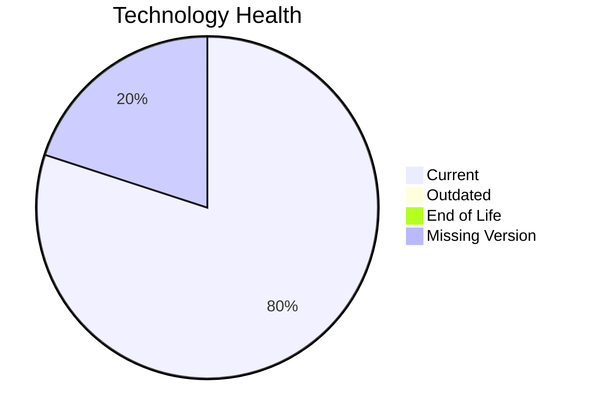

# Application Report: IoTSensorApp-012

**ID:** app012  
**Generated:** 2026-05-17

## Overview

| Attribute | Value |
|-----------|-------|
| Owner | unknown |
| Environment | AWS |
| Business Criticality | High |
| Users | 85 |
| Servers | sv15, sv16 |

## Technology Stack

| Component | Technology | Version | Status |
|-----------|-----------|---------|--------|
| Operating System | Windows Server 2022 | 2022 | 🟢 CURRENT_VERSION |
| Database | PostgreSQL 14 | 14 | 🟢 CURRENT_VERSION |
| Language | Rust 1.70 | 1.70 | 🟢 CURRENT_VERSION |
| Framework | Unknown Framework | N/A | ⚪ NO_KNOWLEDGE |
| App Server | Microsoft IIS 10.0 | 10.0 | 🟢 CURRENT_VERSION |

## Complexity Assessment

**Score:** 5/10 — **MEDIUM**  
**Confidence:** 8

Tech age 3/10 (EOL=0, outdated=0, unknown=1); integration 8/10 (8 interfaces); infrastructure 5/10 (2 servers, 2 envs); criticality 8/10 (High); architecture 4/10 (arch=2-Tier, containerized=Yes, ci/cd=Yes); data 5/10 (1 DB(s), storage≈800GB).

## Modernization Scenarios

### Applicable Scenarios

#### ✅ Switch to ARM-based CPU
- **Priority:** Medium
- **Effort:** Medium
- **Effects:** cost, sustainability
- **Cost:** €5028 (one-time)
- **Savings:** €1000/year
- **Reasoning:** No explicit blockers; likely x86/x64 default estate with modernization potential.

### Not Applicable / Other

| Scenario | Status | Reason |
|----------|--------|--------|
| Operating System Update | FULFILLED | Operating system is already in supported lifecycle. |
| Switch to standard Linux Operating System | NOT_APPLICABLE | Windows-based OS excluded from Linux standardization scenario. |
| Applications Server replacement | PARTIALLY_FULFILLED | Server is supported but may still benefit from modernization. |
| Application Migration to Cloud Infrastructure (Lift & Shift) | FULFILLED | Application already deployed on public cloud. |
| Application Containerization | FULFILLED | Application is already containerized. |
| Application Refactoring and De-coupling | PARTIALLY_FULFILLED | Moderate complexity with selective decoupling opportunities. |
| Upgrade Legacy Databases | PARTIALLY_FULFILLED | Database is supported; periodic modernization still relevant. |
| Switch DB Engine to open-source database solution | NOT_APPLICABLE | Database engine already open-source or open-source based. |
| Update outdated components | FULFILLED | Recorded components are current. |

## Financial Summary

| Metric | Value |
|--------|-------|
| Total One-Time Cost | €5028 |
| Total Yearly Savings | €1000 |
| Break-Even | 5.0 years |
