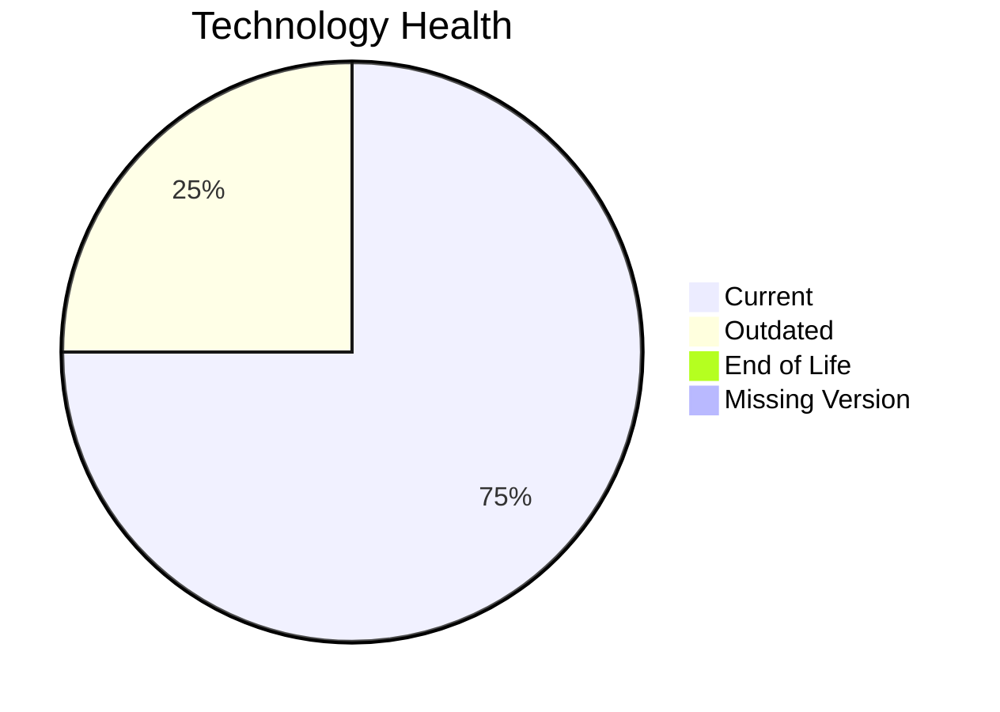

# Application Report: IoTSensorApp-012

**ID:** app012  
**Generated:** 2026-05-13

## Overview
| Attribute | Value |
|---|---|
| Owner | R&D |
| Environment | AWS |
| Business Criticality | High |
| Users | 85 |
| Servers | 2 |

## Technology Stack
| Component | Technology | Status |
|---|---|---|
| Operating System | Windows Server 2022 | 🟢 CURRENT_VERSION |
| Language | Rust 1.70 | 🟡 OUTDATED |
| Application Server | Microsoft IIS 10.0 | 🟢 CURRENT_VERSION |
| Database | PostgreSQL 14 | 🟢 CURRENT_VERSION |

## Complexity Assessment
**Score:** 6/10 — **MEDIUM**  
**Confidence:** Medium

## Modernization Scenarios
| Applicable Scenario | Priority | Cost | Savings/Year |
|---|---|---:|---:|
| Application Refactoring and De-coupling | High | €289133 | €135000 |
| Update outdated components | High | €N/A | €N/A |

## Financial Summary
| Metric | Value |
|---|---:|
| Total One-Time Cost | €289133 |
| Total Yearly Savings | €135000 |
| Break-Even | 2.1 years |
