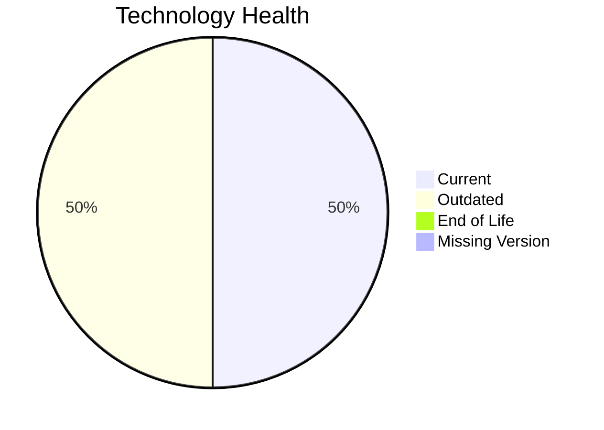

# Application Report: IoTSensorApp-012

**ID:** app012  
**Generated:** 2026-05-17

## Overview

| Attribute | Value |
|-----------|-------|
| Owner | N/A |
| Environment | AWS |
| Business Criticality | High |
| Users | 85 |
| Servers | 2 |

## Technology Stack

| Component | Technology | Version | Status |
|-----------|-----------|---------|--------|
| Operating System | Windows Server | 2022 | 🟢 CURRENT_VERSION |
| Database | PostgreSQL | 14 | 🟡 OUTDATED |
| Language | Rust | 1.70 | 🟡 OUTDATED |
| Framework | N/A | N/A | ⚪ NO_KNOWLEDGE |
| App Server | IIS | 10.0 | 🟢 CURRENT_VERSION |

## Complexity Assessment

**Score:** 6/10 — **MEDIUM**  
**Confidence:** 8

| Factor | Score | Notes |
|--------|-------|-------|
| Technology Age | 6/10 | 2 components are outdated. |
| Integration | 8/10 | High integration surface with 8 external interfaces and 20 APIs. |
| Infrastructure | 5/10 | Moderate infrastructure footprint with 2 servers and 2 environments. |
| Business Criticality | 8/10 | Business criticality is High. |
| Architecture | 4/10 | already containerized, CI/CD exists, multi-tier but still coupled. |
| Data | 6/10 | 1 database engine(s), 800 GB storage, aging database platform. |

## Modernization Scenarios

### Applicable Scenarios

#### ✅ Application Refactoring and De-coupling

- **Priority:** High
- **Effort:** High
- **Effects:** agility, cost, sustainability
- **Cost:** €289133 (one-time)
- **Savings:** €135000/year
- **Reasoning:** Architecture and integration signals point to a tightly coupled design that would benefit from refactoring.

#### ✅ Upgrade Legacy Databases

- **Priority:** High
- **Effort:** Medium
- **Effects:** security, agility
- **Cost:** €11565 (one-time)
- **Savings:** €10000/year
- **Reasoning:** PostgreSQL 14 is assessed as OUTDATED and is a candidate for upgrade.

#### ✅ Update outdated components

- **Priority:** High
- **Effort:** High
- **Effects:** security, agility, cost
- **Cost:** €0 (one-time)
- **Savings:** €0/year
- **Reasoning:** One or more application components are outdated or end-of-life.

### Not Applicable / Other

| Scenario | Status | Reason |
|----------|--------|--------|
| Operating System Update | FULFILLED | Windows Server 2022 is within supported lifecycle. |
| Switch to standard Linux Operating System | NOT_APPLICABLE | Application runs on Windows; this scenario targets proprietary non-Linux Unix platforms rather than Windows estates. |
| Switch to ARM-based CPU | LACK_OF_DATA | CPU architecture is not documented in the workbook, so ARM suitability cannot be assessed confidently. |
| Applications Server replacement | FULFILLED | Microsoft IIS 10.0 is already on a currently supported release. |
| Application Migration to Cloud Infrastructure (Lift & Shift) | FULFILLED | Deployment target already points to AWS/public cloud only. |
| Application Containerization | FULFILLED | Application is already containerized. |
| Switch DB Engine to open-source database solution | FULFILLED | PostgreSQL 14 already uses an open-source-compatible engine family. |

## Financial Summary

| Metric | Value |
|--------|-------|
| Total One-Time Cost | €300698 |
| Total Yearly Savings | €145000 |
| Break-Even | 2.1 years |
