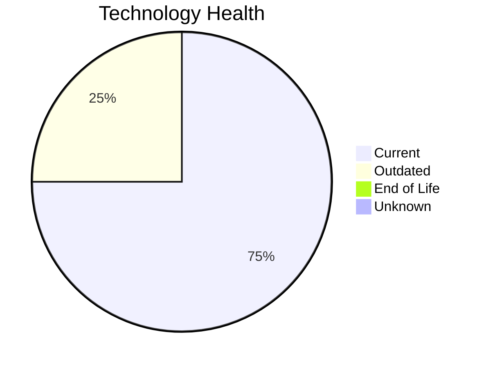

# Application Report: IoTSensorApp-012

**ID:** app012
**Generated:** 2026-05-14

## Overview

| Attribute | Value |
|-----------|-------|
| Owner | R&D |
| Environment | AWS |
| Business Criticality | High |
| Users | 85 |
| Servers | 2 |
| Solution Type | Custom made |
| Architecture | 2-Tier |
| Containerized | Yes |
| CI/CD | Yes |

## Technology Stack

| Component | Technology | Version | Status |
|-----------|-----------|---------|--------|
| Os | Windows Server 2022 | Server 2022 | 🟢 CURRENT_VERSION |
| Database | PostgreSQL 14 | 14 | 🟢 CURRENT_VERSION |
| Programming Language | Rust 1.70 | 1.70 | 🟡 OUTDATED |
| Application Server | Microsoft IIS 10.0 | IIS 10.0 | 🟢 CURRENT_VERSION |

## Complexity Assessment

**Score:** 5/10 — **MEDIUM**
**Confidence:** 8/10

| Factor | Score | Notes |
|--------|-------|-------|
| Technology Age | 4/10 | 0 EOL, 1 outdated components |
| Integration | 7/10 | 8 external interfaces |
| Infrastructure | 4/10 | 2 server(s), 2 environment(s) |
| Business Criticality | 7/10 | High criticality |
| Architecture | 2/10 | Containerized: Yes, CI/CD: Yes |
| Data | 5/10 | DB: PostgreSQL 14 |

## Modernization Scenarios

### Applicable Scenarios

#### ✅ Application Refactoring and De-coupling

- **Priority:** High
- **Effort:** High
- **Effects:** agility, cost, sustainability
- **Cost:** €251,420 (one-time)
- **Savings:** €135,000/year
- **Reasoning:** Application has 2-Tier architecture which may have coupling between layers. Refactoring to modular/microservices architecture would improve agility.

#### ✅ Update outdated components

- **Priority:** High
- **Effort:** High
- **Effects:** security, agility, cost
- **Cost:** N/A (one-time)
- **Savings:** N/A/year
- **Reasoning:** Application has outdated components: programming language Rust 1.70 is outdated. Update recommended.

### Not Applicable / Other

| Scenario | Status | Reason |
|----------|--------|--------|
| Operating System Update | ✔️ FULFILLED | Operating system Windows Server 2022 is on a current, supported version. |
| Switch to standard Linux Operating System | ❌ NOT_APPLICABLE | Application runs on Windows OS. Switching to Linux would require significant re-platforming; not app... |
| Switch to ARM-based CPU | 🚫 BLOCKED | Application runs on Windows Server which has legacy dependencies incompatible with ARM CPU migration... |
| Applications Server replacement | ✔️ FULFILLED | Application server Microsoft IIS 10.0 is on a current, supported version. No replacement needed. |
| Application Migration to Cloud Infrastructure (Lift & Shift) | ✔️ FULFILLED | Application is already deployed on cloud infrastructure (AWS). No migration needed. |
| Application Containerization | ✔️ FULFILLED | Application is already containerized. Scenario already achieved. |
| Upgrade Legacy Databases | ✔️ FULFILLED | Database PostgreSQL 14 is on a current, supported version. No upgrade needed. |
| Switch DB Engine to open-source database solution | ✔️ FULFILLED | Database PostgreSQL 14 is already an open-source or managed solution. No commercial license migratio... |

## Financial Summary

| Metric | Value |
|--------|-------|
| Total One-Time Cost | €251,420 |
| Total Yearly Savings | €135,000 |
| Break-Even | 1.9 years |
