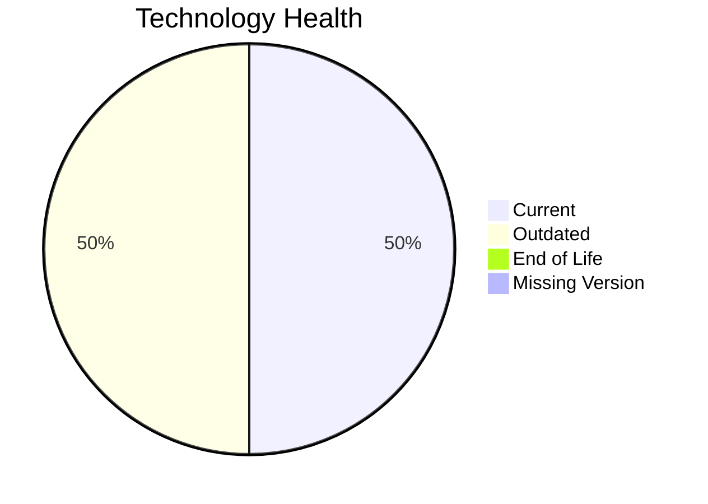

# Application Report: IoTSensorApp-012

**ID:** app012
**Generated:** 2026-05-18T00:00:00Z

## Overview

| Attribute | Value |
|-----------|-------|
| Owner | R&D |
| Environment | AWS |
| Business Criticality | High |
| Users | 85 |
| Servers | 2 |

## Technology Stack

| Component | Technology | Version | Status |
|-----------|-----------|---------|--------|
| Operating System | Windows Server | 2022 | 🟢 CURRENT_VERSION |
| Database | PostgreSQL | 14 | 🟡 OUTDATED |
| Language | Rust | 1.70 | 🟡 OUTDATED |
| Framework | N/A | N/A | ⚪ N/A |
| App Server | Microsoft IIS | 10.0 | 🟢 CURRENT_VERSION |

## Complexity Assessment

**Score:** 6/10 — **MEDIUM**
**Confidence:** 8

| Factor | Score | Notes |
|--------|-------|-------|
| Technology Age | 6/10 | 2 component(s) are outdated. |
| Integration | 8/10 | 8 external interfaces and 20 API endpoints. |
| Infrastructure | 4/10 | 2 server instance(s) across 2 environment(s). |
| Business Criticality | 7/10 | Criticality is High with 85 users. |
| Architecture | 4/10 | Architecture is 2-Tier; containerized=Yes; CI/CD=Yes. |
| Data | 6/10 | Database storage is 800 GB on PostgreSQL 14.  |

## Modernization Scenarios

### Applicable Scenarios

#### ✅ Application Refactoring and De-coupling

- **Priority:** High
- **Effort:** High
- **Effects:** agility, cost, sustainability
- **Cost:** €289,133 (one-time)
- **Savings:** €135,000/year
- **Reasoning:** Architecture and integration signals indicate a tightly coupled estate that would benefit from refactoring.

#### ✅ Upgrade Legacy Databases

- **Priority:** High
- **Effort:** Medium
- **Effects:** security, agility
- **Cost:** €11,565 (one-time)
- **Savings:** €10,000/year
- **Reasoning:** PostgreSQL 14 is assessed as OUTDATED.

#### ✅ Update outdated components

- **Priority:** High
- **Effort:** High
- **Effects:** security, agility, cost
- **Cost:** €N/A (one-time)
- **Savings:** €N/A/year
- **Reasoning:** At least one application runtime component is outdated or end of life.

### Not Applicable / Other

| Scenario | Status | Reason |
|----------|--------|--------|
| Operating System Update | FULFILLED | Windows Server 2022 is on a supported current-enough release. |
| Switch to standard Linux Operating System | NOT_APPLICABLE | The application already runs on Windows Server, so this Linux migration scenario is not a natural fit. |
| Switch to ARM-based CPU | BLOCKED | The current OS/platform choice is a blocker for an ARM move in the scenario definition. |
| Applications Server replacement | FULFILLED | Microsoft IIS 10.0 is already on a current supported release family. |
| Application Migration to Cloud Infrastructure (Lift & Shift) | FULFILLED | The deployment target is already a public cloud platform (AWS). |
| Application Containerization | FULFILLED | The workbook already marks the application as containerized. |
| Switch DB Engine to open-source database solution | FULFILLED | PostgreSQL 14 is already an open-source or open-source-compatible database option. |

## Financial Summary

| Metric | Value |
|--------|-------|
| Total One-Time Cost | €300,698 |
| Total Yearly Savings | €145,000 |
| Break-Even | 2.1 years |
