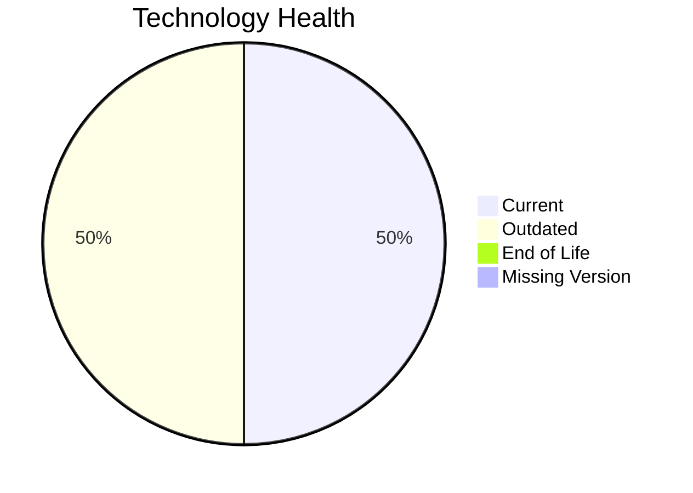

# Application Report: IoTSensorApp-012

**ID:** app012
**Generated:** 2026-05-11

## Overview

| Attribute | Value |
|-----------|-------|
| Owner | R&D |
| Environment | AWS |
| Business Criticality | High |
| Users | 85 |
| Servers | 2 |

## Technology Stack

| Component | Technology | Version | Status |
|-----------|-----------|---------|--------|
| Operating System | Windows Server | Windows Server 2022 | 🟢 CURRENT_VERSION |
| Database | PostgreSQL | PostgreSQL 14 | 🟡 OUTDATED |
| Language | Rust | Rust 1.70 | 🟡 OUTDATED |
| Framework | N/A | N/A | ⚪ |
| App Server | Microsoft IIS | Microsoft IIS 10.0 | 🟢 CURRENT_VERSION |

## Complexity Assessment

**Score:** 6/10 — **MEDIUM**
**Confidence:** 8

Technology age score 6/10 (EOL=0, outdated=2, unknown=0); integration score 8/10 (interfaces=8, api_endpoints=20); infrastructure score 5/10 (servers=2, environments=2); business criticality score 8/10 (High, users=85); architecture score 3/10 (architecture=2-Tier, CI/CD=Yes, containerized=Yes); data score 7/10 (db_count=1, db_storage_gb=800).

## Modernization Scenarios

### Applicable Scenarios

#### ✅ Application Refactoring and De-coupling

- **Priority:** High
- **Effort:** High
- **Effects:** agility, cost, sustainability
- **Cost:** €289133 (one-time)
- **Savings:** €135000/year
- **Reasoning:** Architecture and integration profile indicate decoupling/refactoring opportunity.

#### ✅ Upgrade Legacy Databases

- **Priority:** High
- **Effort:** Medium
- **Effects:** security, agility
- **Cost:** €11565 (one-time)
- **Savings:** €10000/year
- **Reasoning:** Database engine is outdated or end-of-life.

#### ✅ Update outdated components

- **Priority:** High
- **Effort:** High
- **Effects:** security, agility, cost
- **Cost:** N/A
- **Savings:** N/A
- **Reasoning:** Language/framework/server components are outdated or end-of-life.

### Not Applicable / Other

| Scenario | Status | Reason |
|----------|--------|--------|
| Operating System Update | FULFILLED | Operating system is on a supported current version. |
| Switch to standard Linux Operating System | NOT_APPLICABLE | Scenario excludes Windows-based operating systems. |
| Switch to ARM-based CPU | LACK_OF_DATA | CPU architecture (x86/x64/ARM) is not provided in source data. |
| Applications Server replacement | FULFILLED | Application server is already on a supported version. |
| Application Migration to Cloud Infrastructure (Lift & Shift) | FULFILLED | Application is already hosted on public cloud infrastructure. |
| Application Containerization | FULFILLED | Application is already containerized. |
| Switch DB Engine to open-source database solution | FULFILLED | Database engine is already open-source compatible. |

## Financial Summary

| Metric | Value |
|--------|-------|
| Total One-Time Cost | €300698 |
| Total Yearly Savings | €145000 |
| Break-Even | 2.1 years |
