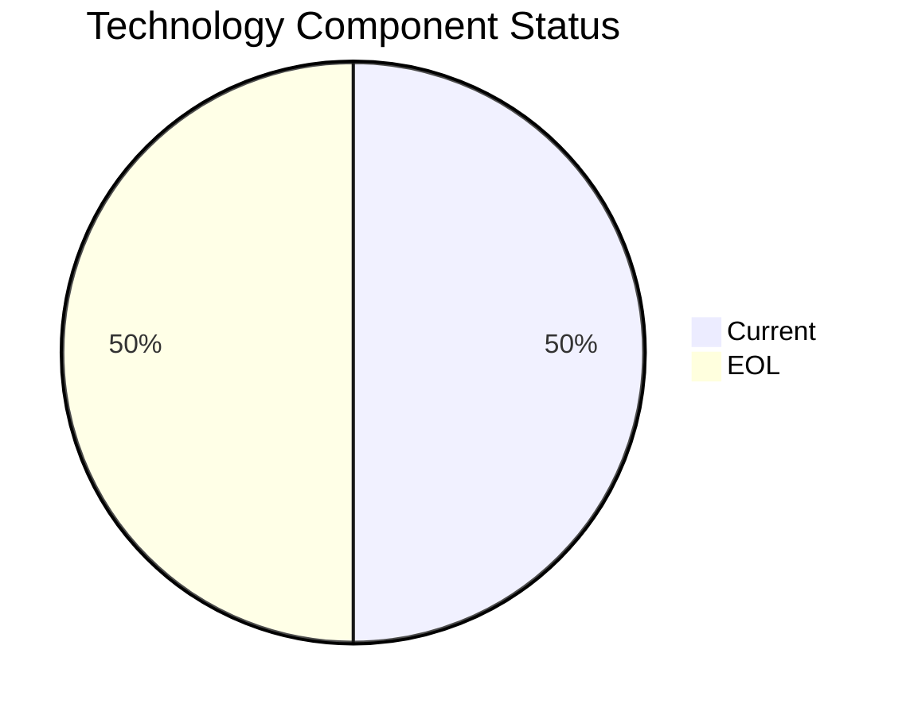

# SecurityApp-013 (app013)

> Analysis timestamp: 2025-07-15T00:00:00Z

## Application Overview

| Attribute | Value |
|-----------|-------|
| **Name** | SecurityApp-013 |
| **Status** | Production |
| **Criticality** | Critical |
| **Users** | 520 |
| **Solution Type** | Custom made |
| **Architecture** | 3-Tier |
| **Containerized** | No |
| **CI/CD** | Yes |
| **Environments** | 3 |
| **Servers** | sv17, sv18 |
| **External Interfaces** | 15 |

## Technology Stack

| Component | Value | Status |
|-----------|-------|--------|
| **Os** | Debian 7 | ❌ EOL |
| **Language** | Java 17 | ✅ CURRENT_VERSION |
| **Database** | SQL Server 2022 | ✅ CURRENT_VERSION |
| **App Server** | Websphere 8.0 | ❌ EOL |

## Technology Health

## Complexity Assessment

**Score: 7/10 — HIGH**

2 EOL component(s) significantly raise technical debt; 15 external interfaces drive integration complexity; 2 server(s) across 3 environment(s); Business criticality is Critical.

| Factor | Value |
|--------|-------|
| Servers | 2 |
| Environments | 3 |
| External Interfaces | 15 |
| EOL Technologies | 2 |
| Outdated Technologies | 0 |
| CI/CD Present | Yes |
| Containerized | No |

## Modernization Scenarios

| Scenario | Status | Reason |
|----------|--------|--------|
| OS Security Patch | 🔧 APPLICABLE | Operating system Debian 7 is EOL and requires security patching/upgrade. |
| Switch to Linux | ✅ FULFILLED | Application already runs on standard Linux (Debian 7). |
| ARM CPU | 🔧 APPLICABLE | Custom or open source application that can be compiled for ARM architecture. |
| App Server Replace | 🔧 APPLICABLE | Application server Websphere 8.0 is EOL and should be replaced. |
| Cloud Deploy | 🔧 APPLICABLE | Application can be migrated to cloud infrastructure. |
| Containerization | 🔧 APPLICABLE | Custom/open source application can be containerized to improve portability. |
| Refactor/Decouple | ✅ FULFILLED | 3-Tier architecture already provides modular separation. |
| DB Upgrade | ✅ FULFILLED | Database SQL Server 2022 is current and actively supported. |
| Open Source DB | 🔧 APPLICABLE | Database SQL Server 2022 is proprietary; switching to open source would reduce l... |
| Update Components | 🔧 APPLICABLE | Application has EOL or outdated components that require updating. |

## Financial Summary

| Metric | Value |
|--------|-------|
| Total Implementation Cost | $194,181.45 |
| Total Annual Savings | $108,500.00 |
| Payback Period | 1.79 years |
| 5-Year Net Benefit | $348,318.55 |

### Applicable Scenario Costs

| Scenario | Impl. Cost | Annual Savings | Payback |
|----------|-----------|----------------|---------|
| OS Security Patch | $1,330.01 | $500.00 | 2.66 yrs |
| ARM CPU | $6,650.05 | $1,000.00 | 6.65 yrs |
| App Server Replace | $13,300.10 | $9,600.00 | 1.39 yrs |
| Cloud Deploy | $6,650.05 | $2,400.00 | 2.77 yrs |
| Containerization | $133,000.99 | $80,000.00 | 1.66 yrs |
| Open Source DB | $33,250.25 | $15,000.00 | 2.22 yrs |
