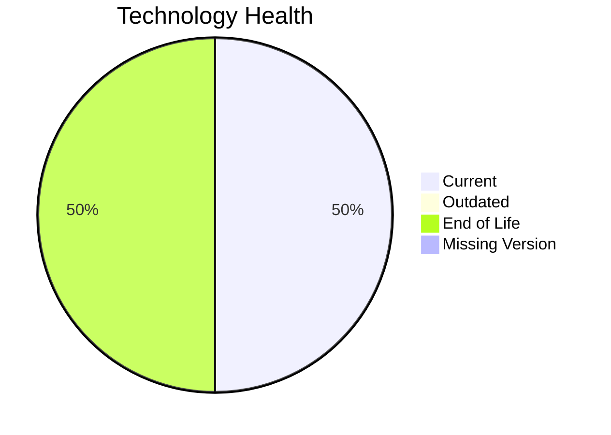

# Application Report: SecurityApp-013

Modernization assessment for SecurityApp-013 based solely on the Excel portfolio row and derived workflow outputs.

**ID:** app013  
**Generated:** 2026-05-07

## Overview

| Attribute | Value |
|-----------|-------|
| Owner | Security |
| Environment | On-Premise |
| Business Criticality | Critical |
| Users | 520 |
| Servers | sv17, sv18 |

## Technology Stack

| Component | Technology | Version | Status |
|-----------|-----------|---------|--------|
| Operating System | Debian | 7 | 🔴 |
| Database | SQL Server | 2022 | 🟢 |
| Language | Java | 17 | 🟢 |
| Framework | N/A | N/A | ⚪ |
| App Server | IBM WebSphere | 8.0 | 🔴 |

## Complexity Assessment

**Score:** 8/10 — **HIGH**  
**Confidence:** 8

| Factor | Score | Notes |
|--------|-------|-------|
| Technology Age | 9/10 | 2 EOL, 0 outdated, 0 unknown lifecycle components. |
| Integration | 8/10 | 15 external interfaces and 8 API endpoints indicate the integration footprint. |
| Infrastructure | 5/10 | 2 listed server instances and 3 environments drive infrastructure coordination. |
| Business Criticality | 10/10 | Business criticality is Critical with approximately 520 users. |
| Architecture | 8/10 | 3-tier architecture is more modular than 1-tier or 2-tier; application is not containerized; application stack contains EOL runtime components |
| Data | 6/10 | database storage is 600 GB; moderate database footprint; proprietary or enterprise database migration complexity |

## Modernization Scenarios

### Applicable Scenarios

#### ✅ Operating System Update

- **Priority:** High
- **Effort:** Low
- **Effects:** security
- **Cost:** €1530 (one-time)
- **Savings:** €500/year
- **Reasoning:** Operating system Debian 7 is eol and matches the OS update trigger.

#### ✅ Applications Server replacement

- **Priority:** Medium
- **Effort:** Medium
- **Effects:** agility, cost
- **Cost:** €15295 (one-time)
- **Savings:** €9600/year
- **Reasoning:** Application server Websphere 8.0 is eol.

#### ✅ Application Migration to Cloud Infrastructure (Lift & Shift)

- **Priority:** High
- **Effort:** Low
- **Effects:** security, agility
- **Cost:** €7648 (one-time)
- **Savings:** €2400/year
- **Reasoning:** The application is still on-premise and matches the lift-and-shift trigger.

#### ✅ Application Containerization

- **Priority:** High
- **Effort:** High
- **Effects:** agility, cost, sustainability
- **Cost:** €152951 (one-time)
- **Savings:** €80000/year
- **Reasoning:** The application is not containerized and no hard blocker is visible in the input.

#### ✅ Application Refactoring and De-coupling

- **Priority:** High
- **Effort:** High
- **Effects:** agility, cost, sustainability
- **Cost:** €382378 (one-time)
- **Savings:** €120000/year
- **Reasoning:** Architecture and complexity indicators suggest a refactoring/de-coupling opportunity.

#### ✅ Switch DB Engine to open-source database solution

- **Priority:** High
- **Effort:** Medium
- **Effects:** cost
- **Cost:** N/A (one-time)
- **Savings:** N/A/year
- **Reasoning:** Database engine SQL Server 2022 is proprietary and matches the open-source migration trigger.

#### ✅ Update outdated components

- **Priority:** High
- **Effort:** High
- **Effects:** security, agility, cost
- **Cost:** N/A (one-time)
- **Savings:** N/A/year
- **Reasoning:** At least one language/framework/application-server component is outdated or end of life.

### Not Applicable / Other

| Scenario | Status | Reason |
|----------|--------|--------|
| Switch to standard Linux Operating System | PARTIALLY_FULFILLED | The application already runs on Linux, but the distribution/version is not current and still needs standardization or upgrade. |
| Switch to ARM-based CPU | LACK_OF_DATA | CPU architecture is not present in the Excel input, so the primary ARM migration trigger cannot be confirmed. |
| Upgrade Legacy Databases | FULFILLED | Database platform SQL Server 2022 is already current. |

## Financial Summary

| Metric | Value |
|--------|-------|
| Total One-Time Cost | €559802 |
| Total Yearly Savings | €212500 |
| Break-Even | 2.6 years |
