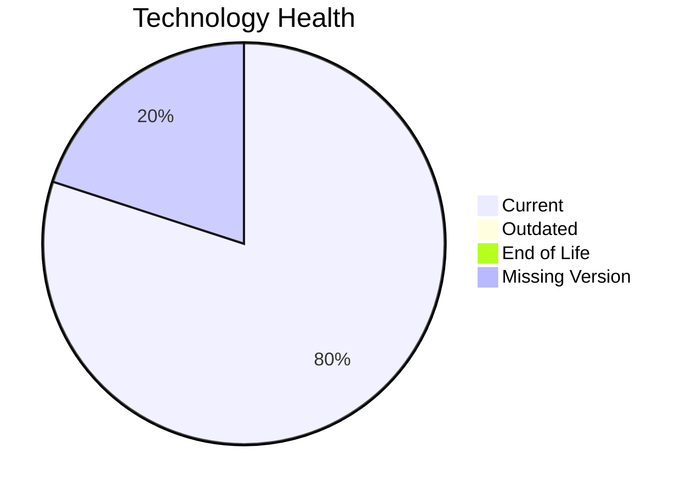

# Application Report: SecurityApp-013

**ID:** app013
**Generated:** 2026-05-14

## Overview

| Attribute | Value |
|-----------|-------|
| Owner | Security |
| Environment | On-Premise |
| Business Criticality | Critical |
| Users | 520 |
| Servers | sv17, sv18 |

## Technology Stack

| Component | Technology | Status |
|-----------|-----------|--------|
| Operating System | Debian 7 | �� |
| Database | SQL Server 2022 | 🟢 |
| Language | Java 17 | 🟢 |

## Complexity Assessment

**Score:** 5/10 — **MEDIUM**

## Modernization Scenarios

### ✅ Application Server Replacement
- **Reasoning:** Legacy application server version should be replaced.

### ✅ App Deployment To Cloud
- **Reasoning:** On-premise deployment model is a direct cloud-migration opportunity.

### ✅ App Containerization
- **Reasoning:** Application is not containerized and can benefit from platform standardization.

### ✅ App Refactor Decoupling
- **Reasoning:** High coupling and/or monolithic architecture indicates refactor opportunity.

### ✅ Switch To Managed Db
- **Reasoning:** On-prem database workloads can move to managed database services.

## Financial Summary

| Metric | Value |
|--------|-------|
| Total One-Time Cost | €397243 |
| Total Yearly Savings | €263500 |
| Break-Even | 1.5 years |
