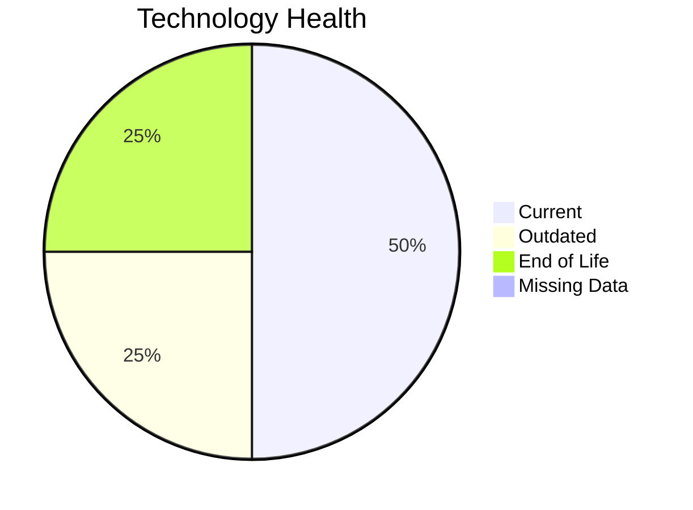

# Application Report: SecurityApp-013

**ID:** app013  
**Generated:** 2026-05-07

## Overview

| Attribute | Value |
|-----------|-------|
| Business Unit | Security |
| Deployment Type | On-Premise |
| Business Criticality | Critical |
| Users | 520 |
| Servers | 2 |
| Solution Type | Custom made |

**Description:** Enterprise security platform for monitoring threats, managing access controls, and ensuring compliance

## Technology Stack

| Component | Technology | Status |
|-----------|-----------|--------|
| Os | Debian 7 | 🟡 OUTDATED |
| Database | SQL Server 2022 | 🟢 CURRENT_VERSION |
| Language | Java 17 | 🟢 CURRENT_VERSION |
| App_Server | Websphere 8.0 | 🔴 EOL |

## Complexity Assessment

**Score:** 7/10 — **HIGH**  
**Confidence:** 9/10

**Reasoning:** Technology age: 8/10 (1 EOL, 1 outdated components) | Integration: 10/10 (15 external interfaces) | Infrastructure: 4/10 (2 servers, 3 environments) | Criticality: 9/10 (critical) | Architecture: 4/10 (containerized: no, CI/CD: yes) | Data: 4/10 (600 GB storage)

### Contributing Factors

| Factor | Value |
|--------|-------|
| Servers | 2 |
| Databases | 1 |
| Environments | 3 |
| Interfaces | 15 |
| EOL Technologies | 1 |
| Outdated Technologies | 1 |
| Containerized | No |
| CI/CD Present | Yes |

## Modernization Scenarios

### Applicable Scenarios

#### ✅ Operating System Update

- **Priority:** High
- **Effort:** Low
- **Effects:** security
- **Cost:** $1,330.01 (one-time)
- **Savings:** $500.00/year
- **Reasoning:** Triggered by: Operating System Version is Outdated, Operating System Version is Unsupported

#### ✅ Applications Server replacement

- **Priority:** Medium
- **Effort:** Medium
- **Effects:** agility, cost
- **Cost:** $13,300.10 (one-time)
- **Savings:** $9,600.00/year
- **Reasoning:** Triggered by: Application Server lacks container support. Supporting conditions: Application is a custom developed Application

#### ✅ Application Migration to Cloud Infrastructure (Lift & Shift)

- **Priority:** High
- **Effort:** Low
- **Effects:** security, agility
- **Cost:** $6,650.05 (one-time)
- **Savings:** $2,400.00/year
- **Reasoning:** Triggered by: Environment Type is On-Premise. Supporting conditions: Application is custom developed

#### ✅ Application Refactoring and De-coupling

- **Priority:** High
- **Effort:** High
- **Effects:** agility, cost, sustainability
- **Cost:** $332,502.49 (one-time)
- **Savings:** $120,000.00/year
- **Reasoning:** Triggered by: Architecture is Tightly Coupled. Supporting conditions: Application is a custom developed application

#### ✅ Update outdated components

- **Priority:** High
- **Effort:** High
- **Effects:** security, agility, cost
- **Cost:** $0.00 (one-time)
- **Savings:** $0.00/year
- **Reasoning:** Triggered by: Used Application Server is legacy or outdated (e.g. Weblogic 10.x, Websphere 7.x, JBoss EAP 5.x, Tomcat 6.x, IIS 6.x). Supporting conditions: Application is a custom developed application

### Other Scenarios

| Scenario | Status | Reason |
|----------|--------|--------|
| Switch to standard Linux Operating System | ✔️ FULFILLED | Fulfilled: Application already runs on a standard, widely supported Linux distri... |
| Switch to ARM-based CPU | ❌ NOT_APPLICABLE | No primary triggers matched for this application. |
| Application Containerization | ❌ NOT_APPLICABLE | No primary triggers matched for this application. |
| Upgrade Legacy Databases | ✔️ FULFILLED | Fulfilled: All database components are on a current, supported version with no e... |
| Switch DB Engine to open-source database solution | ✔️ FULFILLED | Fulfilled: Database engine is already an open-source alternative with no commerc... |

## Financial Summary

| Metric | Value |
|--------|-------|
| Total One-Time Cost | $353,782.64 |
| Total Yearly Savings | $132,500.00 |
| Break-Even | 2.67 years |

---

*This report was automatically generated from application portfolio analysis.*
