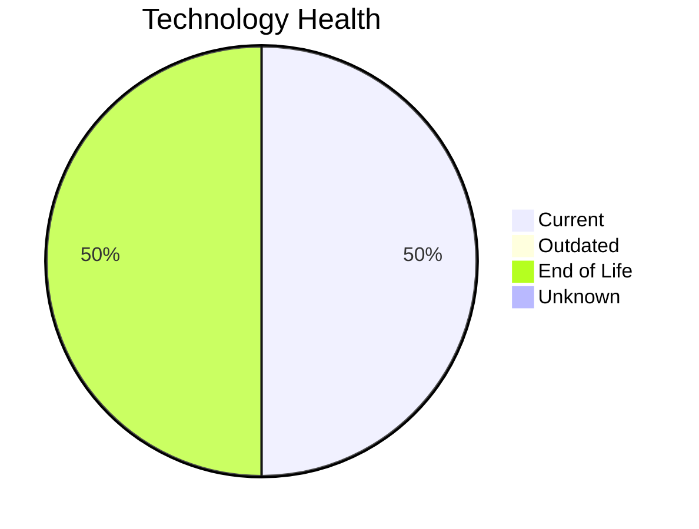

# Application Report: SecurityApp-013

**ID:** app013  
**Generated:** 2026-05-15

## Overview

| Attribute | Value |
|-----------|-------|
| Business Unit | Security |
| Deployment | On-Premise |
| Business Criticality | Critical |
| Users | 520 |
| Solution Type | Custom made |
| Architecture | 3-Tier |
| Containerized | No |
| CI/CD | Yes |
| External Interfaces | 15 |

## Technology Stack

| Component | Technology | Status |
|-----------|-----------|--------|
| Operating System | Debian 7 | 🔴 EOL |
| Database | SQL Server 2022 | 🟢 Current |
| Language | Java 17 | 🟢 Current |
| App Server | Websphere 8.0 | 🔴 EOL |

## Complexity Assessment

**Score:** 6/10 — **MEDIUM**  
**Confidence:** 8

| Factor | Score | Notes |
|--------|-------|-------|
| Technology Age | 6/10 | 2 EOL component(s) detected |
| Integration | 8/10 | 15 external interfaces, 0 dependencies — highly integrated |
| Infrastructure | 5/10 | 2 server instances, 3 environments |
| Business Criticality | 10/10 | Business criticality: critical, 520 users |
| Architecture | 4/10 | 3-tier architecture; not containerized; CI/CD present |
| Data | 4/10 | 600 GB data storage |

## Modernization Scenarios

### Applicable Scenarios

#### ✅ Operating System Update

- **Priority:** High
- **Effort:** Low
- **Effects:** security
- **One-time Cost:** €1,157
- **Yearly Savings:** €500/year
- **Reasoning:** OS 'Debian 7' has reached EOL — critical security risk. Immediate OS update required.

#### ✅ Applications Server replacement

- **Priority:** Medium
- **Effort:** Medium
- **Effects:** agility, cost
- **One-time Cost:** €11,565
- **Yearly Savings:** €10,800/year
- **Reasoning:** Application server 'Websphere 8.0' has reached EOL. Replacement is needed to maintain security and support.

#### ✅ Application Migration to Cloud Infrastructure (Lift & Shift)

- **Priority:** High
- **Effort:** Low
- **Effects:** security, agility
- **One-time Cost:** €5,783
- **Yearly Savings:** €2,700/year
- **Reasoning:** Application is fully on-premise. Migration to cloud (Lift & Shift) can reduce infrastructure costs and improve agility.

#### ✅ Application Containerization

- **Priority:** High
- **Effort:** High
- **Effects:** agility, cost, sustainability
- **One-time Cost:** €115,653
- **Yearly Savings:** €90,000/year
- **Reasoning:** Application is not containerized. Containerization would improve deployment consistency and scalability.

#### ✅ Switch DB Engine to open-source database solution

- **Priority:** High
- **Effort:** Medium
- **Effects:** cost
- **One-time Cost:** N/A
- **Yearly Savings:** N/A
- **Reasoning:** Microsoft SQL Server has licensing costs. Migrating to PostgreSQL or MySQL is a cost-saving option.

#### ✅ Update outdated components

- **Priority:** High
- **Effort:** High
- **Effects:** security, agility, cost
- **One-time Cost:** N/A
- **Yearly Savings:** N/A
- **Reasoning:** Multiple EOL/outdated components detected (2 EOL, 0 outdated). Systematic update program needed.

### Other Scenarios

| Scenario | Status | Reason |
|----------|--------|--------|
| Switch to standard Linux Operating System | ✔️ Fulfilled | OS 'Debian 7' is already a standard Linux distribution. |
| Switch to ARM-based CPU | ❓ No Data | On-premise application. CPU architecture not specified in available data. |
| Application Refactoring and De-coupling | 🔶 Partial | Application has a 3-Tier architecture. Some decoupling already done but may bene... |
| Upgrade Legacy Databases | ✔️ Fulfilled | Database 'SQL Server 2022' is on a current, supported version. |

## Business Case Summary

| Metric | Value |
|--------|-------|
| Total One-time Cost | €134,158 |
| Total Yearly Savings | €104,000 |
| ROI Break-even | 1.3 years |
