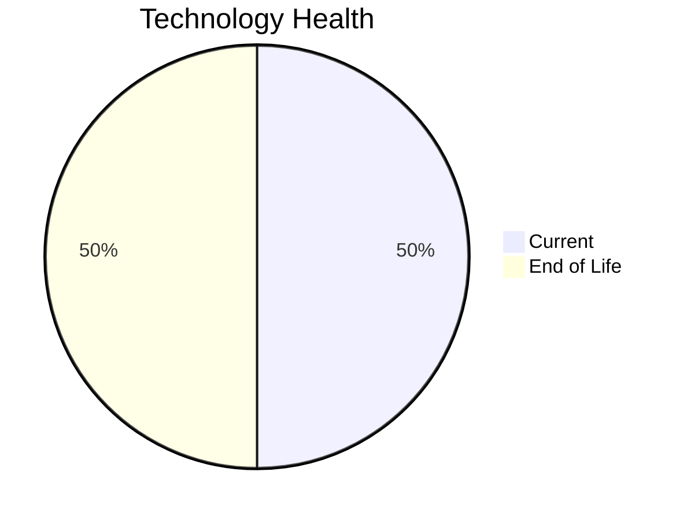

# Application Report: SecurityApp-013

**ID:** app013  
**Generated:** 2026-05-05

## Overview

| Attribute | Value |
|-----------|-------|
| Business Unit | Security |
| Deployment Type | On-Premise |
| Business Criticality | Critical |
| Users | 520 |
| Servers | sv17, sv18 |
| Environments | 3 |
| Architecture | 3-Tier |
| Containerized | No |
| CI/CD | Yes |
| Solution Type | Custom made |
| Data Classification | Confidential |

> Enterprise security platform for monitoring threats, managing access controls, and ensuring compliance

## Technology Stack

| Component | Technology | Version | Status |
|-----------|-----------|---------|--------|
| Os | Debian | 7 | 🔴 EOL |
| Database | SQL Server | 2022 | 🟢 CURRENT_VERSION |
| Language | Java | 17 | 🟢 CURRENT_VERSION |
| Application Server | IBM WebSphere | 8.0 | 🔴 EOL |

## Complexity Assessment

**Score:** 6/10 — **MEDIUM**  
**Confidence:** 7

> Score 6/10 (MEDIUM). EOL components: 2, Outdated: 0. External interfaces: 15. Servers: 2. Criticality: Critical. Architecture: 3-Tier. DB storage: 600.0GB.

| Factor | Value |
|--------|-------|
| Servers | 2 |
| Environments | 3 |
| External Interfaces | 15 |
| Business Criticality | Critical |
| EOL Technologies | 2 |
| Outdated Technologies | 0 |
| CI/CD | Yes |
| Containerized | No |

## Modernization Scenarios

### ✅ Applicable Scenarios

#### ✅ Operating System Update

- **Priority:** High
- **Effort:** Low
- **One-Time Cost:** €1,157
- **Yearly Savings:** €500
- **Reasoning:** OS Debian 7 is EOL. Debian 7 (Wheezy) reached End of Life on May 31, 2018. No security updates available. OS update is required.

#### ✅ Application Server Replacement

- **Priority:** Medium
- **Effort:** Medium
- **One-Time Cost:** €11,565
- **Yearly Savings:** €10,800
- **Reasoning:** Application server IBM WebSphere 8.0 is EOL. IBM WebSphere Application Server 8.0 reached End of Service on April 30, 2018. Replacement with a modern server is recommended.

#### ✅ Application Migration to Cloud (Lift & Shift)

- **Priority:** High
- **Effort:** Low
- **One-Time Cost:** €5,783
- **Yearly Savings:** €2,700
- **Reasoning:** Application is hosted on-premise. Migration to cloud (Lift & Shift) is recommended to reduce infrastructure costs.

#### ✅ Application Containerization

- **Priority:** High
- **Effort:** High
- **One-Time Cost:** €115,653
- **Yearly Savings:** €90,000
- **Reasoning:** Application is not containerized and runs on a compatible OS (Debian 7). Containerization would improve deployment consistency and portability.

#### ✅ Switch DB Engine to Open-Source

- **Priority:** High
- **Effort:** Medium
- **Reasoning:** Application uses SQL Server (SQL Server 2022), a proprietary Microsoft database. Migration to PostgreSQL would reduce licensing costs.

#### ✅ Update Outdated Components

- **Priority:** High
- **Effort:** High
- **Reasoning:** Outdated/EOL application components detected: IBM WebSphere 8.0 (EOL). These should be updated to current supported versions.

### Other Scenarios

| Scenario | Status | Reason |
|----------|--------|--------|
| Switch to Standard Linux OS | ✔️ FULFILLED | Application already runs on a Linux-based OS (Debian 7). However, OS version is EOL; upgrade (os_update_security_patch) ... |
| Switch to ARM-based CPU | ❓ LACK_OF_DATA | CPU architecture is not explicitly documented in the application record. ARM eligibility cannot be confirmed. |
| Application Refactoring and De-coupling | ❓ LACK_OF_DATA | Insufficient architecture details to determine if full decoupling is needed. |
| Upgrade Legacy Databases | ✔️ FULFILLED | Database SQL Server 2022 is on a current supported version. |

## Financial Summary

| Metric | Value |
|--------|-------|
| Total One-Time Cost | €134,158 |
| Total Yearly Savings | €104,000 |
| Break-Even | 1.3 years |
