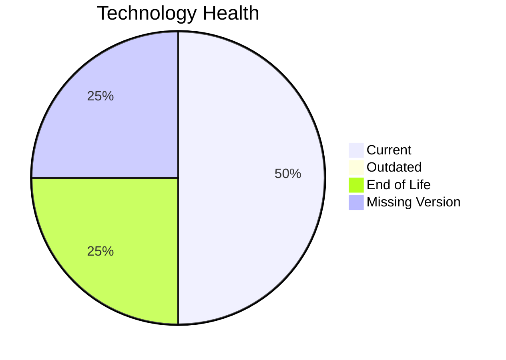

# Application Report: SecurityApp-013

**ID:** app013
**Generated:** 2026-04-24

## Overview

| Attribute | Value |
|-----------|-------|
| Owner | Security |
| Business Unit | Security |
| Deployment Type | On-Premise |
| Business Criticality | Critical |
| Users | 520 |
| Servers | 2 |
| Architecture | 3-Tier |
| Solution Type | Custom made |
| CI/CD | Yes |
| Containerized | No |

## Technology Stack

| Component | Technology | Version | Status |
|-----------|-----------|---------|--------|
| Operating System | Debian 7 | Debian 7 | 🔴 EOL |
| Language | Java 17 | Java 17 | 🟢 CURRENT_VERSION |
| Database | SQL Server 2022 | SQL Server 2022 | 🟢 CURRENT_VERSION |
| App Server | Websphere 8.0 | Websphere 8.0 | ⚪ NO_KNOWLEDGE |

## Complexity Assessment

**Score:** 6/10 — **MEDIUM**
**Confidence:** 7

**Reasoning:** Tech age score 7/10 (1 EOL, 0 outdated components). Integration score 9/10 (15 external interfaces). Infrastructure score 5/10 (2 servers, 3 environments). Business criticality score 5/10 (criticality: Critical). Architecture score 3/10 (architecture: 3-Tier, containerized: No, CI/CD: Yes). Data score 4/10 (600GB storage).

### Contributing Factors

| Factor | Value |
|--------|-------|
| Servers | 2 |
| Environments | 3 |
| External Interfaces | 15 |
| EOL Technologies | 1 |
| Outdated Technologies | 0 |
| CI/CD | Yes |
| Containerized | No |

## Modernization Scenarios

### Applicable Scenarios

#### ✅ Operating System Update

- **Priority:** High
- **Effort:** Low
- **Effects:** security
- **Cost:** €1,157 (one-time)
- **Savings:** €500/year
- **Reasoning:** Operating system 'Debian 7' is EOL. OS update is recommended.

#### ✅ Switch to ARM-based CPU

- **Priority:** Medium
- **Effort:** Medium
- **Effects:** cost, sustainability
- **Cost:** €5,783 (one-time)
- **Savings:** €1,000/year
- **Reasoning:** Custom application on Linux OS is a candidate for ARM-based CPU migration for cost savings.

#### ✅ Application Migration to Cloud Infrastructure (Lift & Shift)

- **Priority:** High
- **Effort:** Low
- **Effects:** security, agility
- **Cost:** €5,783 (one-time)
- **Savings:** €2,700/year
- **Reasoning:** Application is deployed On-Premise. Cloud migration (Lift & Shift) is applicable.

#### ✅ Application Refactoring and De-coupling

- **Priority:** High
- **Effort:** High
- **Effects:** agility, cost, sustainability
- **Cost:** €289,133 (one-time)
- **Savings:** €135,000/year
- **Reasoning:** Custom application with '3-tier' architecture may benefit from refactoring for better agility.

#### ✅ Switch DB Engine to open-source database solution

- **Priority:** High
- **Effort:** Medium
- **Effects:** cost
- **Cost:** N/A (one-time)
- **Savings:** N/A
- **Reasoning:** Database 'SQL Server 2022' is a proprietary/commercial database. Switching to open-source (e.g., PostgreSQL) would reduce licensing costs.

#### ✅ Update outdated components

- **Priority:** High
- **Effort:** High
- **Effects:** security, agility, cost
- **Cost:** N/A (one-time)
- **Savings:** N/A
- **Reasoning:** Some components (lang: CURRENT_VERSION, OS: EOL) need updates.

### Not Applicable / Other

| Scenario | Status | Reason |
|----------|--------|--------|
| Switch to standard Linux Operating System | FULFILLED | Application already runs on a standard Linux distribution: 'Debian 7'.... |
| Applications Server replacement | LACK_OF_DATA | Lifecycle data for application server 'Websphere 8.0' is not available.... |
| Application Containerization | BLOCKED | Legacy OS 'Debian 7' is incompatible with containerization.... |
| Upgrade Legacy Databases | FULFILLED | Database 'SQL Server 2022' is on a currently supported version.... |

## Financial Summary

| Metric | Value |
|--------|-------|
| Total One-Time Cost | €301,856 |
| Total Yearly Savings | €139,200 |
| Break-Even | 2.2 years |
