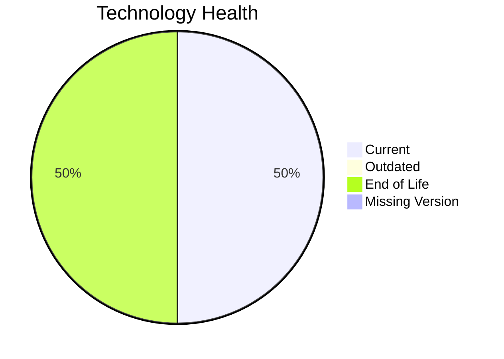

# Application Report: SecurityApp-013

**ID:** app013
**Generated:** 2026-05-18T00:00:00Z

## Overview

| Attribute | Value |
|-----------|-------|
| Owner | Security |
| Environment | On-Premise |
| Business Criticality | Critical |
| Users | 520 |
| Servers | 2 |

## Technology Stack

| Component | Technology | Version | Status |
|-----------|-----------|---------|--------|
| Operating System | Debian | 7 | 🔴 EOL |
| Database | SQL Server | 2022 | 🟢 CURRENT_VERSION |
| Language | Java | 17 | 🟢 CURRENT_VERSION |
| Framework | N/A | N/A | ⚪ N/A |
| App Server | WebSphere | 8.0 | 🔴 EOL |

## Complexity Assessment

**Score:** 7/10 — **HIGH**
**Confidence:** 8

| Factor | Score | Notes |
|--------|-------|-------|
| Technology Age | 8/10 | 2 component(s) are EOL. |
| Integration | 8/10 | 15 external interfaces and 8 API endpoints. |
| Infrastructure | 6/10 | 2 server instance(s) across 3 environment(s). |
| Business Criticality | 9/10 | Criticality is Critical with 520 users. |
| Architecture | 3/10 | Architecture is 3-Tier; containerized=No; CI/CD=Yes. |
| Data | 5/10 | Database storage is 600 GB on SQL Server 2022.  |

## Modernization Scenarios

### Applicable Scenarios

#### ✅ Operating System Update

- **Priority:** High
- **Effort:** Low
- **Effects:** security
- **Cost:** €1,330 (one-time)
- **Savings:** €500/year
- **Reasoning:** Debian 7 is assessed as EOL.

#### ✅ Applications Server replacement

- **Priority:** Medium
- **Effort:** Medium
- **Effects:** agility, cost
- **Cost:** €13,300 (one-time)
- **Savings:** €9,600/year
- **Reasoning:** Websphere 8.0 is assessed as EOL, which directly triggers server replacement.

#### ✅ Application Migration to Cloud Infrastructure (Lift & Shift)

- **Priority:** High
- **Effort:** Low
- **Effects:** security, agility
- **Cost:** €6,650 (one-time)
- **Savings:** €2,400/year
- **Reasoning:** The application is still on-premise, which is the main trigger for lift-and-shift cloud migration.

#### ✅ Application Containerization

- **Priority:** High
- **Effort:** High
- **Effects:** agility, cost, sustainability
- **Cost:** €133,001 (one-time)
- **Savings:** €80,000/year
- **Reasoning:** The application is not yet containerized and the runtime/OS stack is compatible with container packaging.

#### ✅ Application Refactoring and De-coupling

- **Priority:** High
- **Effort:** High
- **Effects:** agility, cost, sustainability
- **Cost:** €332,502 (one-time)
- **Savings:** €120,000/year
- **Reasoning:** Architecture and integration signals indicate a tightly coupled estate that would benefit from refactoring.

#### ✅ Switch DB Engine to open-source database solution

- **Priority:** High
- **Effort:** Medium
- **Effects:** cost
- **Cost:** €N/A (one-time)
- **Savings:** €N/A/year
- **Reasoning:** SQL Server 2022 is a proprietary engine, so moving to an open-source database is a valid modernization option.

#### ✅ Update outdated components

- **Priority:** High
- **Effort:** High
- **Effects:** security, agility, cost
- **Cost:** €N/A (one-time)
- **Savings:** €N/A/year
- **Reasoning:** At least one application runtime component is outdated or end of life.

### Not Applicable / Other

| Scenario | Status | Reason |
|----------|--------|--------|
| Switch to standard Linux Operating System | PARTIALLY_FULFILLED | The application already runs on Linux, but the current distribution/version is outdated or unsupported. |
| Switch to ARM-based CPU | LACK_OF_DATA | CPU architecture is not documented in the workbook, so ARM suitability cannot be confirmed. |
| Upgrade Legacy Databases | FULFILLED | SQL Server 2022 is already on a supported modern database release. |

## Financial Summary

| Metric | Value |
|--------|-------|
| Total One-Time Cost | €486,783 |
| Total Yearly Savings | €212,500 |
| Break-Even | 2.3 years |
