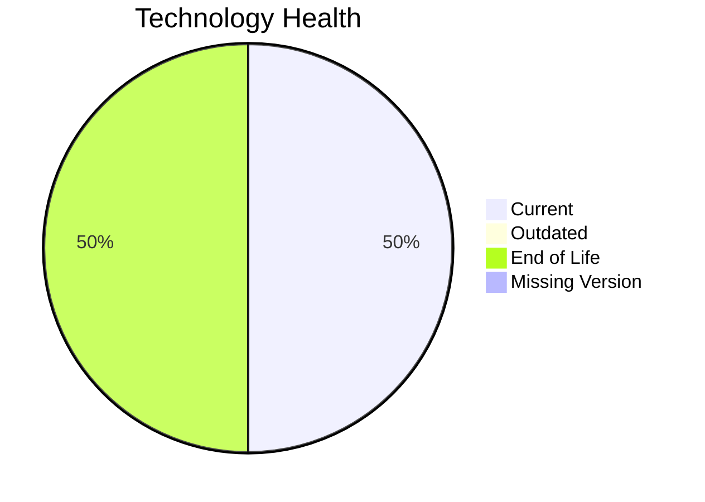

# Application Report: SecurityApp-013

**ID:** app013
**Generated:** 2026-05-19

## Overview

| Attribute | Value |
|-----------|-------|
| Owner | unknown |
| Environment | On-Premise |
| Business Criticality | Critical |
| Users | 520 |
| Servers | 2 |

## Technology Stack

| Component | Technology | Version | Status |
|-----------|-----------|---------|--------|
| Operating System | Debian 7 | 7 | 🔴 EOL |
| Database | SQL Server 2022 | 2022 | 🟢 CURRENT_VERSION |
| Language | Java 17 | 17 | 🟢 CURRENT_VERSION |
| Framework | N/A | N/A | ⚪ N/A |
| App Server | Websphere 8.0 | 8.0 | 🔴 EOL |

## Complexity Assessment

**Score:** 8/10 — **HIGH**
**Confidence:** 9

| Factor | Score | Notes |
|--------|-------|-------|
| Technology Age | n/a | Critical-critical app with complexity driven by technology age, integrations, and architecture characteristics. |
| Integration | n/a | Interfaces: 15 |
| Infrastructure | n/a | Environments: 3 |
| Business Criticality | n/a | Critical |
| Architecture | n/a | Containerized: No; CI/CD: Yes |
| Data | n/a | Databases: 1 |

## Scenario Applicability

### Applicable Scenarios

#### ✅ Operating System Update

- **Priority:** High
- **Effort:** Low
- **Effects:** security
- **Cost:** €1,530 (one-time)
- **Savings:** €500/year
- **Reasoning:** Debian 7 is classified as EOL, which triggers an operating system update scenario.

#### ✅ Applications Server replacement

- **Priority:** Medium
- **Effort:** Medium
- **Effects:** agility, cost
- **Cost:** €15,295 (one-time)
- **Savings:** €9,600/year
- **Reasoning:** Websphere 8.0 is EOL and fits server replacement triggers.

#### ✅ Application Migration to Cloud Infrastructure (Lift & Shift)

- **Priority:** High
- **Effort:** Low
- **Effects:** security, agility
- **Cost:** €7,648 (one-time)
- **Savings:** €2,400/year
- **Reasoning:** Application is hosted on-premise only, so lift-and-shift cloud migration is applicable.

#### ✅ Application Containerization

- **Priority:** High
- **Effort:** High
- **Effects:** agility, cost, sustainability
- **Cost:** €152,951 (one-time)
- **Savings:** €80,000/year
- **Reasoning:** Application is not containerized yet and runs on a platform that can support container adoption.

#### ✅ Application Refactoring and De-coupling

- **Priority:** High
- **Effort:** High
- **Effects:** agility, cost, sustainability
- **Cost:** €382,378 (one-time)
- **Savings:** €120,000/year
- **Reasoning:** Legacy architecture signals or coupling indicators suggest refactoring and de-coupling would add value.

#### ✅ Switch DB Engine to open-source database solution

- **Priority:** High
- **Effort:** Medium
- **Effects:** cost
- **Cost:** N/A (one-time)
- **Savings:** N/A/year
- **Reasoning:** SQL Server 2022 is a proprietary engine that could be evaluated for open-source replacement.

#### ✅ Update outdated components

- **Priority:** High
- **Effort:** High
- **Effects:** security, agility, cost
- **Cost:** N/A (one-time)
- **Savings:** N/A/year
- **Reasoning:** The technology assessment found outdated or EOL components that justify a component refresh.

### Not Applicable / Other

| Scenario | Status | Reason |
|----------|--------|--------|
| Switch to standard Linux Operating System | ✔️ FULFILLED | Debian 7 is already a standard Linux distribution. |
| Switch to ARM-based CPU | ❓ LACK_OF_DATA | CPU architecture is not captured in the inventory, so ARM applicability cannot be confirmed. |
| Upgrade Legacy Databases | ✔️ FULFILLED | SQL Server 2022 is currently supported. |

## Financial Summary

| Metric | Value |
|--------|-------|
| Total One-Time Cost | €559,802 |
| Total Yearly Savings | €212,500 |
| Break-Even | 2.6 years |
