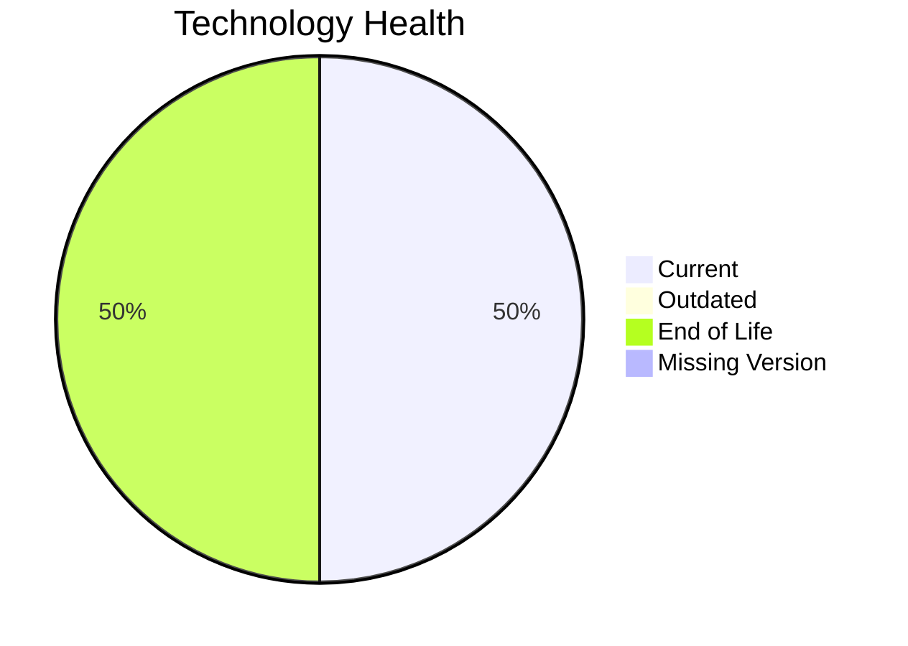

# Application Report: SecurityApp-013

**ID:** app013  
**Generated:** 2026-05-13

## Overview
| Attribute | Value |
|---|---|
| Owner | Security |
| Environment | On-Premise |
| Business Criticality | Critical |
| Users | 520 |
| Servers | 2 |

## Technology Stack
| Component | Technology | Status |
|---|---|---|
| Operating System | Debian 7 | 🔴 EOL |
| Language | Java 17 | 🟢 CURRENT_VERSION |
| Application Server | Websphere 8.0 | 🔴 EOL |
| Database | SQL Server 2022 | 🟢 CURRENT_VERSION |

## Complexity Assessment
**Score:** 8/10 — **HIGH**  
**Confidence:** Medium

## Modernization Scenarios
| Applicable Scenario | Priority | Cost | Savings/Year |
|---|---|---:|---:|
| Operating System Update | High | €1530 | €500 |
| Applications Server replacement | Medium | €15295 | €9600 |
| Application Migration to Cloud Infrastructure (Lift & Shift) | High | €7648 | €2400 |
| Application Containerization | High | €152951 | €80000 |
| Application Refactoring and De-coupling | High | €382378 | €120000 |
| Switch DB Engine to open-source database solution | High | €N/A | €N/A |
| Update outdated components | High | €N/A | €N/A |

## Financial Summary
| Metric | Value |
|---|---:|
| Total One-Time Cost | €559802 |
| Total Yearly Savings | €212500 |
| Break-Even | 2.6 years |
