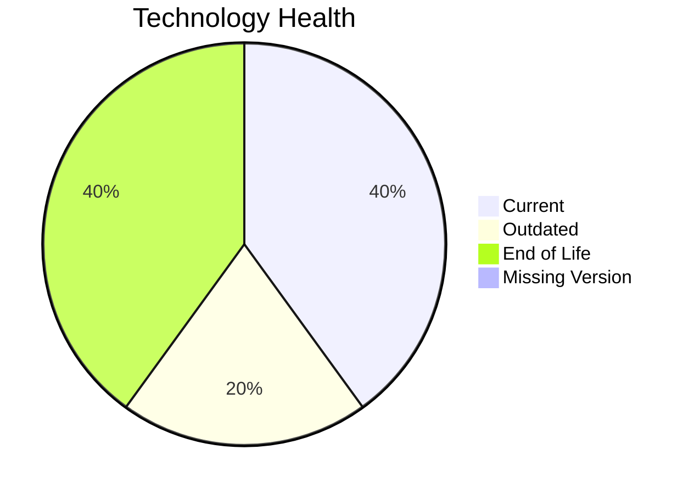

# Application Report: DocumentApp-014

**ID:** app014
**Generated:** 2026-05-11

## Overview

| Attribute | Value |
|-----------|-------|
| Owner | Operations |
| Environment | AWS |
| Business Criticality | Medium |
| Users | 890 |
| Servers | 2 |

## Technology Stack

| Component | Technology | Version | Status |
|-----------|-----------|---------|--------|
| Operating System | Windows Server | Windows Server 2019 | 🟡 OUTDATED |
| Database | MySQL | MySQL 8.0 | 🟢 CURRENT_VERSION |
| Language | .NET 6 | C# .NET 6 | 🔴 EOL |
| Framework | .NET 6 | C# .NET 6 | 🔴 EOL |
| App Server | Microsoft IIS | Microsoft IIS 10.0 | 🟢 CURRENT_VERSION |

## Complexity Assessment

**Score:** 6/10 — **MEDIUM**
**Confidence:** 8

Technology age score 9/10 (EOL=2, outdated=1, unknown=0); integration score 8/10 (interfaces=9, api_endpoints=18); infrastructure score 5/10 (servers=2, environments=2); business criticality score 5/10 (Medium, users=890); architecture score 5/10 (architecture=2-Tier, CI/CD=Yes, containerized=No); data score 3/10 (db_count=1, db_storage_gb=120).

## Modernization Scenarios

### Applicable Scenarios

#### ✅ Operating System Update

- **Priority:** High
- **Effort:** Low
- **Effects:** security
- **Cost:** €1157 (one-time)
- **Savings:** €500/year
- **Reasoning:** Operating system is outdated or end-of-life per technology assessment.

#### ✅ Application Containerization

- **Priority:** High
- **Effort:** High
- **Effects:** agility, cost, sustainability
- **Cost:** €115653 (one-time)
- **Savings:** €90000/year
- **Reasoning:** Traditional non-container deployment on supported OS can be containerized.

#### ✅ Application Refactoring and De-coupling

- **Priority:** High
- **Effort:** High
- **Effects:** agility, cost, sustainability
- **Cost:** €289133 (one-time)
- **Savings:** €135000/year
- **Reasoning:** Architecture and integration profile indicate decoupling/refactoring opportunity.

#### ✅ Update outdated components

- **Priority:** High
- **Effort:** High
- **Effects:** security, agility, cost
- **Cost:** N/A
- **Savings:** N/A
- **Reasoning:** Language/framework/server components are outdated or end-of-life.

### Not Applicable / Other

| Scenario | Status | Reason |
|----------|--------|--------|
| Switch to standard Linux Operating System | NOT_APPLICABLE | Scenario excludes Windows-based operating systems. |
| Switch to ARM-based CPU | LACK_OF_DATA | CPU architecture (x86/x64/ARM) is not provided in source data. |
| Applications Server replacement | FULFILLED | Application server is already on a supported version. |
| Application Migration to Cloud Infrastructure (Lift & Shift) | FULFILLED | Application is already hosted on public cloud infrastructure. |
| Upgrade Legacy Databases | FULFILLED | Database version is currently supported. |
| Switch DB Engine to open-source database solution | FULFILLED | Database engine is already open-source compatible. |

## Financial Summary

| Metric | Value |
|--------|-------|
| Total One-Time Cost | €405943 |
| Total Yearly Savings | €225500 |
| Break-Even | 1.8 years |
