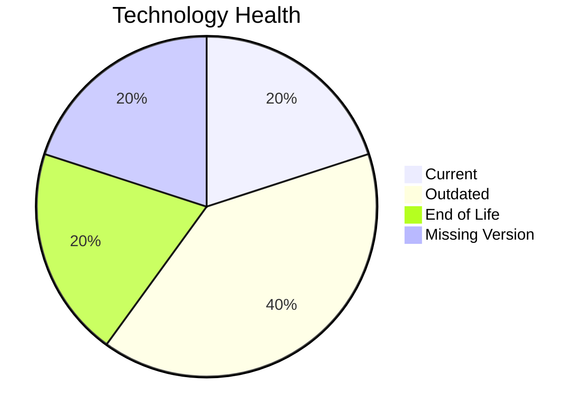

# Application Report: DocumentApp-014

**ID:** app014
**Generated:** 2026-05-07

## Overview

| Attribute | Value |
|-----------|-------|
| Owner | N/A |
| Environment | AWS |
| Business Criticality | Medium |
| Users | 890 |
| Servers | 2 |

## Technology Stack

| Component | Technology | Version | Status |
|-----------|-----------|---------|--------|
| Operating System | Windows Server | 2019 | 🟡 OUTDATED |
| Database | MySQL | 8.0 | 🟡 OUTDATED |
| Language | C# | unknown | ⚪ NO_KNOWLEDGE |
| Framework | .NET | 6 | 🔴 EOL |
| App Server | IIS | 10.0 | 🟢 CURRENT_VERSION |

## Complexity Assessment

**Score:** 6/10 — **MEDIUM**
**Confidence:** 6

| Factor | Score | Notes |
|--------|-------|-------|
| Technology Age | 8/10 | At least one EOL component was found in the application stack. |
| Integration | 8/10 | The application exposes 9 interfaces, indicating heavy integration. |
| Infrastructure | 5/10 | 2 servers and 2 environments indicate moderate infrastructure complexity. |
| Business Criticality | 5/10 | Criticality is 'Medium' with 890 users. |
| Architecture | 5/10 | A 2-tier architecture suggests some legacy coupling. CI/CD lowers delivery risk. |
| Data | 5/10 | Database footprint (120 GB) indicates moderate data migration effort. |

## Modernization Scenarios

### Applicable Scenarios

#### ✅ Operating System Update

- **Priority:** High
- **Effort:** Low
- **Effects:** security
- **Cost:** €1,157 (one-time)
- **Savings:** €500/year
- **Reasoning:** Windows Server 2019 is still supported but is an older generation than Windows Server 2022.

#### ✅ Application Containerization

- **Priority:** High
- **Effort:** High
- **Effects:** agility, cost, sustainability
- **Cost:** €115,653 (one-time)
- **Savings:** €90,000/year
- **Reasoning:** The application is not containerized and has a deployable server-based stack.

#### ✅ Application Refactoring and De-coupling

- **Priority:** High
- **Effort:** High
- **Effects:** agility, cost, sustainability
- **Cost:** €289,133 (one-time)
- **Savings:** €135,000/year
- **Reasoning:** The architecture indicates coupling or legacy structure that would benefit from refactoring.

#### ✅ Upgrade Legacy Databases

- **Priority:** High
- **Effort:** Medium
- **Effects:** security, agility
- **Cost:** €11,565 (one-time)
- **Savings:** €10,000/year
- **Reasoning:** MySQL 8.0 is aging and treated conservatively as outdated in 2026.

#### ✅ Update outdated components

- **Priority:** High
- **Effort:** High
- **Effects:** security, agility, cost
- **Cost:** €N/A (one-time)
- **Savings:** €N/A/year
- **Reasoning:** At least one language, framework, or application server component is outdated or EOL.

### Not Applicable / Other

| Scenario | Status | Reason |
|----------|--------|--------|
| Switch to standard Linux Operating System | NOT_APPLICABLE | The scenario excludes Windows-based operating systems. |
| Switch to ARM-based CPU | LACK_OF_DATA | CPU architecture is not present in the workbook, so ARM suitability cannot be validated. |
| Applications Server replacement | FULFILLED | IIS 10.0 remains supported on current Windows Server releases. |
| Application Migration to Cloud Infrastructure (Lift & Shift) | FULFILLED | Application is already hosted on AWS, which satisfies the public cloud hosting indicator. |
| Switch DB Engine to open-source database solution | FULFILLED | The application already uses an open-source or open-source-compatible database engine. |

## Financial Summary

| Metric | Value |
|--------|-------|
| Total One-Time Cost | €417,508 |
| Total Yearly Savings | €235,500 |
| Break-Even | 1.8 years |
