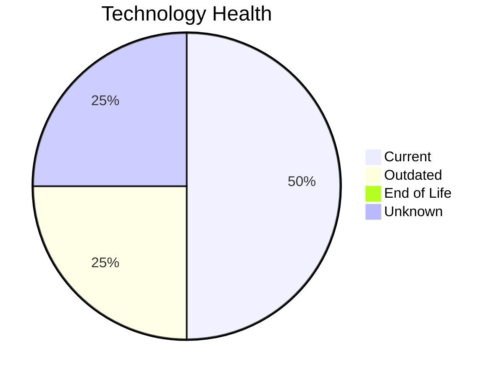

# Application Report: DocumentApp-014

**ID:** app014  
**Generated:** 2026-05-06

## Overview

| Attribute | Value |
|-----------|-------|
| Business Unit | Operations |
| Deployment | AWS |
| Business Criticality | Medium |
| Users | 890 |
| Servers | 2 |
| Architecture | 2-Tier |
| Containerized | No |
| CI/CD | Yes |

## Technology Stack

| Component | Technology | Status |
|-----------|-----------|--------|
| Operating System | Windows Server 2019 | 🟢 CURRENT_VERSION |
| Database | MySQL 8.0 | 🟢 CURRENT_VERSION |
| Language | C# .NET 6 | 🟡 OUTDATED |
| App Server | Microsoft IIS 10.0 | ⚪ NO_KNOWLEDGE |

## Complexity Assessment

**Score:** 6/10 — **MEDIUM**  
**Confidence:** 8/10

> Complexity score 6/10 (MEDIUM). 1 outdated component(s), 9 external interfaces.

| Factor | Score |
|--------|-------|
| Technology Age & EOL | 4/10 |
| Integration Complexity | 7/10 |
| Infrastructure Scale | 4/10 |
| Business Criticality | 9/10 |
| Code & Architecture | 6/10 |
| Data Complexity | 4/10 |

## Modernization Scenarios

### Applicable Scenarios

#### ✅ Application Containerization

- **Priority:** High
- **Effort:** High
- **Effects:** agility, cost, sustainability
- **Cost:** €115,653 (one-time)
- **Savings:** €90,000/year
- **Reasoning:** Application is not containerized; containerization could improve portability and deployment efficiency.

#### ✅ Application Refactoring and De-coupling

- **Priority:** High
- **Effort:** High
- **Effects:** agility, cost, sustainability
- **Cost:** €289,133 (one-time)
- **Savings:** €135,000/year
- **Reasoning:** 2-tier architecture could benefit from decoupling into services.

#### ✅ Update outdated components

- **Priority:** High
- **Effort:** High
- **Effects:** security, agility, cost
- **Cost:** N/A (one-time)
- **Savings:** N/A
- **Reasoning:** Components need updating. Outdated: C# .NET 6.

### Other Scenarios

| Scenario | Status | Reason |
|----------|--------|--------|
| Operating System Update | FULFILLED | Operating system is on a current, supported version. |
| Switch to standard Linux Operating System | NOT_APPLICABLE | Windows Server OS; this scenario targets proprietary Unix-like systems. |
| Switch to ARM-based CPU | LACK_OF_DATA | CPU architecture not documented in application data. |
| Applications Server replacement | LACK_OF_DATA | Application server lifecycle status unknown. |
| Application Migration to Cloud Infrastructure (Lift & Shift) | FULFILLED | Application is already deployed on cloud (AWS). |
| Upgrade Legacy Databases | FULFILLED | Database (MySQL 8.0) is on a current, supported version. |
| Switch DB Engine to open-source database solution | FULFILLED | Database (MySQL 8.0) is already open-source or compatible. |

## Financial Summary

| Metric | Value |
|--------|-------|
| Total One-Time Investment | €404,786 |
| Total Annual Savings | €225,000 |
| Break-Even | 1.8 years |
