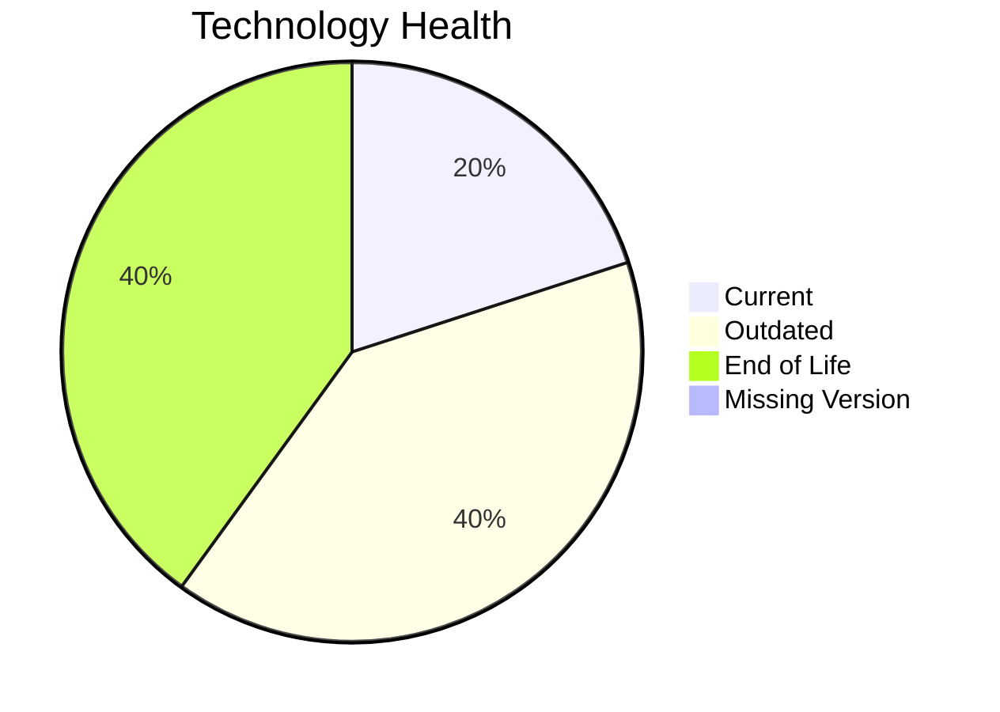

# Application Report: DocumentApp-014

**ID:** app014
**Generated:** 2026-05-18T00:00:00Z

## Overview

| Attribute | Value |
|-----------|-------|
| Owner | Operations |
| Environment | AWS |
| Business Criticality | Medium |
| Users | 890 |
| Servers | 2 |

## Technology Stack

| Component | Technology | Version | Status |
|-----------|-----------|---------|--------|
| Operating System | Windows Server | 2019 | 🟡 OUTDATED |
| Database | MySQL | 8.0 | 🟡 OUTDATED |
| Language | .NET | 6 | 🔴 EOL |
| Framework | .NET | 6 | 🔴 EOL |
| App Server | Microsoft IIS | 10.0 | 🟢 CURRENT_VERSION |

## Complexity Assessment

**Score:** 6/10 — **MEDIUM**
**Confidence:** 8

| Factor | Score | Notes |
|--------|-------|-------|
| Technology Age | 8/10 | 2 component(s) are EOL. |
| Integration | 7/10 | 9 external interfaces and 18 API endpoints. |
| Infrastructure | 4/10 | 2 server instance(s) across 2 environment(s). |
| Business Criticality | 5/10 | Criticality is Medium with 890 users. |
| Architecture | 5/10 | Architecture is 2-Tier; containerized=No; CI/CD=Yes. |
| Data | 5/10 | Database storage is 120 GB on MySQL 8.0.  |

## Modernization Scenarios

### Applicable Scenarios

#### ✅ Operating System Update

- **Priority:** High
- **Effort:** Low
- **Effects:** security
- **Cost:** €1,157 (one-time)
- **Savings:** €500/year
- **Reasoning:** Windows Server 2019 is assessed as OUTDATED.

#### ✅ Application Containerization

- **Priority:** High
- **Effort:** High
- **Effects:** agility, cost, sustainability
- **Cost:** €115,653 (one-time)
- **Savings:** €90,000/year
- **Reasoning:** The application is not yet containerized and the runtime/OS stack is compatible with container packaging.

#### ✅ Application Refactoring and De-coupling

- **Priority:** High
- **Effort:** High
- **Effects:** agility, cost, sustainability
- **Cost:** €289,133 (one-time)
- **Savings:** €135,000/year
- **Reasoning:** Architecture and integration signals indicate a tightly coupled estate that would benefit from refactoring.

#### ✅ Upgrade Legacy Databases

- **Priority:** High
- **Effort:** Medium
- **Effects:** security, agility
- **Cost:** €11,565 (one-time)
- **Savings:** €10,000/year
- **Reasoning:** MySQL 8.0 is assessed as OUTDATED.

#### ✅ Update outdated components

- **Priority:** High
- **Effort:** High
- **Effects:** security, agility, cost
- **Cost:** €N/A (one-time)
- **Savings:** €N/A/year
- **Reasoning:** At least one application runtime component is outdated or end of life.

### Not Applicable / Other

| Scenario | Status | Reason |
|----------|--------|--------|
| Switch to standard Linux Operating System | NOT_APPLICABLE | The application already runs on Windows Server, so this Linux migration scenario is not a natural fit. |
| Switch to ARM-based CPU | BLOCKED | The current OS/platform choice is a blocker for an ARM move in the scenario definition. |
| Applications Server replacement | FULFILLED | Microsoft IIS 10.0 is already on a current supported release family. |
| Application Migration to Cloud Infrastructure (Lift & Shift) | FULFILLED | The deployment target is already a public cloud platform (AWS). |
| Switch DB Engine to open-source database solution | FULFILLED | MySQL 8.0 is already an open-source or open-source-compatible database option. |

## Financial Summary

| Metric | Value |
|--------|-------|
| Total One-Time Cost | €417,508 |
| Total Yearly Savings | €235,500 |
| Break-Even | 1.8 years |
