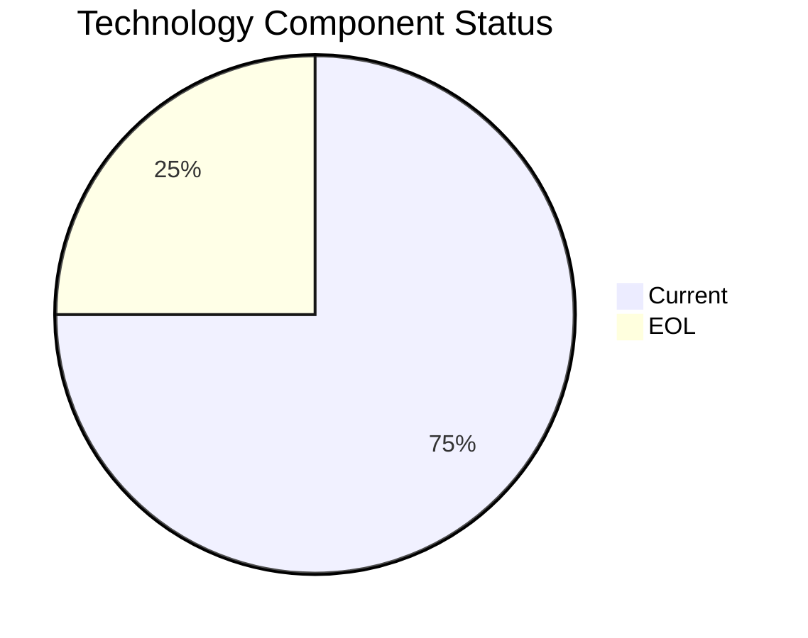

# DocumentApp-014 (app014)

> Analysis timestamp: 2025-07-15T00:00:00Z

## Application Overview

| Attribute | Value |
|-----------|-------|
| **Name** | DocumentApp-014 |
| **Status** | Production |
| **Criticality** | Medium |
| **Users** | 890 |
| **Solution Type** | Open Source |
| **Architecture** | 2-Tier |
| **Containerized** | No |
| **CI/CD** | Yes |
| **Environments** | 2 |
| **Servers** | sv19, sv20 |
| **External Interfaces** | 9 |

## Technology Stack

| Component | Value | Status |
|-----------|-------|--------|
| **Os** | Windows Server 2019 | ✅ CURRENT_VERSION |
| **Language** | C# .NET 6 | ❌ EOL |
| **Database** | MySQL 8.0 | ✅ CURRENT_VERSION |
| **App Server** | Microsoft IIS 10.0 | ✅ CURRENT_VERSION |

## Technology Health

## Complexity Assessment

**Score: 6/10 — MEDIUM**

1 EOL component(s) significantly raise technical debt; 9 external interfaces drive integration complexity; 2 server(s) across 2 environment(s); Business criticality is Medium.

| Factor | Value |
|--------|-------|
| Servers | 2 |
| Environments | 2 |
| External Interfaces | 9 |
| EOL Technologies | 1 |
| Outdated Technologies | 0 |
| CI/CD Present | Yes |
| Containerized | No |

## Modernization Scenarios

| Scenario | Status | Reason |
|----------|--------|--------|
| OS Security Patch | ✅ FULFILLED | Operating system Windows Server 2019 is current and maintained. |
| Switch to Linux | ➖ NOT_APPLICABLE | Application runs on Windows Server 2019; Windows-to-Linux migration is a separat... |
| ARM CPU | 🔧 APPLICABLE | Custom or open source application that can be compiled for ARM architecture. |
| App Server Replace | ✅ FULFILLED | Application server Microsoft IIS 10.0 is current. |
| Cloud Deploy | 🔧 APPLICABLE | Application can be migrated to cloud infrastructure. |
| Containerization | 🔧 APPLICABLE | Custom/open source application can be containerized to improve portability. |
| Refactor/Decouple | 🔧 APPLICABLE | 2-Tier architecture can benefit from further decoupling into microservices. |
| DB Upgrade | ✅ FULFILLED | Database MySQL 8.0 is current and actively supported. |
| Open Source DB | ✅ FULFILLED | Database MySQL 8.0 is already open source. |
| Update Components | 🔧 APPLICABLE | Application has EOL or outdated components that require updating. |

## Financial Summary

| Metric | Value |
|--------|-------|
| Total Implementation Cost | $416,350.94 |
| Total Annual Savings | $228,700.00 |
| Payback Period | 1.82 years |
| 5-Year Net Benefit | $727,149.06 |

### Applicable Scenario Costs

| Scenario | Impl. Cost | Annual Savings | Payback |
|----------|-----------|----------------|---------|
| ARM CPU | $5,782.65 | $1,000.00 | 5.78 yrs |
| Cloud Deploy | $5,782.65 | $2,700.00 | 2.14 yrs |
| Containerization | $115,653.04 | $90,000.00 | 1.29 yrs |
| Refactor/Decouple | $289,132.60 | $135,000.00 | 2.14 yrs |
