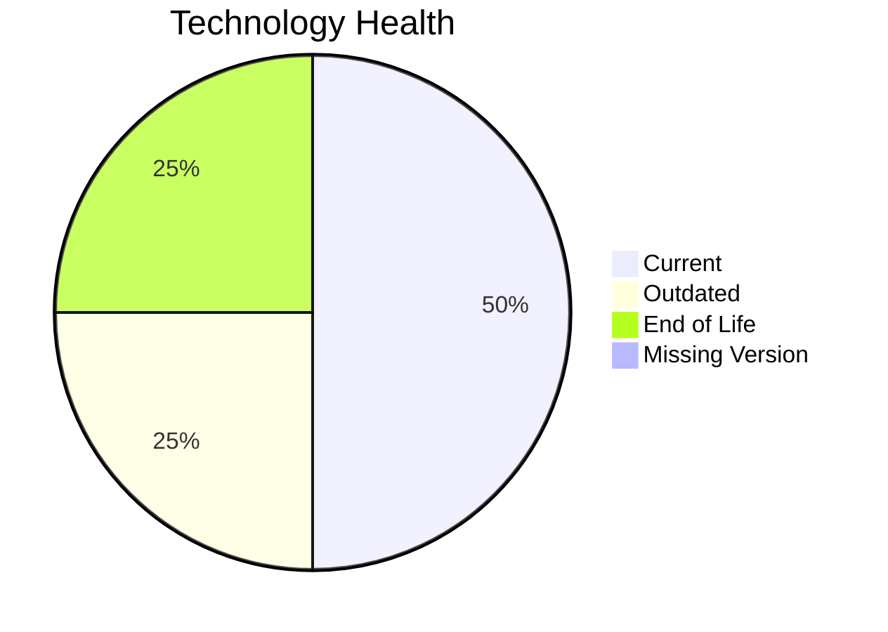

# Application Report: DocumentApp-014

**ID:** app014  
**Generated:** 2026-05-13

## Overview
| Attribute | Value |
|---|---|
| Owner | Operations |
| Environment | AWS |
| Business Criticality | Medium |
| Users | 890 |
| Servers | 2 |

## Technology Stack
| Component | Technology | Status |
|---|---|---|
| Operating System | Windows Server 2019 | 🟡 OUTDATED |
| Language | C# .NET 6 | 🔴 EOL |
| Application Server | Microsoft IIS 10.0 | 🟢 CURRENT_VERSION |
| Database | MySQL 8.0 | 🟢 CURRENT_VERSION |

## Complexity Assessment
**Score:** 6/10 — **MEDIUM**  
**Confidence:** Medium

## Modernization Scenarios
| Applicable Scenario | Priority | Cost | Savings/Year |
|---|---|---:|---:|
| Operating System Update | High | €1157 | €500 |
| Application Containerization | High | €115653 | €90000 |
| Application Refactoring and De-coupling | High | €289133 | €135000 |
| Update outdated components | High | €N/A | €N/A |

## Financial Summary
| Metric | Value |
|---|---:|
| Total One-Time Cost | €405943 |
| Total Yearly Savings | €225500 |
| Break-Even | 1.8 years |
