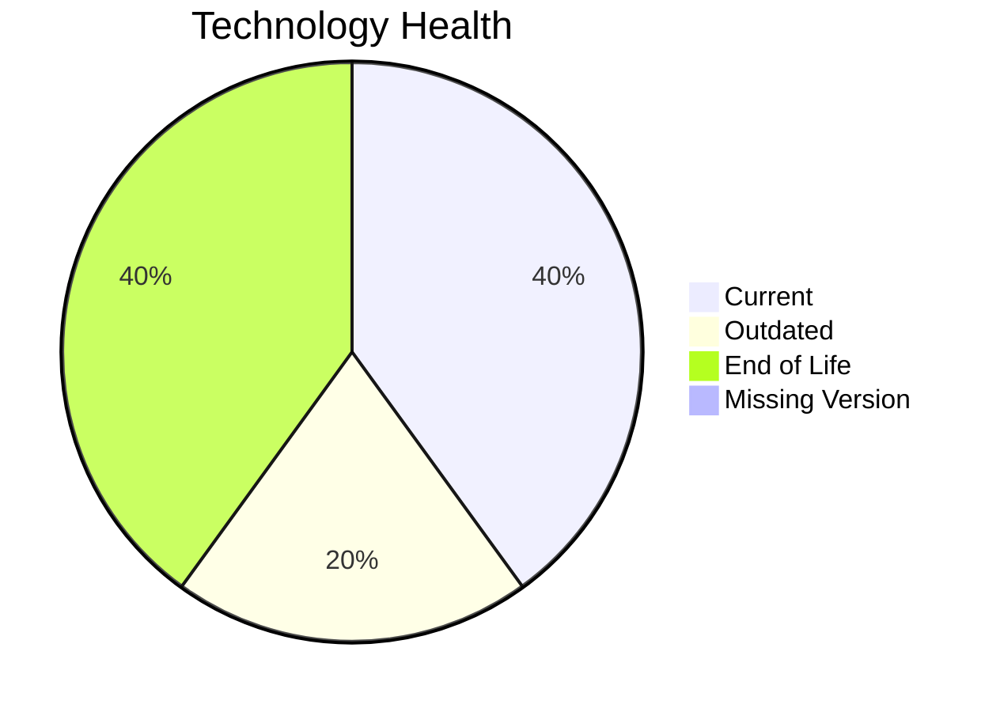

# Application Report: DocumentApp-014

Modernization assessment for DocumentApp-014 based solely on the Excel portfolio row and derived workflow outputs.

**ID:** app014  
**Generated:** 2026-05-07

## Overview

| Attribute | Value |
|-----------|-------|
| Owner | Operations |
| Environment | AWS |
| Business Criticality | Medium |
| Users | 890 |
| Servers | sv19, sv20 |

## Technology Stack

| Component | Technology | Version | Status |
|-----------|-----------|---------|--------|
| Operating System | Windows Server | 2019 | 🟢 |
| Database | MySQL | 8.0 | 🟡 |
| Language | .NET | 6 | 🔴 |
| Framework | .NET | 6 | 🔴 |
| App Server | Microsoft IIS | 10.0 | 🟢 |

## Complexity Assessment

**Score:** 7/10 — **HIGH**  
**Confidence:** 8

| Factor | Score | Notes |
|--------|-------|-------|
| Technology Age | 9/10 | 2 EOL, 1 outdated, 0 unknown lifecycle components. |
| Integration | 8/10 | 9 external interfaces and 18 API endpoints indicate the integration footprint. |
| Infrastructure | 5/10 | 2 listed server instances and 2 environments drive infrastructure coordination. |
| Business Criticality | 5/10 | Business criticality is Medium with approximately 890 users. |
| Architecture | 8/10 | 2-tier architecture still carries coupling risk; application is not containerized; application stack contains EOL runtime components |
| Data | 3/10 | database storage is 120 GB |

## Modernization Scenarios

### Applicable Scenarios

#### ✅ Application Containerization

- **Priority:** High
- **Effort:** High
- **Effects:** agility, cost, sustainability
- **Cost:** €133001 (one-time)
- **Savings:** €80000/year
- **Reasoning:** The application is not containerized and no hard blocker is visible in the input.

#### ✅ Application Refactoring and De-coupling

- **Priority:** High
- **Effort:** High
- **Effects:** agility, cost, sustainability
- **Cost:** €332502 (one-time)
- **Savings:** €120000/year
- **Reasoning:** Architecture and complexity indicators suggest a refactoring/de-coupling opportunity.

#### ✅ Upgrade Legacy Databases

- **Priority:** High
- **Effort:** Medium
- **Effects:** security, agility
- **Cost:** €13300 (one-time)
- **Savings:** €10000/year
- **Reasoning:** Database platform MySQL 8.0 is outdated.

#### ✅ Update outdated components

- **Priority:** High
- **Effort:** High
- **Effects:** security, agility, cost
- **Cost:** N/A (one-time)
- **Savings:** N/A/year
- **Reasoning:** At least one language/framework/application-server component is outdated or end of life.

### Not Applicable / Other

| Scenario | Status | Reason |
|----------|--------|--------|
| Operating System Update | FULFILLED | Operating system Windows Server 2019 is already on a supported version. |
| Switch to standard Linux Operating System | NOT_APPLICABLE | The application already runs on Windows; this Linux standardization scenario is not a natural fit. |
| Switch to ARM-based CPU | LACK_OF_DATA | CPU architecture is not present in the Excel input, so the primary ARM migration trigger cannot be confirmed. |
| Applications Server replacement | FULFILLED | Application server Microsoft IIS 10.0 is already current. |
| Application Migration to Cloud Infrastructure (Lift & Shift) | FULFILLED | The application is already hosted on AWS, which fulfills the lift-and-shift cloud target. |
| Switch DB Engine to open-source database solution | FULFILLED | Database engine MySQL 8.0 is already open-source aligned. |

## Financial Summary

| Metric | Value |
|--------|-------|
| Total One-Time Cost | €478803 |
| Total Yearly Savings | €210000 |
| Break-Even | 2.3 years |
