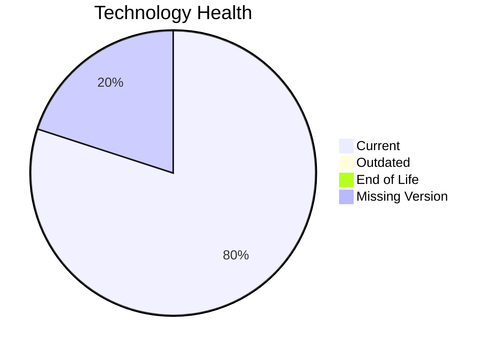

# Application Report: DocumentApp-014

**ID:** app014
**Generated:** 2026-05-14

## Overview

| Attribute | Value |
|-----------|-------|
| Owner | Operations |
| Environment | AWS |
| Business Criticality | Medium |
| Users | 890 |
| Servers | sv19, sv20 |

## Technology Stack

| Component | Technology | Status |
|-----------|-----------|--------|
| Operating System | Windows Server 2019 | �� |
| Database | MySQL 8.0 | 🟡 |
| Language | C# .NET 6 | 🟢 |

## Complexity Assessment

**Score:** 5/10 — **MEDIUM**

## Modernization Scenarios

### ✅ Switch To Arm Cpu
- **Reasoning:** Cloud-hosted workload with manageable complexity is a candidate for ARM.

### ✅ App Containerization
- **Reasoning:** Application is not containerized and can benefit from platform standardization.

### ✅ App Refactor Decoupling
- **Reasoning:** High coupling and/or monolithic architecture indicates refactor opportunity.

### ✅ Upgrade Legacy Databases
- **Reasoning:** Database platform is aging and should be upgraded.

### ✅ Serverless Db Migration
- **Reasoning:** API-intensive cloud workload can evaluate serverless DB patterns.

## Financial Summary

| Metric | Value |
|--------|-------|
| Total One-Time Cost | €372101 |
| Total Yearly Savings | €249900 |
| Break-Even | 1.5 years |
