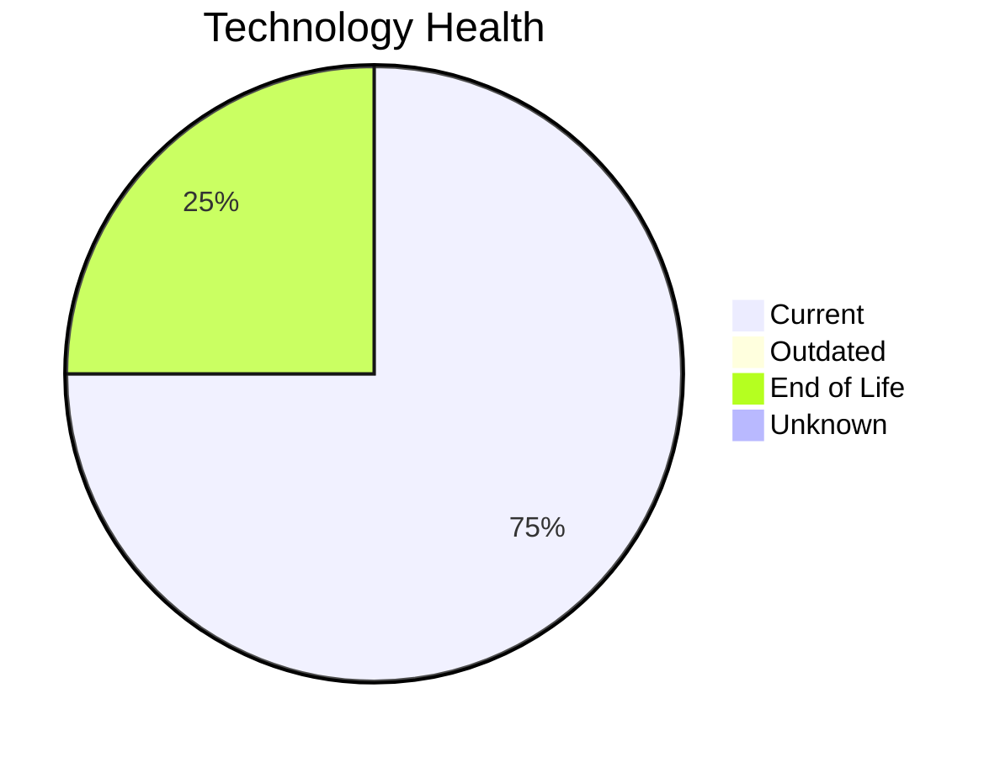

# Application Report: DocumentApp-014

**ID:** app014  
**Generated:** 2026-05-15

## Overview

| Attribute | Value |
|-----------|-------|
| Business Unit | Operations |
| Deployment | AWS |
| Business Criticality | Medium |
| Users | 890 |
| Solution Type | Open Source |
| Architecture | 2-Tier |
| Containerized | No |
| CI/CD | Yes |
| External Interfaces | 9 |

## Technology Stack

| Component | Technology | Status |
|-----------|-----------|--------|
| Operating System | Windows Server 2019 | 🟢 Current |
| Database | MySQL 8.0 | 🟢 Current |
| Language | C# .NET 6 | 🔴 EOL |
| App Server | Microsoft IIS 10.0 | 🟢 Current |

## Complexity Assessment

**Score:** 6/10 — **MEDIUM**  
**Confidence:** 8

| Factor | Score | Notes |
|--------|-------|-------|
| Technology Age | 6/10 | 1 EOL component(s) detected |
| Integration | 8/10 | 9 external interfaces, 0 dependencies — highly integrated |
| Infrastructure | 5/10 | 2 server instances, 2 environments |
| Business Criticality | 6/10 | Business criticality: medium, 890 users |
| Architecture | 6/10 | 2-tier architecture; not containerized; CI/CD present |
| Data | 3/10 | Standard data complexity |

## Modernization Scenarios

### Applicable Scenarios

#### ✅ Switch to ARM-based CPU

- **Priority:** Medium
- **Effort:** Medium
- **Effects:** cost, sustainability
- **One-time Cost:** €5,783
- **Yearly Savings:** €1,000/year
- **Reasoning:** Application is cloud-deployed. ARM-based cloud instances offer cost savings potential.

#### ✅ Application Containerization

- **Priority:** High
- **Effort:** High
- **Effects:** agility, cost, sustainability
- **One-time Cost:** €115,653
- **Yearly Savings:** €90,000/year
- **Reasoning:** Application is not containerized. Containerization would improve deployment consistency and scalability.

#### ✅ Update outdated components

- **Priority:** High
- **Effort:** High
- **Effects:** security, agility, cost
- **One-time Cost:** N/A
- **Yearly Savings:** N/A
- **Reasoning:** Component(s) detected as EOL. Targeted component updates recommended.

### Other Scenarios

| Scenario | Status | Reason |
|----------|--------|--------|
| Operating System Update | ✔️ Fulfilled | OS 'Windows Server 2019' is on a current, supported version with no end-of-life ... |
| Switch to standard Linux Operating System | ➖ N/A | Application runs on Windows (Windows Server 2019). Scenario excludes Windows-bas... |
| Applications Server replacement | ✔️ Fulfilled | Application server 'Microsoft IIS 10.0' is on a current, supported version. |
| Application Migration to Cloud Infrastructure (Lift & Shift) | ✔️ Fulfilled | Application is already deployed in the cloud. |
| Application Refactoring and De-coupling | ➖ N/A | Application architecture does not indicate a need for major refactoring. |
| Upgrade Legacy Databases | ✔️ Fulfilled | Database 'MySQL 8.0' is on a current, supported version. |
| Switch DB Engine to open-source database solution | ✔️ Fulfilled | Database 'MySQL 8.0' is already an open-source engine. |

## Business Case Summary

| Metric | Value |
|--------|-------|
| Total One-time Cost | €121,436 |
| Total Yearly Savings | €91,000 |
| ROI Break-even | 1.3 years |
