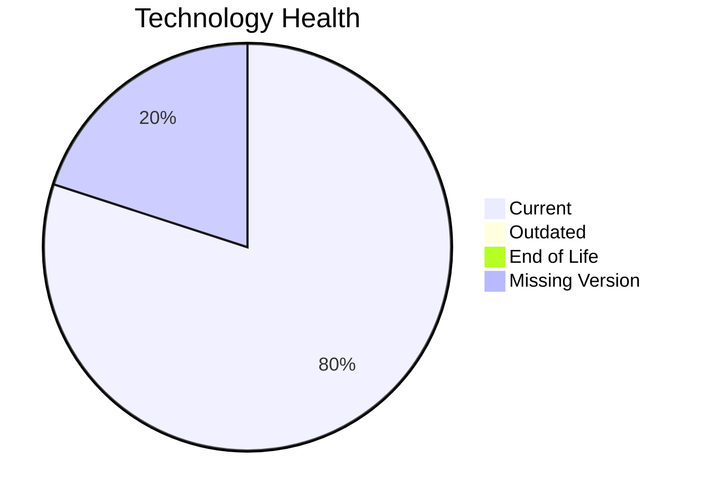

# Application Report: ReportingApp-015

**ID:** app015
**Generated:** 2026-05-14

## Overview

| Attribute | Value |
|-----------|-------|
| Owner | Finance |
| Environment | AWS |
| Business Criticality | Low |
| Users | 340 |
| Servers | sv21 |

## Technology Stack

| Component | Technology | Status |
|-----------|-----------|--------|
| Operating System | Windows Server 2019 | �� |
| Database | MongoDB | 🟢 |
| Language | PHP 8.1 | 🟢 |

## Complexity Assessment

**Score:** 4/10 — **MEDIUM**

## Modernization Scenarios

### ✅ Switch To Arm Cpu
- **Reasoning:** Cloud-hosted workload with manageable complexity is a candidate for ARM.

### ✅ App Containerization
- **Reasoning:** Application is not containerized and can benefit from platform standardization.

## Financial Summary

| Metric | Value |
|--------|-------|
| Total One-Time Cost | €91823 |
| Total Yearly Savings | €90900 |
| Break-Even | 1.0 years |
