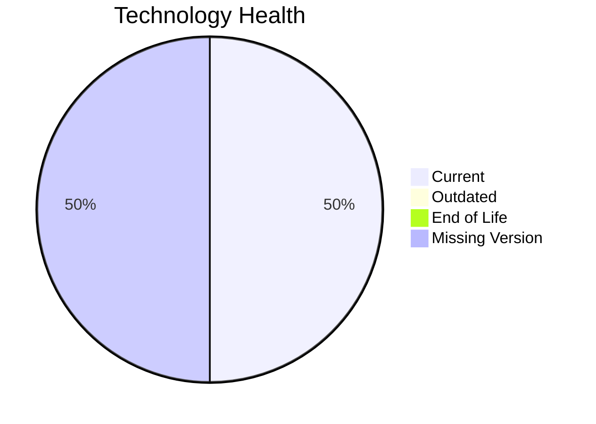

# Application Report: ReportingApp-015

**ID:** app015
**Generated:** 2026-04-24

## Overview

| Attribute | Value |
|-----------|-------|
| Owner | Finance |
| Business Unit | Finance |
| Deployment Type | AWS |
| Business Criticality | Low |
| Users | 340 |
| Servers | N/A |
| Architecture | 2-Tier |
| Solution Type | Custom made |
| CI/CD | Yes |
| Containerized | No |

## Technology Stack

| Component | Technology | Version | Status |
|-----------|-----------|---------|--------|
| Operating System | Windows Server 2019 | Windows Server 2019 | 🟢 CURRENT_VERSION |
| Language | PHP 8.1 | PHP 8.1 | 🟢 CURRENT_VERSION |
| Database | MongoDB | MongoDB | ⚪ NO_KNOWLEDGE |
| App Server | Microsoft IIS 10.0 | Microsoft IIS 10.0 | ⚪ NO_KNOWLEDGE |

## Complexity Assessment

**Score:** 4/10 — **MEDIUM**
**Confidence:** 7

**Reasoning:** Tech age score 5/10 (0 EOL, 0 outdated components). Integration score 5/10 (4 external interfaces). Infrastructure score 5/10 (1 servers, 4 environments). Business criticality score 2/10 (criticality: Low). Architecture score 5/10 (architecture: 2-Tier, containerized: No, CI/CD: Yes). Data score 4/10 (400GB storage).

### Contributing Factors

| Factor | Value |
|--------|-------|
| Servers | 1 |
| Environments | 4 |
| External Interfaces | 4 |
| EOL Technologies | 0 |
| Outdated Technologies | 0 |
| CI/CD | Yes |
| Containerized | No |

## Modernization Scenarios

### Applicable Scenarios

#### ✅ Application Containerization

- **Priority:** High
- **Effort:** High
- **Effects:** agility, cost, sustainability
- **Cost:** €87,450 (one-time)
- **Savings:** €90,000/year
- **Reasoning:** Custom/open-source application not yet containerized is a strong candidate for containerization.

#### ✅ Application Refactoring and De-coupling

- **Priority:** High
- **Effort:** High
- **Effects:** agility, cost, sustainability
- **Cost:** €218,626 (one-time)
- **Savings:** €135,000/year
- **Reasoning:** Custom application with '2-tier' architecture may benefit from refactoring for better agility.

#### ✅ Update outdated components

- **Priority:** High
- **Effort:** High
- **Effects:** security, agility, cost
- **Cost:** N/A (one-time)
- **Savings:** N/A
- **Reasoning:** Some components (lang: CURRENT_VERSION, OS: CURRENT_VERSION) need updates.

### Not Applicable / Other

| Scenario | Status | Reason |
|----------|--------|--------|
| Operating System Update | FULFILLED | Operating system 'Windows Server 2019' is currently supported and up to date.... |
| Switch to standard Linux Operating System | NOT_APPLICABLE | Exclusion criterion: Application runs on Windows-based OS.... |
| Switch to ARM-based CPU | BLOCKED | Legacy Windows OS is not ARM-compatible for server workloads.... |
| Applications Server replacement | LACK_OF_DATA | Lifecycle data for application server 'Microsoft IIS 10.0' is not available.... |
| Application Migration to Cloud Infrastructure (Lift & Shift) | FULFILLED | Application is already deployed on cloud: 'AWS'.... |
| Upgrade Legacy Databases | LACK_OF_DATA | Cannot determine lifecycle status of database 'MongoDB'.... |
| Switch DB Engine to open-source database solution | FULFILLED | Database 'MongoDB' is already an open-source solution.... |

## Financial Summary

| Metric | Value |
|--------|-------|
| Total One-Time Cost | €306,076 |
| Total Yearly Savings | €225,000 |
| Break-Even | 1.4 years |
