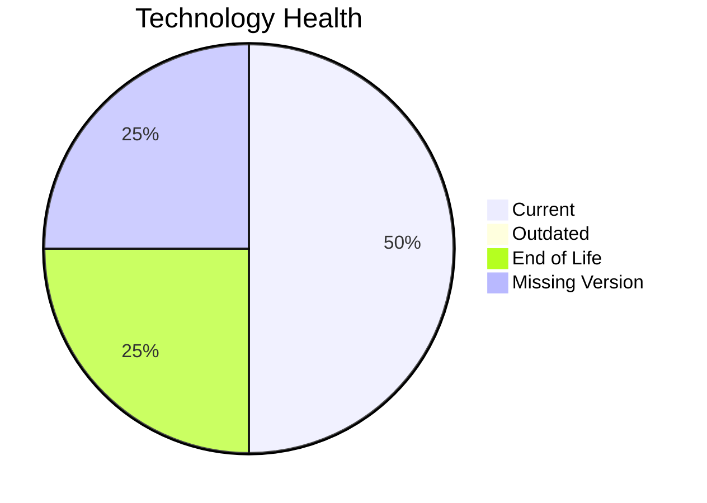

# Application Report: ReportingApp-015

Modernization assessment for ReportingApp-015 based solely on the Excel portfolio row and derived workflow outputs.

**ID:** app015  
**Generated:** 2026-05-07

## Overview

| Attribute | Value |
|-----------|-------|
| Owner | Finance |
| Environment | AWS |
| Business Criticality | Low |
| Users | 340 |
| Servers | sv21 |

## Technology Stack

| Component | Technology | Version | Status |
|-----------|-----------|---------|--------|
| Operating System | Windows Server | 2019 | 🟢 |
| Database | MongoDB | unknown | ⚪ |
| Language | PHP | 8.1 | 🔴 |
| Framework | N/A | N/A | ⚪ |
| App Server | Microsoft IIS | 10.0 | 🟢 |

## Complexity Assessment

**Score:** 6/10 — **MEDIUM**  
**Confidence:** 7

| Factor | Score | Notes |
|--------|-------|-------|
| Technology Age | 7/10 | 1 EOL, 0 outdated, 1 unknown lifecycle components. |
| Integration | 5/10 | 4 external interfaces and 6 API endpoints indicate the integration footprint. |
| Infrastructure | 5/10 | 1 listed server instances and 4 environments drive infrastructure coordination. |
| Business Criticality | 2/10 | Business criticality is Low with approximately 340 users. |
| Architecture | 8/10 | 2-tier architecture still carries coupling risk; application is not containerized; application stack contains EOL runtime components |
| Data | 5/10 | database storage is 400 GB; moderate database footprint |

## Modernization Scenarios

### Applicable Scenarios

#### ✅ Application Containerization

- **Priority:** High
- **Effort:** High
- **Effects:** agility, cost, sustainability
- **Cost:** €115653 (one-time)
- **Savings:** €90000/year
- **Reasoning:** The application is not containerized and no hard blocker is visible in the input.

#### ✅ Application Refactoring and De-coupling

- **Priority:** High
- **Effort:** High
- **Effects:** agility, cost, sustainability
- **Cost:** €289133 (one-time)
- **Savings:** €135000/year
- **Reasoning:** Architecture and complexity indicators suggest a refactoring/de-coupling opportunity.

#### ✅ Update outdated components

- **Priority:** High
- **Effort:** High
- **Effects:** security, agility, cost
- **Cost:** N/A (one-time)
- **Savings:** N/A/year
- **Reasoning:** At least one language/framework/application-server component is outdated or end of life.

### Not Applicable / Other

| Scenario | Status | Reason |
|----------|--------|--------|
| Operating System Update | FULFILLED | Operating system Windows Server 2019 is already on a supported version. |
| Switch to standard Linux Operating System | NOT_APPLICABLE | The application already runs on Windows; this Linux standardization scenario is not a natural fit. |
| Switch to ARM-based CPU | LACK_OF_DATA | CPU architecture is not present in the Excel input, so the primary ARM migration trigger cannot be confirmed. |
| Applications Server replacement | FULFILLED | Application server Microsoft IIS 10.0 is already current. |
| Application Migration to Cloud Infrastructure (Lift & Shift) | FULFILLED | The application is already hosted on AWS, which fulfills the lift-and-shift cloud target. |
| Upgrade Legacy Databases | LACK_OF_DATA | Database technology is known but its version support status is not. |
| Switch DB Engine to open-source database solution | FULFILLED | Database engine MongoDB is already open-source aligned. |

## Financial Summary

| Metric | Value |
|--------|-------|
| Total One-Time Cost | €404786 |
| Total Yearly Savings | €225000 |
| Break-Even | 1.8 years |
