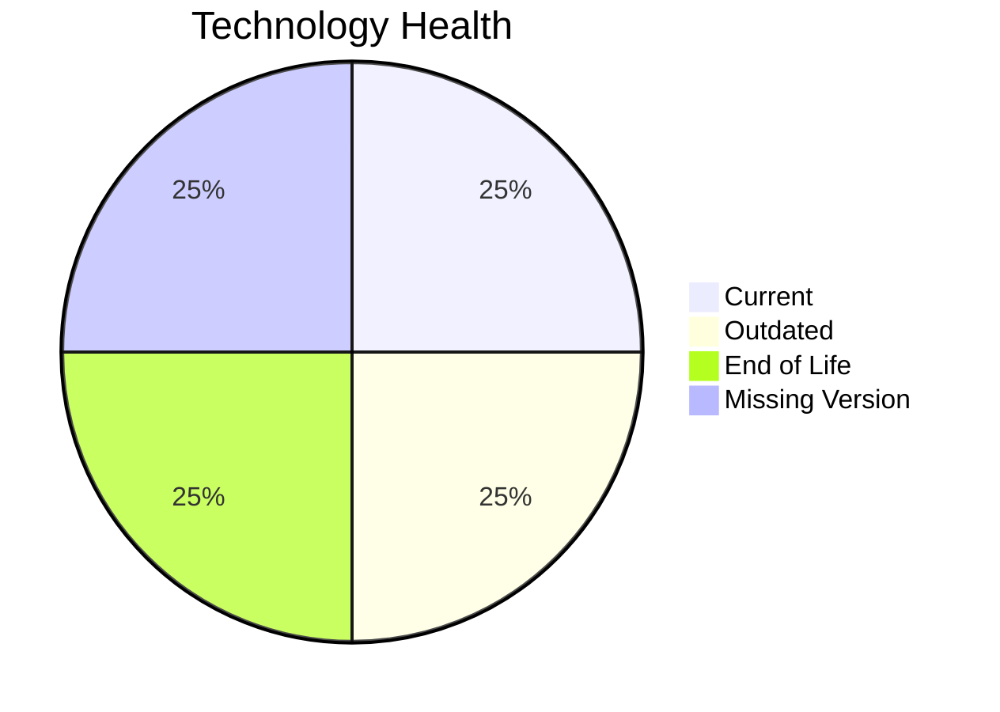

# Application Report: ReportingApp-015

**ID:** app015  
**Generated:** 2026-05-13

## Overview
| Attribute | Value |
|---|---|
| Owner | Finance |
| Environment | AWS |
| Business Criticality | Low |
| Users | 340 |
| Servers | 1 |

## Technology Stack
| Component | Technology | Status |
|---|---|---|
| Operating System | Windows Server 2019 | 🟡 OUTDATED |
| Language | PHP 8.1 | 🔴 EOL |
| Application Server | Microsoft IIS 10.0 | 🟢 CURRENT_VERSION |
| Database | MongoDB | ⚪ NO_KNOWLEDGE |

## Complexity Assessment
**Score:** 5/10 — **MEDIUM**  
**Confidence:** Medium

## Modernization Scenarios
| Applicable Scenario | Priority | Cost | Savings/Year |
|---|---|---:|---:|
| Operating System Update | High | €1006 | €500 |
| Application Containerization | High | €100568 | €90000 |
| Application Refactoring and De-coupling | High | €251420 | €135000 |
| Update outdated components | High | €N/A | €N/A |

## Financial Summary
| Metric | Value |
|---|---:|
| Total One-Time Cost | €352994 |
| Total Yearly Savings | €225500 |
| Break-Even | 1.6 years |
