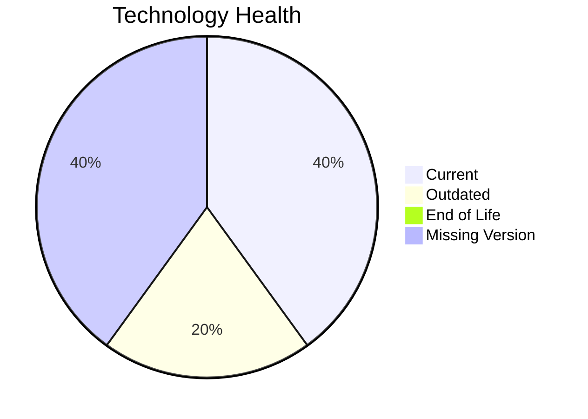

# Application Report: ReportingApp-015

**ID:** app015  
**Generated:** 2026-05-17

## Overview

| Attribute | Value |
|-----------|-------|
| Owner | unknown |
| Environment | AWS |
| Business Criticality | Low |
| Users | 340 |
| Servers | sv21 |

## Technology Stack

| Component | Technology | Version | Status |
|-----------|-----------|---------|--------|
| Operating System | Windows Server 2019 | 2019 | 🟡 OUTDATED |
| Database | MongoDB | N/A | ⚪ NO_KNOWLEDGE |
| Language | PHP 8.1 | 8.1 | 🟢 CURRENT_VERSION |
| Framework | Unknown Framework | N/A | ⚪ NO_KNOWLEDGE |
| App Server | Microsoft IIS 10.0 | 10.0 | 🟢 CURRENT_VERSION |

## Complexity Assessment

**Score:** 4/10 — **MEDIUM**  
**Confidence:** 8

Tech age 4/10 (EOL=0, outdated=1, unknown=2); integration 5/10 (4 interfaces); infrastructure 5/10 (1 servers, 4 envs); criticality 3/10 (Low); architecture 6/10 (arch=2-Tier, containerized=No, ci/cd=Yes); data 3/10 (1 DB(s), storage≈400GB).

## Modernization Scenarios

### Applicable Scenarios

#### ✅ Operating System Update
- **Priority:** High
- **Effort:** Low
- **Effects:** security
- **Cost:** €875 (one-time)
- **Savings:** €500/year
- **Reasoning:** Operating system is outdated/EOL in technology assessment.

#### ✅ Switch to ARM-based CPU
- **Priority:** Medium
- **Effort:** Medium
- **Effects:** cost, sustainability
- **Cost:** €4373 (one-time)
- **Savings:** €1000/year
- **Reasoning:** No explicit blockers; likely x86/x64 default estate with modernization potential.

#### ✅ Application Containerization
- **Priority:** High
- **Effort:** High
- **Effects:** agility, cost, sustainability
- **Cost:** €87450 (one-time)
- **Savings:** €90000/year
- **Reasoning:** Traditional deployment without containers on supported OS baseline.

#### ✅ Update outdated components
- **Priority:** High
- **Effort:** High
- **Effects:** security, agility, cost
- **Cost:** €N/A (one-time)
- **Savings:** €N/A/year
- **Reasoning:** Technology assessment found outdated/EOL components.

### Not Applicable / Other

| Scenario | Status | Reason |
|----------|--------|--------|
| Switch to standard Linux Operating System | NOT_APPLICABLE | Windows-based OS excluded from Linux standardization scenario. |
| Applications Server replacement | PARTIALLY_FULFILLED | Server is supported but may still benefit from modernization. |
| Application Migration to Cloud Infrastructure (Lift & Shift) | FULFILLED | Application already deployed on public cloud. |
| Application Refactoring and De-coupling | PARTIALLY_FULFILLED | Moderate complexity with selective decoupling opportunities. |
| Upgrade Legacy Databases | LACK_OF_DATA | Database version/support data missing. |
| Switch DB Engine to open-source database solution | NOT_APPLICABLE | Database engine already open-source or open-source based. |

## Financial Summary

| Metric | Value |
|--------|-------|
| Total One-Time Cost | €92698 |
| Total Yearly Savings | €91500 |
| Break-Even | 1.0 years |
