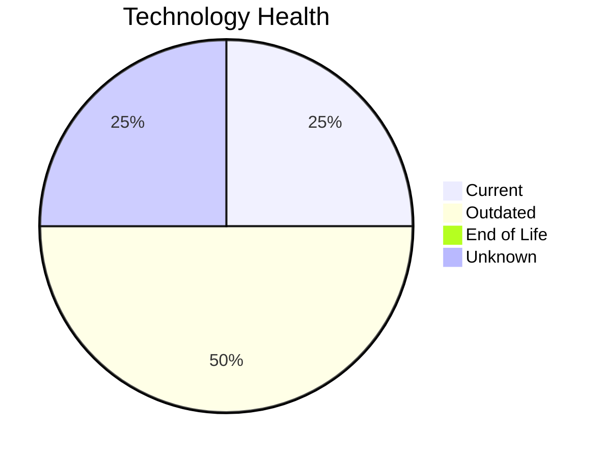

# Application Report: ReportingApp-015

**ID:** app015
**Generated:** 2026-05-14

## Overview

| Attribute | Value |
|-----------|-------|
| Owner | Finance |
| Environment | AWS |
| Business Criticality | Low |
| Users | 340 |
| Servers | 1 |
| Solution Type | Custom made |
| Architecture | 2-Tier |
| Containerized | No |
| CI/CD | Yes |

## Technology Stack

| Component | Technology | Version | Status |
|-----------|-----------|---------|--------|
| Os | Windows Server 2019 | Server 2019 | 🟡 OUTDATED |
| Database | MongoDB |  | ⚪ NO_KNOWLEDGE |
| Programming Language | PHP 8.1 | 8.1 | 🟡 OUTDATED |
| Application Server | Microsoft IIS 10.0 | IIS 10.0 | 🟢 CURRENT_VERSION |

## Complexity Assessment

**Score:** 5/10 — **MEDIUM**
**Confidence:** 8/10

| Factor | Score | Notes |
|--------|-------|-------|
| Technology Age | 6/10 | 0 EOL, 2 outdated components |
| Integration | 5/10 | 4 external interfaces |
| Infrastructure | 6/10 | 1 server(s), 4 environment(s) |
| Business Criticality | 2/10 | Low criticality |
| Architecture | 3/10 | Containerized: No, CI/CD: Yes |
| Data | 5/10 | DB: MongoDB |

## Modernization Scenarios

### Applicable Scenarios

#### ✅ Operating System Update

- **Priority:** High
- **Effort:** Low
- **Effects:** security
- **Cost:** €1,006 (one-time)
- **Savings:** €500/year
- **Reasoning:** Operating system Windows Server 2019 is outdated (past mainstream support) and requires update.

#### ✅ Application Refactoring and De-coupling

- **Priority:** High
- **Effort:** High
- **Effects:** agility, cost, sustainability
- **Cost:** €251,420 (one-time)
- **Savings:** €135,000/year
- **Reasoning:** Application has 2-Tier architecture which may have coupling between layers. Refactoring to modular/microservices architecture would improve agility.

#### ✅ Update outdated components

- **Priority:** High
- **Effort:** High
- **Effects:** security, agility, cost
- **Cost:** N/A (one-time)
- **Savings:** N/A/year
- **Reasoning:** Application has outdated components: programming language PHP 8.1 is outdated. Update recommended.

### Not Applicable / Other

| Scenario | Status | Reason |
|----------|--------|--------|
| Switch to standard Linux Operating System | ❌ NOT_APPLICABLE | Application runs on Windows OS. Switching to Linux would require significant re-platforming; not app... |
| Switch to ARM-based CPU | 🚫 BLOCKED | Application runs on Windows Server which has legacy dependencies incompatible with ARM CPU migration... |
| Applications Server replacement | ✔️ FULFILLED | Application server Microsoft IIS 10.0 is on a current, supported version. No replacement needed. |
| Application Migration to Cloud Infrastructure (Lift & Shift) | ✔️ FULFILLED | Application is already deployed on cloud infrastructure (AWS). No migration needed. |
| Application Containerization | ⚠️ PARTIALLY_FULFILLED | Application runs on Windows Server with potentially pre-.NET 6 stack. Containerization may be limite... |
| Upgrade Legacy Databases | ❓ LACK_OF_DATA | Cannot assess database lifecycle status for MongoDB without version information. |
| Switch DB Engine to open-source database solution | ✔️ FULFILLED | Database MongoDB is already an open-source or managed solution. No commercial license migration need... |

## Financial Summary

| Metric | Value |
|--------|-------|
| Total One-Time Cost | €252,426 |
| Total Yearly Savings | €135,500 |
| Break-Even | 1.9 years |
