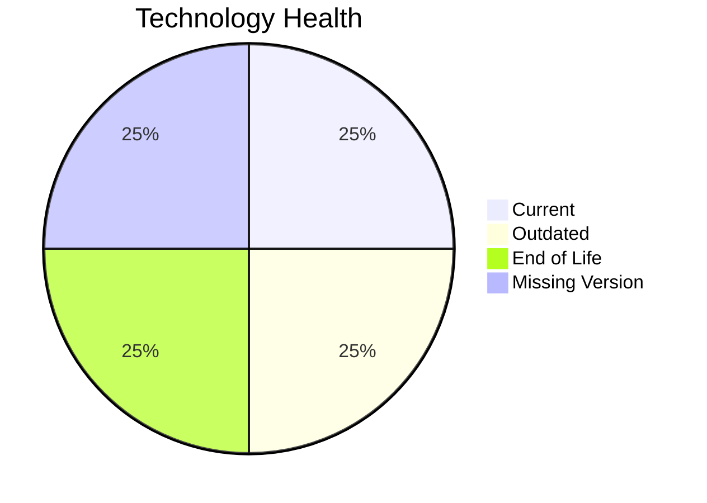

# Application Report: ReportingApp-015

**ID:** app015
**Generated:** 2026-05-18T00:00:00Z

## Overview

| Attribute | Value |
|-----------|-------|
| Owner | Finance |
| Environment | AWS |
| Business Criticality | Low |
| Users | 340 |
| Servers | 1 |

## Technology Stack

| Component | Technology | Version | Status |
|-----------|-----------|---------|--------|
| Operating System | Windows Server | 2019 | 🟡 OUTDATED |
| Database | MongoDB | unknown | ⚪ NO_KNOWLEDGE |
| Language | PHP | 8.1 | 🔴 EOL |
| Framework | N/A | N/A | ⚪ N/A |
| App Server | Microsoft IIS | 10.0 | 🟢 CURRENT_VERSION |

## Complexity Assessment

**Score:** 6/10 — **MEDIUM**
**Confidence:** 8

| Factor | Score | Notes |
|--------|-------|-------|
| Technology Age | 7/10 | 1 component(s) are EOL. |
| Integration | 5/10 | 4 external interfaces and 6 API endpoints. |
| Infrastructure | 8/10 | 1 server instance(s) across 4 environment(s). |
| Business Criticality | 2/10 | Criticality is Low with 340 users. |
| Architecture | 5/10 | Architecture is 2-Tier; containerized=No; CI/CD=Yes. |
| Data | 5/10 | Database storage is 400 GB on MongoDB.  |

## Modernization Scenarios

### Applicable Scenarios

#### ✅ Operating System Update

- **Priority:** High
- **Effort:** Low
- **Effects:** security
- **Cost:** €1,157 (one-time)
- **Savings:** €500/year
- **Reasoning:** Windows Server 2019 is assessed as OUTDATED.

#### ✅ Update outdated components

- **Priority:** High
- **Effort:** High
- **Effects:** security, agility, cost
- **Cost:** €N/A (one-time)
- **Savings:** €N/A/year
- **Reasoning:** At least one application runtime component is outdated or end of life.

### Not Applicable / Other

| Scenario | Status | Reason |
|----------|--------|--------|
| Switch to standard Linux Operating System | NOT_APPLICABLE | The application already runs on Windows Server, so this Linux migration scenario is not a natural fit. |
| Switch to ARM-based CPU | BLOCKED | The current OS/platform choice is a blocker for an ARM move in the scenario definition. |
| Applications Server replacement | FULFILLED | Microsoft IIS 10.0 is already on a current supported release family. |
| Application Migration to Cloud Infrastructure (Lift & Shift) | FULFILLED | The deployment target is already a public cloud platform (AWS). |
| Application Containerization | BLOCKED | The application runs on Windows without evidence of .NET 6+ runtime support. |
| Application Refactoring and De-coupling | NOT_APPLICABLE | The workbook does not show strong evidence of monolithic or tightly coupled design that would justify refactoring first. |
| Upgrade Legacy Databases | LACK_OF_DATA | MongoDB is assessed as NO_KNOWLEDGE. |
| Switch DB Engine to open-source database solution | FULFILLED | MongoDB is already an open-source or open-source-compatible database option. |

## Financial Summary

| Metric | Value |
|--------|-------|
| Total One-Time Cost | €1,157 |
| Total Yearly Savings | €500 |
| Break-Even | 2.3 years |
