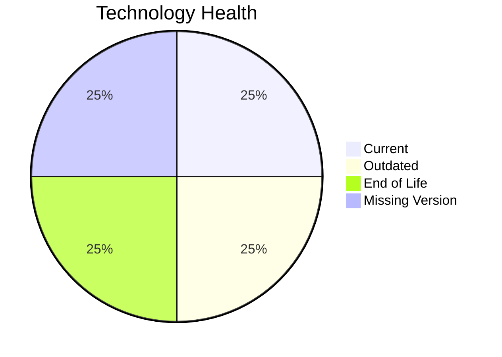

# Application Report: ReportingApp-015

**ID:** app015
**Generated:** 2026-05-11

## Overview

| Attribute | Value |
|-----------|-------|
| Owner | Finance |
| Environment | AWS |
| Business Criticality | Low |
| Users | 340 |
| Servers | 1 |

## Technology Stack

| Component | Technology | Version | Status |
|-----------|-----------|---------|--------|
| Operating System | Windows Server | Windows Server 2019 | 🟡 OUTDATED |
| Database | MongoDB | MongoDB | ⚪ NO_KNOWLEDGE |
| Language | PHP | PHP 8.1 | 🔴 EOL |
| Framework | N/A | N/A | ⚪ |
| App Server | Microsoft IIS | Microsoft IIS 10.0 | 🟢 CURRENT_VERSION |

## Complexity Assessment

**Score:** 5/10 — **MEDIUM**
**Confidence:** 7

Technology age score 8/10 (EOL=1, outdated=1, unknown=1); integration score 5/10 (interfaces=4, api_endpoints=6); infrastructure score 5/10 (servers=1, environments=4); business criticality score 2/10 (Low, users=340); architecture score 5/10 (architecture=2-Tier, CI/CD=Yes, containerized=No); data score 5/10 (db_count=1, db_storage_gb=400).

## Modernization Scenarios

### Applicable Scenarios

#### ✅ Operating System Update

- **Priority:** High
- **Effort:** Low
- **Effects:** security
- **Cost:** €1006 (one-time)
- **Savings:** €500/year
- **Reasoning:** Operating system is outdated or end-of-life per technology assessment.

#### ✅ Update outdated components

- **Priority:** High
- **Effort:** High
- **Effects:** security, agility, cost
- **Cost:** N/A
- **Savings:** N/A
- **Reasoning:** Language/framework/server components are outdated or end-of-life.

### Not Applicable / Other

| Scenario | Status | Reason |
|----------|--------|--------|
| Switch to standard Linux Operating System | NOT_APPLICABLE | Scenario excludes Windows-based operating systems. |
| Switch to ARM-based CPU | LACK_OF_DATA | CPU architecture (x86/x64/ARM) is not provided in source data. |
| Applications Server replacement | FULFILLED | Application server is already on a supported version. |
| Application Migration to Cloud Infrastructure (Lift & Shift) | FULFILLED | Application is already hosted on public cloud infrastructure. |
| Application Containerization | LACK_OF_DATA | Containerization prerequisites are unclear from source data. |
| Application Refactoring and De-coupling | PARTIALLY_FULFILLED | Some modularity exists, but additional decoupling opportunities remain. |
| Upgrade Legacy Databases | LACK_OF_DATA | Database version/support information is incomplete. |
| Switch DB Engine to open-source database solution | LACK_OF_DATA | Database engine details are insufficient for open-source migration assessment. |

## Financial Summary

| Metric | Value |
|--------|-------|
| Total One-Time Cost | €1006 |
| Total Yearly Savings | €500 |
| Break-Even | 2.0 years |
