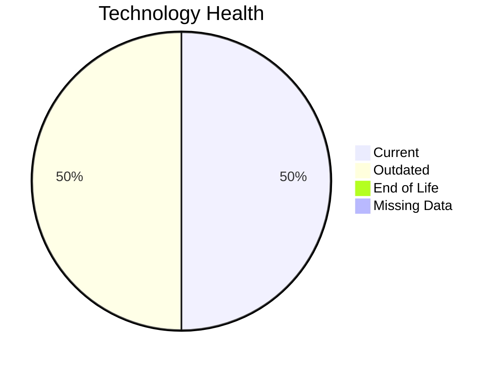

# Application Report: ReportingApp-015

**ID:** app015  
**Generated:** 2026-05-07

## Overview

| Attribute | Value |
|-----------|-------|
| Business Unit | Finance |
| Deployment Type | AWS |
| Business Criticality | Low |
| Users | 340 |
| Servers | N/A |
| Solution Type | Custom made |

**Description:** Financial reporting tool for generating executive dashboards and regulatory compliance reports

## Technology Stack

| Component | Technology | Status |
|-----------|-----------|--------|
| Os | Windows Server 2019 | 🟢 CURRENT_VERSION |
| Database | MongoDB None | 🟡 OUTDATED |
| Language | PHP 8.1 | 🟢 CURRENT_VERSION |
| App_Server | Microsoft IIS 10.0 | 🟡 OUTDATED |

## Complexity Assessment

**Score:** 4/10 — **MEDIUM**  
**Confidence:** 9/10

**Reasoning:** Technology age: 6/10 (0 EOL, 2 outdated components) | Integration: 5/10 (4 external interfaces) | Infrastructure: 4/10 (1 servers, 4 environments) | Criticality: 2/10 (low) | Architecture: 4/10 (containerized: no, CI/CD: yes) | Data: 4/10 (400 GB storage)

### Contributing Factors

| Factor | Value |
|--------|-------|
| Servers | 1 |
| Databases | 1 |
| Environments | 4 |
| Interfaces | 4 |
| EOL Technologies | 0 |
| Outdated Technologies | 2 |
| Containerized | No |
| CI/CD Present | Yes |

## Modernization Scenarios

### Applicable Scenarios

#### ✅ Switch to standard Linux Operating System

- **Priority:** Medium
- **Effort:** Medium
- **Effects:** agility, security, cost
- **Cost:** $262.35 (one-time)
- **Savings:** $400.00/year
- **Reasoning:** Triggered by: Operating System lacks container support. Supporting conditions: Application is a custom developed Application

#### ✅ Applications Server replacement

- **Priority:** Medium
- **Effort:** Medium
- **Effects:** agility, cost
- **Cost:** $8,745.03 (one-time)
- **Savings:** $10,800.00/year
- **Reasoning:** Triggered by: Application Server lacks container support. Supporting conditions: Application is a custom developed Application

#### ✅ Upgrade Legacy Databases

- **Priority:** High
- **Effort:** Medium
- **Effects:** security, agility
- **Cost:** $8,745.03 (one-time)
- **Savings:** $10,000.00/year
- **Reasoning:** Triggered by: Database Support is End of Life / Outdated. Supporting conditions: Application is a custom developed application

#### ✅ Update outdated components

- **Priority:** High
- **Effort:** High
- **Effects:** security, agility, cost
- **Cost:** $0.00 (one-time)
- **Savings:** $0.00/year
- **Reasoning:** Triggered by: Used Application Server is legacy or outdated (e.g. Weblogic 10.x, Websphere 7.x, JBoss EAP 5.x, Tomcat 6.x, IIS 6.x). Supporting conditions: Application is a custom developed application

### Other Scenarios

| Scenario | Status | Reason |
|----------|--------|--------|
| Operating System Update | ✔️ FULFILLED | Fulfilled: Operating system is on a current, supported version with no end-of-li... |
| Switch to ARM-based CPU | ❌ NOT_APPLICABLE | No primary triggers matched for this application. |
| Application Migration to Cloud Infrastructure (Lift & Shift) | ✔️ FULFILLED | Fulfilled: Application is already hosted on a Public Cloud provider |
| Application Containerization | ❌ NOT_APPLICABLE | No primary triggers matched for this application. |
| Application Refactoring and De-coupling | ❌ NOT_APPLICABLE | No primary triggers matched for this application. |
| Switch DB Engine to open-source database solution | ✔️ FULFILLED | Fulfilled: Database engine is already an open-source alternative with no commerc... |

## Financial Summary

| Metric | Value |
|--------|-------|
| Total One-Time Cost | $17,752.41 |
| Total Yearly Savings | $21,200.00 |
| Break-Even | 0.84 years |

---

*This report was automatically generated from application portfolio analysis.*
