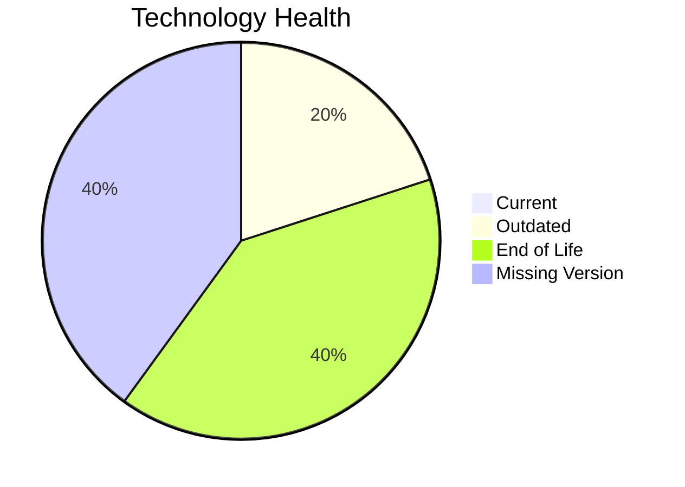

# Application Report: MobileApp-016

**ID:** app016
**Generated:** 2026-05-11

## Overview

| Attribute | Value |
|-----------|-------|
| Owner | Operations |
| Environment | AWS |
| Business Criticality | Medium |
| Users | 1580 |
| Servers | 2 |

## Technology Stack

| Component | Technology | Version | Status |
|-----------|-----------|---------|--------|
| Operating System | RHEL | RHEL 7 | 🔴 EOL |
| Database | SQL Server | SQL Server 2019 | 🟡 OUTDATED |
| Language | React Native | React Native | ⚪ NO_KNOWLEDGE |
| Framework | React Native | React Native | ⚪ NO_KNOWLEDGE |
| App Server | Payara | Payara 4.0 | 🔴 EOL |

## Complexity Assessment

**Score:** 7/10 — **HIGH**
**Confidence:** 7

Technology age score 9/10 (EOL=2, outdated=1, unknown=2); integration score 8/10 (interfaces=10, api_endpoints=30); infrastructure score 5/10 (servers=2, environments=3); business criticality score 6/10 (Medium, users=1580); architecture score 3/10 (architecture=3-Tier, CI/CD=Yes, containerized=Yes); data score 7/10 (db_count=1, db_storage_gb=2000).

## Modernization Scenarios

### Applicable Scenarios

#### ✅ Operating System Update

- **Priority:** High
- **Effort:** Low
- **Effects:** security
- **Cost:** €1330 (one-time)
- **Savings:** €500/year
- **Reasoning:** Operating system is outdated or end-of-life per technology assessment.

#### ✅ Applications Server replacement

- **Priority:** Medium
- **Effort:** Medium
- **Effects:** agility, cost
- **Cost:** €13300 (one-time)
- **Savings:** €9600/year
- **Reasoning:** Application server version is legacy or unsupported.

#### ✅ Application Refactoring and De-coupling

- **Priority:** High
- **Effort:** High
- **Effects:** agility, cost, sustainability
- **Cost:** €332502 (one-time)
- **Savings:** €120000/year
- **Reasoning:** Architecture and integration profile indicate decoupling/refactoring opportunity.

#### ✅ Upgrade Legacy Databases

- **Priority:** High
- **Effort:** Medium
- **Effects:** security, agility
- **Cost:** €13300 (one-time)
- **Savings:** €10000/year
- **Reasoning:** Database engine is outdated or end-of-life.

#### ✅ Switch DB Engine to open-source database solution

- **Priority:** High
- **Effort:** Medium
- **Effects:** cost
- **Cost:** N/A
- **Savings:** N/A
- **Reasoning:** Proprietary database engine creates open-source migration opportunity.

#### ✅ Update outdated components

- **Priority:** High
- **Effort:** High
- **Effects:** security, agility, cost
- **Cost:** N/A
- **Savings:** N/A
- **Reasoning:** Language/framework/server components are outdated or end-of-life.

### Not Applicable / Other

| Scenario | Status | Reason |
|----------|--------|--------|
| Switch to standard Linux Operating System | FULFILLED | Application already runs on a standard Linux distribution. |
| Switch to ARM-based CPU | LACK_OF_DATA | CPU architecture (x86/x64/ARM) is not provided in source data. |
| Application Migration to Cloud Infrastructure (Lift & Shift) | FULFILLED | Application is already hosted on public cloud infrastructure. |
| Application Containerization | FULFILLED | Application is already containerized. |

## Financial Summary

| Metric | Value |
|--------|-------|
| Total One-Time Cost | €360432 |
| Total Yearly Savings | €140100 |
| Break-Even | 2.6 years |
