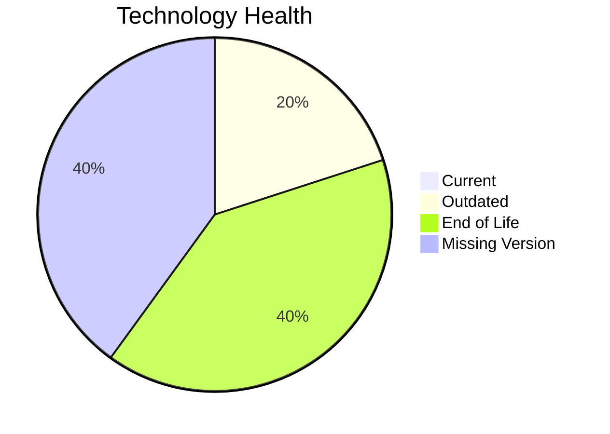

# Application Report: MobileApp-016

Modernization assessment for MobileApp-016 based solely on the Excel portfolio row and derived workflow outputs.

**ID:** app016  
**Generated:** 2026-05-07

## Overview

| Attribute | Value |
|-----------|-------|
| Owner | Operations |
| Environment | AWS |
| Business Criticality | Medium |
| Users | 1580 |
| Servers | sv22, sv23 |

## Technology Stack

| Component | Technology | Version | Status |
|-----------|-----------|---------|--------|
| Operating System | RHEL | 7 | 🔴 |
| Database | SQL Server | 2019 | 🟡 |
| Language | React Native | unknown | ⚪ |
| Framework | React Native | unknown | ⚪ |
| App Server | Payara | 4.0 | 🔴 |

## Complexity Assessment

**Score:** 8/10 — **HIGH**  
**Confidence:** 7

| Factor | Score | Notes |
|--------|-------|-------|
| Technology Age | 9/10 | 2 EOL, 1 outdated, 2 unknown lifecycle components. |
| Integration | 8/10 | 10 external interfaces and 30 API endpoints indicate the integration footprint. |
| Infrastructure | 5/10 | 2 listed server instances and 3 environments drive infrastructure coordination. |
| Business Criticality | 7/10 | Business criticality is Medium with approximately 1580 users. |
| Architecture | 8/10 | 3-tier architecture is more modular than 1-tier or 2-tier; application stack contains EOL runtime components |
| Data | 7/10 | database storage is 2000 GB; large database footprint; proprietary or enterprise database migration complexity |

## Modernization Scenarios

### Applicable Scenarios

#### ✅ Operating System Update

- **Priority:** High
- **Effort:** Low
- **Effects:** security
- **Cost:** €1530 (one-time)
- **Savings:** €500/year
- **Reasoning:** Operating system RHEL 7 is eol and matches the OS update trigger.

#### ✅ Applications Server replacement

- **Priority:** Medium
- **Effort:** Medium
- **Effects:** agility, cost
- **Cost:** €15295 (one-time)
- **Savings:** €9600/year
- **Reasoning:** Application server Payara 4.0 is eol.

#### ✅ Upgrade Legacy Databases

- **Priority:** High
- **Effort:** Medium
- **Effects:** security, agility
- **Cost:** €15295 (one-time)
- **Savings:** €10000/year
- **Reasoning:** Database platform SQL Server 2019 is outdated.

#### ✅ Switch DB Engine to open-source database solution

- **Priority:** High
- **Effort:** Medium
- **Effects:** cost
- **Cost:** N/A (one-time)
- **Savings:** N/A/year
- **Reasoning:** Database engine SQL Server 2019 is proprietary and matches the open-source migration trigger.

#### ✅ Update outdated components

- **Priority:** High
- **Effort:** High
- **Effects:** security, agility, cost
- **Cost:** N/A (one-time)
- **Savings:** N/A/year
- **Reasoning:** At least one language/framework/application-server component is outdated or end of life.

### Not Applicable / Other

| Scenario | Status | Reason |
|----------|--------|--------|
| Switch to standard Linux Operating System | PARTIALLY_FULFILLED | The application already runs on Linux, but the distribution/version is not current and still needs standardization or upgrade. |
| Switch to ARM-based CPU | LACK_OF_DATA | CPU architecture is not present in the Excel input, so the primary ARM migration trigger cannot be confirmed. |
| Application Migration to Cloud Infrastructure (Lift & Shift) | FULFILLED | The application is already hosted on AWS, which fulfills the lift-and-shift cloud target. |
| Application Containerization | FULFILLED | The application is already containerized. |
| Application Refactoring and De-coupling | PARTIALLY_FULFILLED | The application already shows some modular traits, but the source does not prove a fully decoupled architecture. |

## Financial Summary

| Metric | Value |
|--------|-------|
| Total One-Time Cost | €32120 |
| Total Yearly Savings | €20100 |
| Break-Even | 1.6 years |
