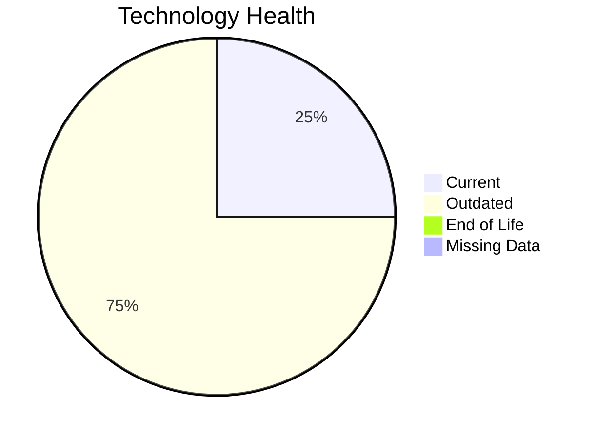

# Application Report: MobileApp-016

**ID:** app016  
**Generated:** 2026-05-07

## Overview

| Attribute | Value |
|-----------|-------|
| Business Unit | Operations |
| Deployment Type | AWS |
| Business Criticality | Medium |
| Users | 1580 |
| Servers | 2 |
| Solution Type | Custom made |

**Description:** Mobile application for drivers and customers to track shipments and manage delivery operations

## Technology Stack

| Component | Technology | Status |
|-----------|-----------|--------|
| Os | RHEL 7 | 🟡 OUTDATED |
| Database | SQL Server 2019 | 🟢 CURRENT_VERSION |
| Language | React Native None | 🟡 OUTDATED |
| App_Server | Payara 4.0 | 🟡 OUTDATED |

## Complexity Assessment

**Score:** 6/10 — **MEDIUM**  
**Confidence:** 9/10

**Reasoning:** Technology age: 6/10 (0 EOL, 3 outdated components) | Integration: 10/10 (10 external interfaces) | Infrastructure: 4/10 (2 servers, 3 environments) | Criticality: 5/10 (medium) | Architecture: 2/10 (containerized: yes, CI/CD: yes) | Data: 6/10 (2000 GB storage)

### Contributing Factors

| Factor | Value |
|--------|-------|
| Servers | 2 |
| Databases | 1 |
| Environments | 3 |
| Interfaces | 10 |
| EOL Technologies | 0 |
| Outdated Technologies | 3 |
| Containerized | Yes |
| CI/CD Present | Yes |

## Modernization Scenarios

### Applicable Scenarios

#### ✅ Operating System Update

- **Priority:** High
- **Effort:** Low
- **Effects:** security
- **Cost:** $1,156.53 (one-time)
- **Savings:** $500.00/year
- **Reasoning:** Triggered by: Operating System Version is Outdated, Operating System Version is Unsupported

#### ✅ Application Refactoring and De-coupling

- **Priority:** High
- **Effort:** High
- **Effects:** agility, cost, sustainability
- **Cost:** $289,132.60 (one-time)
- **Savings:** $135,000.00/year
- **Reasoning:** Triggered by: Architecture is Tightly Coupled. Supporting conditions: Application is a custom developed application

#### ✅ Update outdated components

- **Priority:** High
- **Effort:** High
- **Effects:** security, agility, cost
- **Cost:** $0.00 (one-time)
- **Savings:** $0.00/year
- **Reasoning:** Triggered by: Used Programming language is legacy or outdated (e.g. Java 6 or older, .NET Framework 3.5 or older, PHP 5.x or older, Python 2.x), Used programming language is no longer supported by vendor or community. Supporting conditions: Application is a custom developed application

### Other Scenarios

| Scenario | Status | Reason |
|----------|--------|--------|
| Switch to standard Linux Operating System | ✔️ FULFILLED | Fulfilled: Application already runs on a standard, widely supported Linux distri... |
| Switch to ARM-based CPU | ❌ NOT_APPLICABLE | No primary triggers matched for this application. |
| Applications Server replacement | ✔️ FULFILLED | Fulfilled: Application server is already containerized and optimized |
| Application Migration to Cloud Infrastructure (Lift & Shift) | ✔️ FULFILLED | Fulfilled: Application is already hosted on a Public Cloud provider |
| Application Containerization | ✔️ FULFILLED | Fulfilled: Application is already containerized |
| Upgrade Legacy Databases | ✔️ FULFILLED | Fulfilled: All database components are on a current, supported version with no e... |
| Switch DB Engine to open-source database solution | ✔️ FULFILLED | Fulfilled: Database engine is already an open-source alternative with no commerc... |

## Financial Summary

| Metric | Value |
|--------|-------|
| Total One-Time Cost | $290,289.13 |
| Total Yearly Savings | $135,500.00 |
| Break-Even | 2.14 years |

---

*This report was automatically generated from application portfolio analysis.*
