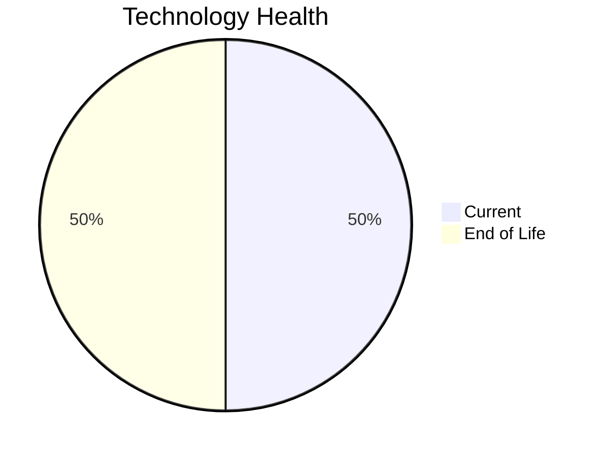

# Application Report: MobileApp-016

**ID:** app016
**Generated:** 2026-05-14

## Overview

| Attribute | Value |
|-----------|-------|
| Business Unit | Operations |
| Business Criticality | Medium |
| Solution Type | Custom made |
| Deployment Type | AWS |
| Users | 1580 |
| Servers | 2 |
| External Interfaces | 10 |
| Containerized | Yes |
| CI/CD Present | Yes |
| Architecture | 3-Tier |

## Technology Stack

| Component | Technology | Version | Status |
|-----------|-----------|---------|--------|
| Os | RHEL | 7 | 🔴 EOL |
| Framework | React Native | current | 🟢 CURRENT_VERSION |
| Database | SQL Server | 2019 | 🟢 CURRENT_VERSION |
| App Server | Payara | 4.0 | 🔴 EOL |

## Complexity Assessment

**Score:** 6/10 — **MEDIUM**
**Confidence:** 7

Score 6/10 (MEDIUM): EOL components=2, Outdated=0, Interfaces=10, Servers=2, Criticality=Medium, Architecture=3-Tier.

| Factor | Value |
|--------|-------|
| Servers | 2 |
| Environments | 3 |
| Interfaces | 10 |
| EOL Technologies | 2 |
| Outdated Technologies | 0 |
| Business Criticality | Medium |

## Modernization Scenarios

### Applicable Scenarios

#### ✅ Operating System Update

- **Priority:** High
- **Effort:** Low
- **Effects:** security
- **One-Time Cost:** $1,157
- **Annual Savings:** $500/year
- **Reasoning:** Operating system RHEL 7 is EOL. Update to a current supported OS version is recommended.

#### ✅ Switch to ARM-based CPU

- **Priority:** Medium
- **Effort:** Medium
- **Effects:** cost, sustainability
- **One-Time Cost:** $5,783
- **Annual Savings:** $1,000/year
- **Reasoning:** Application is containerized on standard Linux. ARM migration is feasible if x86-specific binaries are absent. CPU architecture not explicitly documented.

#### ✅ Applications Server replacement

- **Priority:** Medium
- **Effort:** Medium
- **Effects:** agility, cost
- **One-Time Cost:** $11,565
- **Annual Savings:** $10,800/year
- **Reasoning:** Application server Payara 4.0 is EOL. Replacement with a modern server is recommended.

#### ✅ Switch DB Engine to open-source database solution

- **Priority:** High
- **Effort:** Medium
- **Effects:** cost
- **Reasoning:** Database SQL Server 2019 is a proprietary licensed database. Switching to PostgreSQL or another open-source solution would eliminate license costs.

#### ✅ Update outdated components

- **Priority:** High
- **Effort:** High
- **Effects:** security, agility, cost
- **Reasoning:** Application has EOL or very legacy components. Update of outdated programming language and framework components is required.

### Other Scenarios

| Scenario | Status | Reason |
|----------|--------|--------|
| Switch to standard Linux Operating System | ✔️ FULFILLED | Application already runs on a standard Linux distribution: RHEL 7. |
| Application Migration to Cloud Infrastructure (Lift & Shift) | ✔️ FULFILLED | Application is already deployed on cloud infrastructure (AWS). |
| Application Containerization | ✔️ FULFILLED | Application is already containerized (is_containerized=Yes). |
| Application Refactoring and De-coupling | ❌ NOT_APPLICABLE | Application already uses 3-tier architecture. Primary triggers for monolith/tight coupling do not ap... |
| Upgrade Legacy Databases | ✔️ FULFILLED | Database SQL Server 2019 is on a current, supported version. |