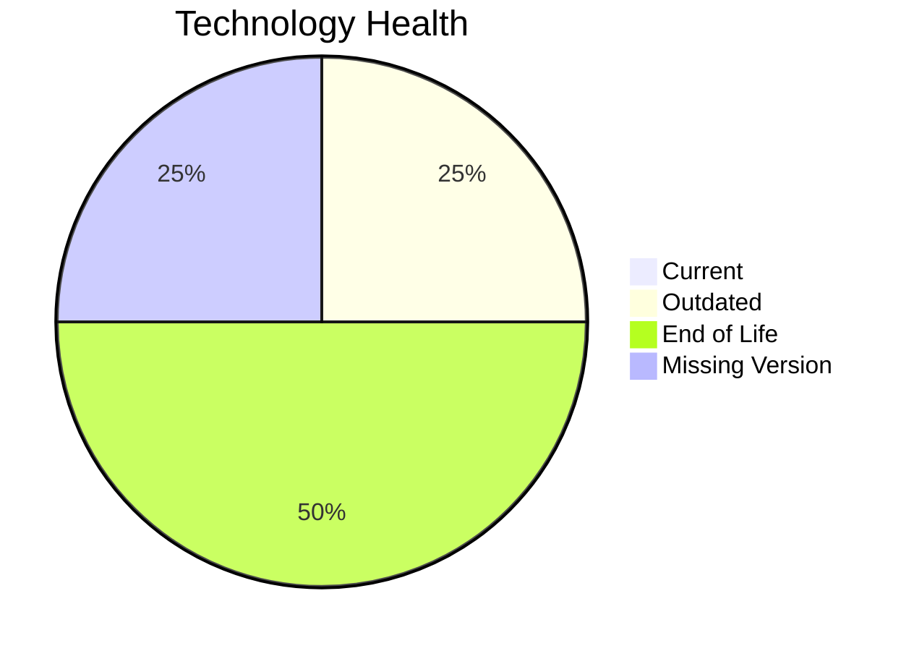

# Application Report: MobileApp-016

**ID:** app016  
**Generated:** 2026-05-17

## Overview

| Attribute | Value |
|-----------|-------|
| Owner | N/A |
| Environment | AWS |
| Business Criticality | Medium |
| Users | 1580 |
| Servers | 2 |

## Technology Stack

| Component | Technology | Version | Status |
|-----------|-----------|---------|--------|
| Operating System | RHEL | 7 | 🔴 EOL |
| Database | SQL Server | 2019 | 🟡 OUTDATED |
| Language | N/A | N/A | ⚪ NO_KNOWLEDGE |
| Framework | React Native | N/A | ⚪ NO_KNOWLEDGE |
| App Server | Payara | 4.0 | 🔴 EOL |

## Complexity Assessment

**Score:** 7/10 — **HIGH**  
**Confidence:** 7

| Factor | Score | Notes |
|--------|-------|-------|
| Technology Age | 9/10 | 2 components are EOL. |
| Integration | 8/10 | High integration surface with 10 external interfaces and 30 APIs. |
| Infrastructure | 5/10 | Moderate infrastructure footprint with 2 servers and 3 environments. |
| Business Criticality | 5/10 | Business criticality is Medium. |
| Architecture | 4/10 | already containerized, CI/CD exists, traditional multi-tier architecture, legacy application server. |
| Data | 8/10 | 1 database engine(s), 2000 GB storage, aging database platform. |

## Modernization Scenarios

### Applicable Scenarios

#### ✅ Operating System Update

- **Priority:** High
- **Effort:** Low
- **Effects:** security
- **Cost:** €1330 (one-time)
- **Savings:** €500/year
- **Reasoning:** RHEL 7 is assessed as EOL, which triggers an OS update scenario.

#### ✅ Applications Server replacement

- **Priority:** Medium
- **Effort:** Medium
- **Effects:** agility, cost
- **Cost:** €13300 (one-time)
- **Savings:** €9600/year
- **Reasoning:** Payara 4.0 is assessed as EOL and should be modernized or replaced.

#### ✅ Application Refactoring and De-coupling

- **Priority:** High
- **Effort:** High
- **Effects:** agility, cost, sustainability
- **Cost:** €332502 (one-time)
- **Savings:** €120000/year
- **Reasoning:** Architecture and integration signals point to a tightly coupled design that would benefit from refactoring.

#### ✅ Upgrade Legacy Databases

- **Priority:** High
- **Effort:** Medium
- **Effects:** security, agility
- **Cost:** €13300 (one-time)
- **Savings:** €10000/year
- **Reasoning:** SQL Server 2019 is assessed as OUTDATED and is a candidate for upgrade.

#### ✅ Switch DB Engine to open-source database solution

- **Priority:** High
- **Effort:** Medium
- **Effects:** cost
- **Cost:** €0 (one-time)
- **Savings:** €0/year
- **Reasoning:** SQL Server 2019 is a proprietary database platform and a candidate for open-source migration.

#### ✅ Update outdated components

- **Priority:** High
- **Effort:** High
- **Effects:** security, agility, cost
- **Cost:** €0 (one-time)
- **Savings:** €0/year
- **Reasoning:** One or more application components are outdated or end-of-life.

### Not Applicable / Other

| Scenario | Status | Reason |
|----------|--------|--------|
| Switch to standard Linux Operating System | FULFILLED | RHEL 7 already belongs to a standard Linux family. |
| Switch to ARM-based CPU | LACK_OF_DATA | CPU architecture is not documented in the workbook, so ARM suitability cannot be assessed confidently. |
| Application Migration to Cloud Infrastructure (Lift & Shift) | FULFILLED | Deployment target already points to AWS/public cloud only. |
| Application Containerization | FULFILLED | Application is already containerized. |

## Financial Summary

| Metric | Value |
|--------|-------|
| Total One-Time Cost | €360432 |
| Total Yearly Savings | €140100 |
| Break-Even | 2.6 years |
