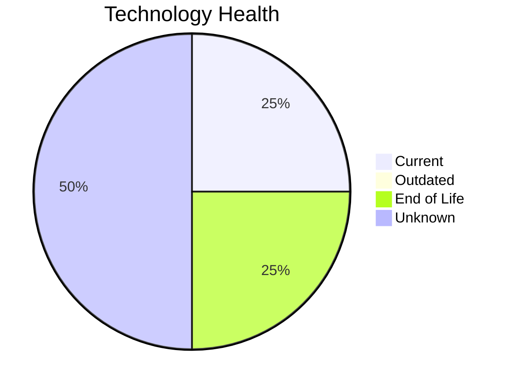

# Application Report: MobileApp-016

**ID:** app016
**Generated:** 2026-05-14

## Overview

| Attribute | Value |
|-----------|-------|
| Owner | Operations |
| Environment | AWS |
| Business Criticality | Medium |
| Users | 1580 |
| Servers | 2 |
| Solution Type | Custom made |
| Architecture | 3-Tier |
| Containerized | Yes |
| CI/CD | Yes |

## Technology Stack

| Component | Technology | Version | Status |
|-----------|-----------|---------|--------|
| Os | RHEL 7 | 7 | 🔴 EOL |
| Database | SQL Server 2019 | Server 2019 | 🟢 CURRENT_VERSION |
| Programming Language | React Native | Native | ⚪ NO_KNOWLEDGE |
| Application Server | Payara 4.0 | 4.0 | ⚪ NO_KNOWLEDGE |

## Complexity Assessment

**Score:** 6/10 — **MEDIUM**
**Confidence:** 8/10

| Factor | Score | Notes |
|--------|-------|-------|
| Technology Age | 7/10 | 1 EOL, 0 outdated components |
| Integration | 9/10 | 10 external interfaces |
| Infrastructure | 6/10 | 2 server(s), 3 environment(s) |
| Business Criticality | 4/10 | Medium criticality |
| Architecture | 2/10 | Containerized: Yes, CI/CD: Yes |
| Data | 5/10 | DB: SQL Server 2019 |

## Modernization Scenarios

### Applicable Scenarios

#### ✅ Operating System Update

- **Priority:** High
- **Effort:** Low
- **Effects:** security
- **Cost:** €1,157 (one-time)
- **Savings:** €500/year
- **Reasoning:** Operating system RHEL 7 has reached End of Life and no longer receives security patches. Immediate OS update required.

#### ✅ Switch to ARM-based CPU

- **Priority:** Medium
- **Effort:** Medium
- **Effects:** cost, sustainability
- **Cost:** €5,783 (one-time)
- **Savings:** €1,000/year
- **Reasoning:** Application is containerized on Linux and custom-developed, making it a good candidate for ARM CPU migration for cost and sustainability benefits.

#### ✅ Switch DB Engine to open-source database solution

- **Priority:** High
- **Effort:** Medium
- **Effects:** cost
- **Cost:** €28,913 (one-time)
- **Savings:** €15,000/year
- **Reasoning:** Application uses proprietary database SQL Server 2019. Migration to an open-source alternative would reduce costs.

### Not Applicable / Other

| Scenario | Status | Reason |
|----------|--------|--------|
| Switch to standard Linux Operating System | ✔️ FULFILLED | Application already runs on standard Linux (RHEL 7). No migration needed. |
| Applications Server replacement | ❓ LACK_OF_DATA | Cannot assess application server lifecycle for Payara 4.0. |
| Application Migration to Cloud Infrastructure (Lift & Shift) | ✔️ FULFILLED | Application is already deployed on cloud infrastructure (AWS). No migration needed. |
| Application Containerization | ✔️ FULFILLED | Application is already containerized. Scenario already achieved. |
| Application Refactoring and De-coupling | ❌ NOT_APPLICABLE | Application has 3-Tier architecture and is containerized, suggesting modern modular design. Refactor... |
| Upgrade Legacy Databases | ✔️ FULFILLED | Database SQL Server 2019 is on a current, supported version. No upgrade needed. |
| Update outdated components | ❓ LACK_OF_DATA | Some component version data is missing or inconclusive. |

## Financial Summary

| Metric | Value |
|--------|-------|
| Total One-Time Cost | €35,853 |
| Total Yearly Savings | €16,500 |
| Break-Even | 2.2 years |
