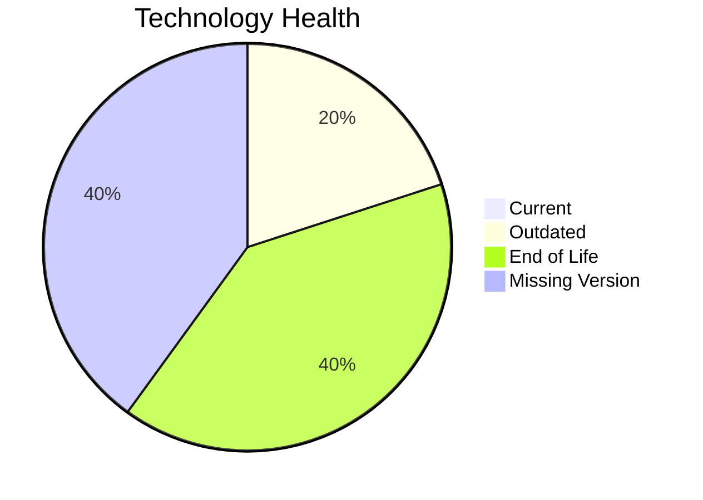

# Application Report: MobileApp-016

**ID:** app016
**Generated:** 2026-05-18T00:00:00Z

## Overview

| Attribute | Value |
|-----------|-------|
| Owner | Operations |
| Environment | AWS |
| Business Criticality | Medium |
| Users | 1580 |
| Servers | 2 |

## Technology Stack

| Component | Technology | Version | Status |
|-----------|-----------|---------|--------|
| Operating System | RHEL | 7 | 🔴 EOL |
| Database | SQL Server | 2019 | 🟡 OUTDATED |
| Language | React Native | unknown | ⚪ NO_KNOWLEDGE |
| Framework | React Native | unknown | ⚪ NO_KNOWLEDGE |
| App Server | Payara | 4.0 | 🔴 EOL |

## Complexity Assessment

**Score:** 6/10 — **MEDIUM**
**Confidence:** 7

| Factor | Score | Notes |
|--------|-------|-------|
| Technology Age | 8/10 | 2 component(s) are EOL. |
| Integration | 9/10 | 10 external interfaces and 30 API endpoints. |
| Infrastructure | 6/10 | 2 server instance(s) across 3 environment(s). |
| Business Criticality | 6/10 | Criticality is Medium with 1580 users. |
| Architecture | 2/10 | Architecture is 3-Tier; containerized=Yes; CI/CD=Yes. |
| Data | 6/10 | Database storage is 2000 GB on SQL Server 2019.  |

## Modernization Scenarios

### Applicable Scenarios

#### ✅ Operating System Update

- **Priority:** High
- **Effort:** Low
- **Effects:** security
- **Cost:** €1,157 (one-time)
- **Savings:** €500/year
- **Reasoning:** RHEL 7 is assessed as EOL.

#### ✅ Applications Server replacement

- **Priority:** Medium
- **Effort:** Medium
- **Effects:** agility, cost
- **Cost:** €11,565 (one-time)
- **Savings:** €10,800/year
- **Reasoning:** Payara 4.0 is assessed as EOL, which directly triggers server replacement.

#### ✅ Upgrade Legacy Databases

- **Priority:** High
- **Effort:** Medium
- **Effects:** security, agility
- **Cost:** €11,565 (one-time)
- **Savings:** €10,000/year
- **Reasoning:** SQL Server 2019 is assessed as OUTDATED.

#### ✅ Switch DB Engine to open-source database solution

- **Priority:** High
- **Effort:** Medium
- **Effects:** cost
- **Cost:** €N/A (one-time)
- **Savings:** €N/A/year
- **Reasoning:** SQL Server 2019 is a proprietary engine, so moving to an open-source database is a valid modernization option.

#### ✅ Update outdated components

- **Priority:** High
- **Effort:** High
- **Effects:** security, agility, cost
- **Cost:** €N/A (one-time)
- **Savings:** €N/A/year
- **Reasoning:** At least one application runtime component is outdated or end of life.

### Not Applicable / Other

| Scenario | Status | Reason |
|----------|--------|--------|
| Switch to standard Linux Operating System | PARTIALLY_FULFILLED | The application already runs on Linux, but the current distribution/version is outdated or unsupported. |
| Switch to ARM-based CPU | LACK_OF_DATA | CPU architecture is not documented in the workbook, so ARM suitability cannot be confirmed. |
| Application Migration to Cloud Infrastructure (Lift & Shift) | FULFILLED | The deployment target is already a public cloud platform (AWS). |
| Application Containerization | FULFILLED | The workbook already marks the application as containerized. |
| Application Refactoring and De-coupling | PARTIALLY_FULFILLED | The application already shows some modular characteristics, but there is not enough evidence of true microservice decoupling. |

## Financial Summary

| Metric | Value |
|--------|-------|
| Total One-Time Cost | €24,287 |
| Total Yearly Savings | €21,300 |
| Break-Even | 1.1 years |
