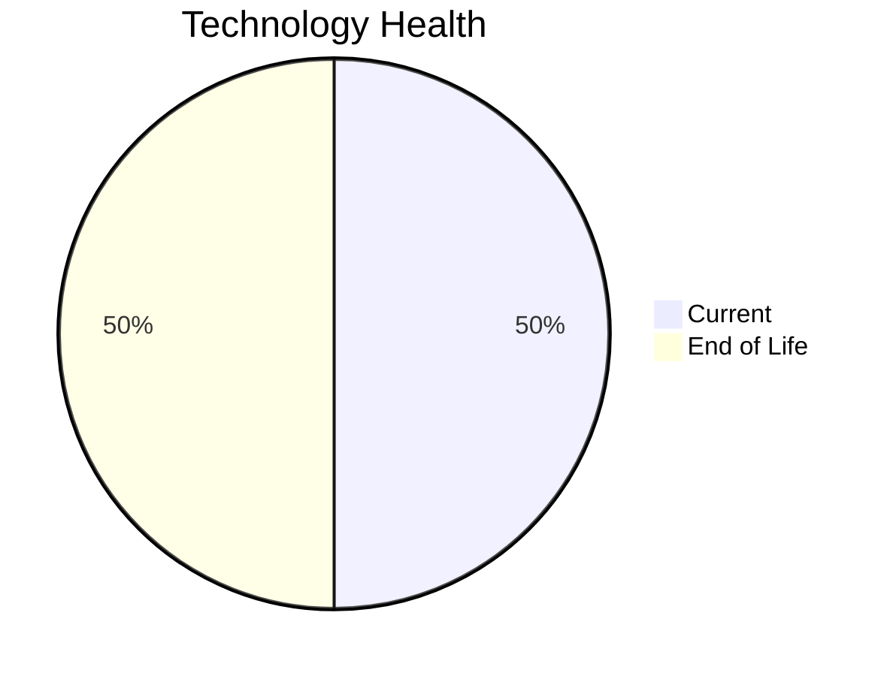

# Application Report: MobileApp-016

**ID:** app016  
**Generated:** 2026-05-05

## Overview

| Attribute | Value |
|-----------|-------|
| Business Unit | Operations |
| Deployment Type | AWS |
| Business Criticality | Medium |
| Users | 1580 |
| Servers | sv22, sv23 |
| Environments | 3 |
| Architecture | 3-Tier |
| Containerized | Yes |
| CI/CD | Yes |
| Solution Type | Custom made |
| Data Classification | Internal |

> Mobile application for drivers and customers to track shipments and manage delivery operations

## Technology Stack

| Component | Technology | Version | Status |
|-----------|-----------|---------|--------|
| Os | RHEL | 7 | 🔴 EOL |
| Database | SQL Server | 2019 | 🟢 CURRENT_VERSION |
| Language | React Native | current | 🟢 CURRENT_VERSION |
| Application Server | Payara | 4.x | 🔴 EOL |

## Complexity Assessment

**Score:** 6/10 — **MEDIUM**  
**Confidence:** 7

> Score 6/10 (MEDIUM). EOL components: 2, Outdated: 0. External interfaces: 10. Servers: 2. Criticality: Medium. Architecture: 3-Tier. DB storage: 2000.0GB.

| Factor | Value |
|--------|-------|
| Servers | 2 |
| Environments | 3 |
| External Interfaces | 10 |
| Business Criticality | Medium |
| EOL Technologies | 2 |
| Outdated Technologies | 0 |
| CI/CD | Yes |
| Containerized | Yes |

## Modernization Scenarios

### ✅ Applicable Scenarios

#### ✅ Operating System Update

- **Priority:** High
- **Effort:** Low
- **One-Time Cost:** €1,157
- **Yearly Savings:** €500
- **Reasoning:** OS RHEL 7 is EOL. RHEL 7 reached End of Maintenance Support on June 30, 2024. No security updates without ELS. OS update is required.

#### ✅ Application Server Replacement

- **Priority:** Medium
- **Effort:** Medium
- **One-Time Cost:** €11,565
- **Yearly Savings:** €10,800
- **Reasoning:** Application server Payara 4.x is EOL. Payara 4.x reached End of Life. Payara 6 is the current Long Term Support release. Replacement with a modern server is recommended.

#### ✅ Switch DB Engine to Open-Source

- **Priority:** High
- **Effort:** Medium
- **Reasoning:** Application uses SQL Server (SQL Server 2019), a proprietary Microsoft database. Migration to PostgreSQL would reduce licensing costs.

#### ✅ Update Outdated Components

- **Priority:** High
- **Effort:** High
- **Reasoning:** Outdated/EOL application components detected: Payara 4.x (EOL). These should be updated to current supported versions.

### Other Scenarios

| Scenario | Status | Reason |
|----------|--------|--------|
| Switch to Standard Linux OS | ✔️ FULFILLED | Application already runs on a Linux-based OS (RHEL 7). However, OS version is EOL; upgrade (os_update_security_patch) is... |
| Switch to ARM-based CPU | ❓ LACK_OF_DATA | CPU architecture is not explicitly documented in the application record. ARM eligibility cannot be confirmed. |
| Application Migration to Cloud (Lift & Shift) | ✔️ FULFILLED | Application is already hosted on cloud (AWS). Lift & Shift is not needed. |
| Application Containerization | ✔️ FULFILLED | Application is already containerized. |
| Application Refactoring and De-coupling | 🔶 PARTIALLY_FULFILLED | Application uses 3-tier architecture with CI/CD and containerization. Some decoupling is in place, but microservices mig... |
| Upgrade Legacy Databases | ✔️ FULFILLED | Database SQL Server 2019 is on a current supported version. |

## Financial Summary

| Metric | Value |
|--------|-------|
| Total One-Time Cost | €12,722 |
| Total Yearly Savings | €11,300 |
| Break-Even | 1.1 years |
