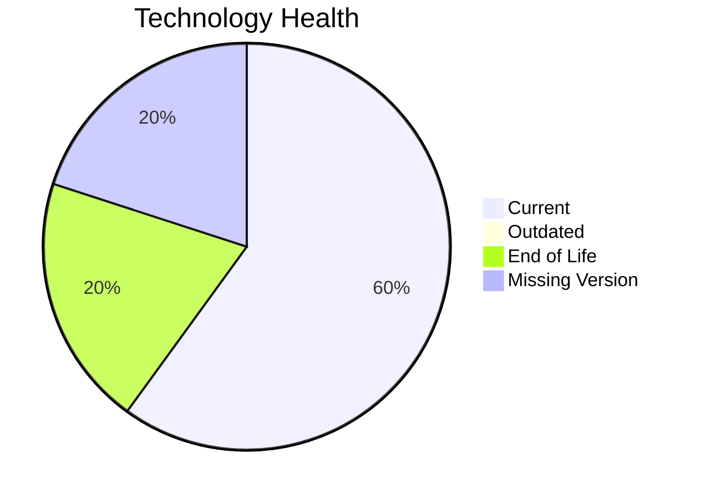

# Application Report: BackupApp-017

**ID:** app017
**Generated:** 2026-05-14

## Overview

| Attribute | Value |
|-----------|-------|
| Owner | IT |
| Environment | On-Premise |
| Business Criticality | High |
| Users | 45 |
| Servers | sv24, sv25 |

## Technology Stack

| Component | Technology | Status |
|-----------|-----------|--------|
| Operating System | RHEL 7 | 🔴 |
| Database | Oracle 12c | 🟡 |
| Language | PowerShell | 🟢 |

## Complexity Assessment

**Score:** 7/10 — **HIGH**

## Modernization Scenarios

### ✅ Os Update Security Patch
- **Reasoning:** EOL operating system/server components require security remediation.

### ✅ App Deployment To Cloud
- **Reasoning:** On-premise deployment model is a direct cloud-migration opportunity.

### ✅ App Containerization
- **Reasoning:** Application is not containerized and can benefit from platform standardization.

### ✅ App Refactor Decoupling
- **Reasoning:** High coupling and/or monolithic architecture indicates refactor opportunity.

### ✅ Switch To Managed Db
- **Reasoning:** On-prem database workloads can move to managed database services.

## Financial Summary

| Metric | Value |
|--------|-------|
| Total One-Time Cost | €513383 |
| Total Yearly Savings | €227900 |
| Break-Even | 2.3 years |
