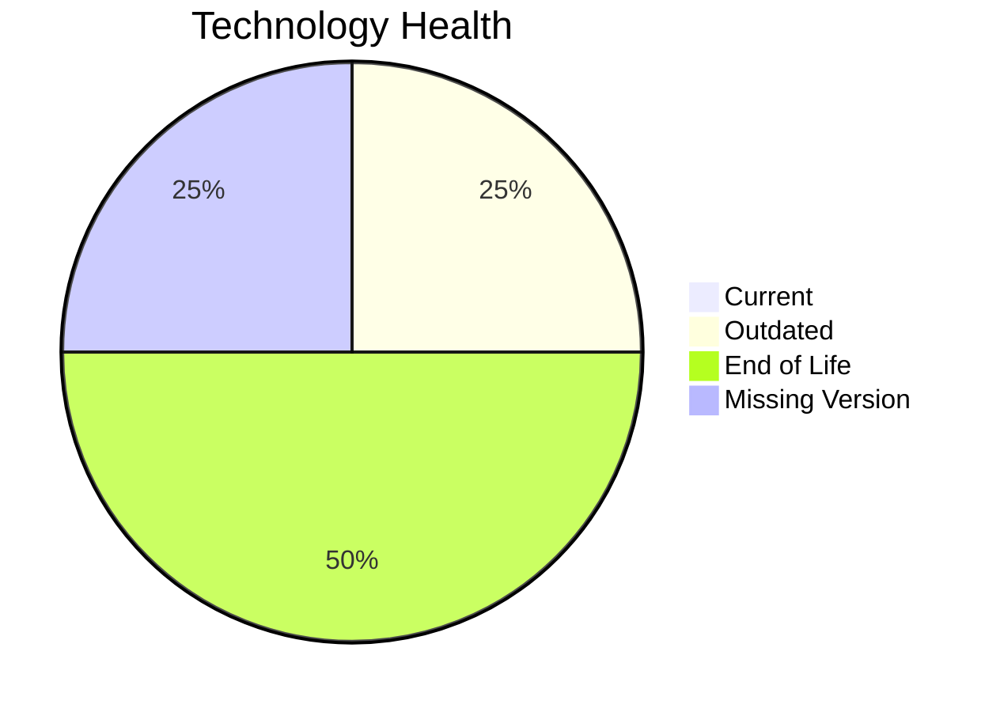

# Application Report: BackupApp-017

**ID:** app017
**Generated:** 2026-05-07

## Overview

| Attribute | Value |
|-----------|-------|
| Owner | N/A |
| Environment | On-Premise |
| Business Criticality | High |
| Users | 45 |
| Servers | 2 |

## Technology Stack

| Component | Technology | Version | Status |
|-----------|-----------|---------|--------|
| Operating System | RHEL | 7 | 🔴 EOL |
| Database | Oracle Database | 12c | 🔴 EOL |
| Language | PowerShell | unknown | ⚪ NO_KNOWLEDGE |
| Framework | N/A | N/A | ⚪ NO_KNOWLEDGE |
| App Server | Payara | 5.0 | 🟡 OUTDATED |

## Complexity Assessment

**Score:** 8/10 — **HIGH**
**Confidence:** 6

| Factor | Score | Notes |
|--------|-------|-------|
| Technology Age | 9/10 | 2 EOL components were found in the application stack. |
| Integration | 8/10 | The application exposes 8 interfaces, indicating heavy integration. |
| Infrastructure | 8/10 | 2 servers and 5 environments indicate larger infrastructure scope. |
| Business Criticality | 8/10 | Criticality is 'High' with 45 users. |
| Architecture | 6/10 | Architecture detail is incomplete, so a neutral score was used. Third-party software reduces architectural control. |
| Data | 7/10 | Database footprint (350 GB) and/or legacy database technology increase data migration complexity. |

## Modernization Scenarios

### Applicable Scenarios

#### ✅ Operating System Update

- **Priority:** High
- **Effort:** Low
- **Effects:** security
- **Cost:** €1,530 (one-time)
- **Savings:** €500/year
- **Reasoning:** RHEL 7 reached end of maintenance support in June 2024.

#### ✅ Applications Server replacement

- **Priority:** Medium
- **Effort:** Medium
- **Effects:** agility, cost
- **Cost:** €15,295 (one-time)
- **Savings:** €9,600/year
- **Reasoning:** Payara 5 is supported only on older Jakarta EE baselines and treated as outdated.

#### ✅ Application Migration to Cloud Infrastructure (Lift & Shift)

- **Priority:** High
- **Effort:** Low
- **Effects:** security, agility
- **Cost:** €7,648 (one-time)
- **Savings:** €2,400/year
- **Reasoning:** Application is still on-premise, which is the primary trigger for lift-and-shift cloud migration.

#### ✅ Upgrade Legacy Databases

- **Priority:** High
- **Effort:** Medium
- **Effects:** security, agility
- **Cost:** €15,295 (one-time)
- **Savings:** €10,000/year
- **Reasoning:** Oracle 12c is out of standard support.

### Not Applicable / Other

| Scenario | Status | Reason |
|----------|--------|--------|
| Switch to standard Linux Operating System | PARTIALLY_FULFILLED | Application runs on Linux already, but the current RHEL 7 release is EOL. |
| Switch to ARM-based CPU | LACK_OF_DATA | CPU architecture is not present in the workbook, so ARM suitability cannot be validated. |
| Application Containerization | BLOCKED | The application is third-party software and container packaging cannot be assumed to be under customer control. |
| Application Refactoring and De-coupling | BLOCKED | The application is third-party software, so internal refactoring is not under customer control. |
| Switch DB Engine to open-source database solution | BLOCKED | The scenario excludes third-party applications because database portability is not under customer control. |
| Update outdated components | BLOCKED | The scenario excludes third-party applications because runtime components are vendor-managed. |

## Financial Summary

| Metric | Value |
|--------|-------|
| Total One-Time Cost | €39,768 |
| Total Yearly Savings | €22,500 |
| Break-Even | 1.8 years |
