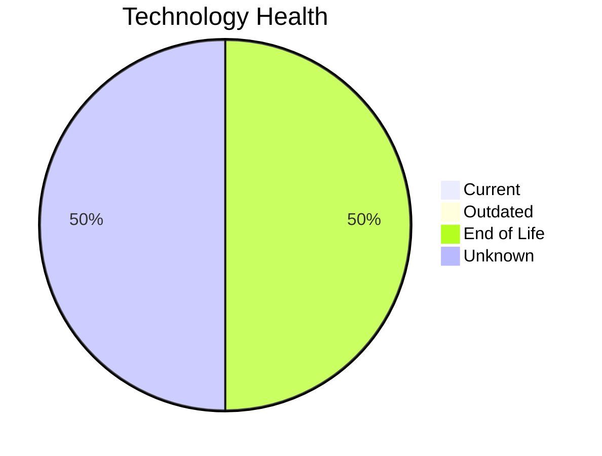

# Application Report: BackupApp-017

**ID:** app017
**Generated:** 2026-05-14

## Overview

| Attribute | Value |
|-----------|-------|
| Owner | IT |
| Environment | On-Premise |
| Business Criticality | High |
| Users | 45 |
| Servers | 2 |
| Solution Type | 3rd party software |
| Architecture | unknown |
| Containerized | No |
| CI/CD | No |

## Technology Stack

| Component | Technology | Version | Status |
|-----------|-----------|---------|--------|
| Os | RHEL 7 | 7 | 🔴 EOL |
| Database | Oracle 12c | 12c | 🔴 EOL |
| Programming Language | PowerShell |  | ⚪ NO_KNOWLEDGE |
| Application Server | Payara 5.0 | 5.0 | ⚪ NO_KNOWLEDGE |

## Complexity Assessment

**Score:** 7/10 — **HIGH**
**Confidence:** 8/10

| Factor | Score | Notes |
|--------|-------|-------|
| Technology Age | 8/10 | 2 EOL, 0 outdated components |
| Integration | 7/10 | 8 external interfaces |
| Infrastructure | 6/10 | 2 server(s), 5 environment(s) |
| Business Criticality | 7/10 | High criticality |
| Architecture | 8/10 | Containerized: No, CI/CD: No |
| Data | 5/10 | DB: Oracle 12c |

## Modernization Scenarios

### Applicable Scenarios

#### ✅ Operating System Update

- **Priority:** High
- **Effort:** Low
- **Effects:** security
- **Cost:** €1,330 (one-time)
- **Savings:** €500/year
- **Reasoning:** Operating system RHEL 7 has reached End of Life and no longer receives security patches. Immediate OS update required.

#### ✅ Application Migration to Cloud Infrastructure (Lift & Shift)

- **Priority:** High
- **Effort:** Low
- **Effects:** security, agility
- **Cost:** €6,650 (one-time)
- **Savings:** €2,400/year
- **Reasoning:** Application is deployed on-premise. Cloud migration (Lift & Shift) would improve scalability and reduce infrastructure overhead.

#### ✅ Upgrade Legacy Databases

- **Priority:** High
- **Effort:** Medium
- **Effects:** security, agility
- **Cost:** €13,300 (one-time)
- **Savings:** €10,000/year
- **Reasoning:** Database Oracle 12c is End of Life and no longer receives security patches. Upgrade or migration is urgently needed.

### Not Applicable / Other

| Scenario | Status | Reason |
|----------|--------|--------|
| Switch to standard Linux Operating System | ✔️ FULFILLED | Application already runs on standard Linux (RHEL 7). No migration needed. |
| Switch to ARM-based CPU | 🚫 BLOCKED | 3rd party software has potential x86-specific dependencies that are vendor-managed; customer cannot ... |
| Applications Server replacement | ❓ LACK_OF_DATA | Cannot assess application server lifecycle for Payara 5.0. |
| Application Containerization | 🚫 BLOCKED | Application is 3rd party software. Containerization is a vendor responsibility and cannot be modifie... |
| Application Refactoring and De-coupling | 🚫 BLOCKED | Application is 3rd party software; internal architecture is not under customer control and cannot be... |
| Switch DB Engine to open-source database solution | 🚫 BLOCKED | Oracle database is used by a 3rd party application. The database engine is part of the vendor stack ... |
| Update outdated components | 🚫 BLOCKED | 3rd party application — component versions (language, framework, app server) are vendor-managed and ... |

## Financial Summary

| Metric | Value |
|--------|-------|
| Total One-Time Cost | €21,280 |
| Total Yearly Savings | €12,900 |
| Break-Even | 1.6 years |
