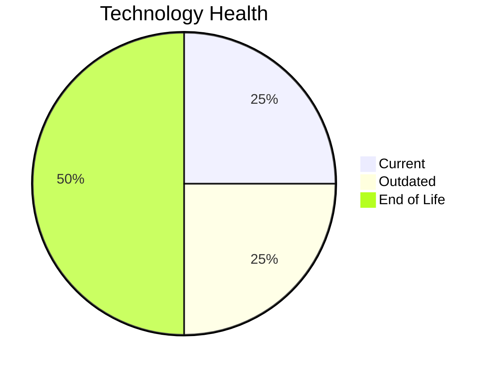

# Application Report: BackupApp-017

**ID:** app017
**Generated:** 2026-05-14

## Overview

| Attribute | Value |
|-----------|-------|
| Business Unit | IT |
| Business Criticality | High |
| Solution Type | 3rd party software |
| Deployment Type | On-Premise |
| Users | 45 |
| Servers | 2 |
| External Interfaces | 8 |
| Containerized | No |
| CI/CD Present | No |
| Architecture | unknown |

## Technology Stack

| Component | Technology | Version | Status |
|-----------|-----------|---------|--------|
| Os | RHEL | 7 | 🔴 EOL |
| Language | PowerShell | current | 🟢 CURRENT_VERSION |
| Database | Oracle | 12c | 🔴 EOL |
| App Server | Payara | 5.0 | 🟡 OUTDATED |

## Complexity Assessment

**Score:** 7/10 — **HIGH**
**Confidence:** 7

Score 7/10 (HIGH): EOL components=2, Outdated=1, Interfaces=8, Servers=2, Criticality=High, Architecture=unknown.

| Factor | Value |
|--------|-------|
| Servers | 2 |
| Environments | 5 |
| Interfaces | 8 |
| EOL Technologies | 2 |
| Outdated Technologies | 1 |
| Business Criticality | High |

## Modernization Scenarios

### Applicable Scenarios

#### ✅ Operating System Update

- **Priority:** High
- **Effort:** Low
- **Effects:** security
- **One-Time Cost:** $1,330
- **Annual Savings:** $500/year
- **Reasoning:** Operating system RHEL 7 is EOL. Update to a current supported OS version is recommended.

#### ✅ Applications Server replacement

- **Priority:** Medium
- **Effort:** Medium
- **Effects:** agility, cost
- **One-Time Cost:** $13,300
- **Annual Savings:** $9,600/year
- **Reasoning:** Application server Payara 5.0 is outdated. Upgrade or replacement recommended.

#### ✅ Application Migration to Cloud Infrastructure (Lift & Shift)

- **Priority:** High
- **Effort:** Low
- **Effects:** security, agility
- **One-Time Cost:** $6,650
- **Annual Savings:** $2,400/year
- **Reasoning:** Application is On-Premise. Lift & Shift to cloud infrastructure is applicable to reduce infrastructure costs.

#### ✅ Upgrade Legacy Databases

- **Priority:** High
- **Effort:** Medium
- **Effects:** security, agility
- **One-Time Cost:** $13,300
- **Annual Savings:** $10,000/year
- **Reasoning:** Database Oracle 12c is EOL. Upgrade to a current supported version is required.

#### ✅ Switch DB Engine to open-source database solution

- **Priority:** High
- **Effort:** Medium
- **Effects:** cost
- **Reasoning:** Database Oracle 12c is a proprietary licensed database. Switching to PostgreSQL or another open-source solution would eliminate license costs.

#### ✅ Update outdated components

- **Priority:** High
- **Effort:** High
- **Effects:** security, agility, cost
- **Reasoning:** Application has EOL or very legacy components. Update of outdated programming language and framework components is required.

### Other Scenarios

| Scenario | Status | Reason |
|----------|--------|--------|
| Switch to standard Linux Operating System | ✔️ FULFILLED | Application already runs on a standard Linux distribution: RHEL 7. |
| Switch to ARM-based CPU | ❌ NOT_APPLICABLE | Application is 3rd party software. 3rd party/SaaS applications cannot have their infrastructure arch... |
| Application Containerization | 🚫 BLOCKED | Application is 3rd party software. Containerization depends on vendor support. |
| Application Refactoring and De-coupling | ❓ LACK_OF_DATA | Application architecture is unknown ('unknown'). Cannot determine coupling level. |