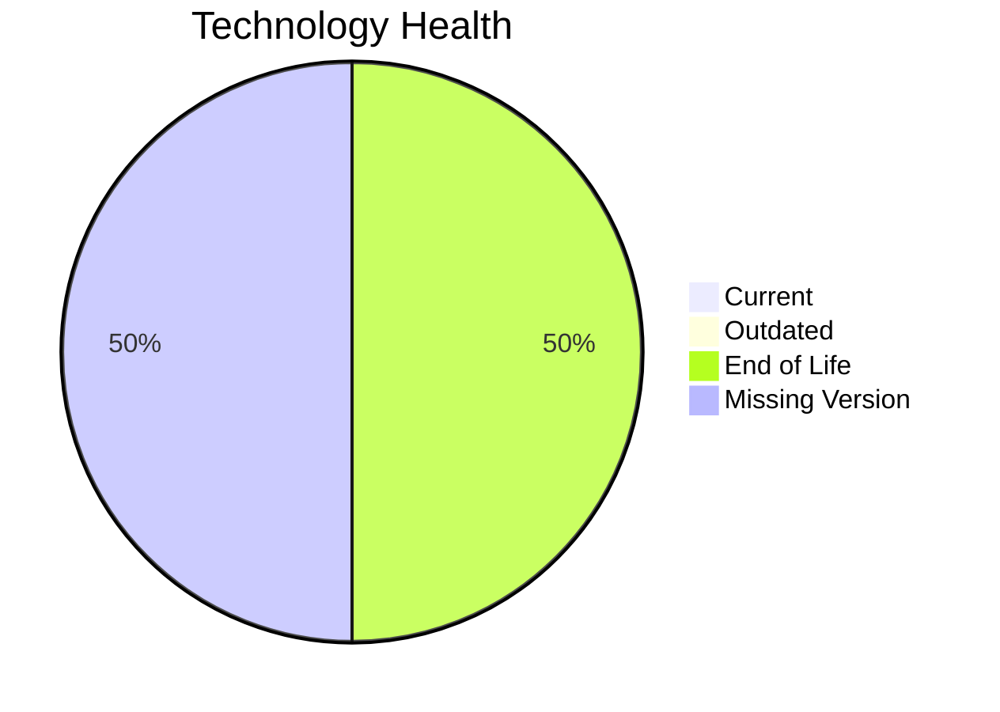

# Application Report: BackupApp-017

**ID:** app017
**Generated:** 2026-04-24

## Overview

| Attribute | Value |
|-----------|-------|
| Owner | IT |
| Business Unit | IT |
| Deployment Type | On-Premise |
| Business Criticality | High |
| Users | 45 |
| Servers | 2 |
| Architecture | unknown |
| Solution Type | 3rd party software |
| CI/CD | No |
| Containerized | No |

## Technology Stack

| Component | Technology | Version | Status |
|-----------|-----------|---------|--------|
| Operating System | RHEL 7 | RHEL 7 | 🔴 EOL |
| Language | PowerShell | PowerShell | ⚪ NO_KNOWLEDGE |
| Database | Oracle 12c | Oracle 12c | 🔴 EOL |
| App Server | Payara 5.0 | Payara 5.0 | ⚪ NO_KNOWLEDGE |

## Complexity Assessment

**Score:** 7/10 — **HIGH**
**Confidence:** 7

**Reasoning:** Tech age score 9/10 (2 EOL, 0 outdated components). Integration score 7/10 (8 external interfaces). Infrastructure score 5/10 (2 servers, 5 environments). Business criticality score 8/10 (criticality: High). Architecture score 5/10 (architecture: unknown, containerized: No, CI/CD: No). Data score 4/10 (350GB storage).

### Contributing Factors

| Factor | Value |
|--------|-------|
| Servers | 2 |
| Environments | 5 |
| External Interfaces | 8 |
| EOL Technologies | 2 |
| Outdated Technologies | 0 |
| CI/CD | No |
| Containerized | No |

## Modernization Scenarios

### Applicable Scenarios

#### ✅ Operating System Update

- **Priority:** High
- **Effort:** Low
- **Effects:** security
- **Cost:** €1,330 (one-time)
- **Savings:** €500/year
- **Reasoning:** Operating system 'RHEL 7' is EOL. OS update is recommended.

#### ✅ Upgrade Legacy Databases

- **Priority:** High
- **Effort:** Medium
- **Effects:** security, agility
- **Cost:** €13,300 (one-time)
- **Savings:** €10,000/year
- **Reasoning:** Database 'Oracle 12c' is EOL. Upgrade to a supported version is recommended.

### Not Applicable / Other

| Scenario | Status | Reason |
|----------|--------|--------|
| Switch to standard Linux Operating System | FULFILLED | Application already runs on a standard Linux distribution: 'RHEL 7'.... |
| Switch to ARM-based CPU | NOT_APPLICABLE | Exclusion: SaaS or 3rd party application; ARM migration not applicable.... |
| Applications Server replacement | LACK_OF_DATA | Lifecycle data for application server 'Payara 5.0' is not available.... |
| Application Migration to Cloud Infrastructure (Lift & Shift) | BLOCKED | 3rd party application may have constraints preventing cloud lift & shift.... |
| Application Containerization | NOT_APPLICABLE | Exclusion: 3rd party software - runtime packaging cannot be modified by the cust... |
| Application Refactoring and De-coupling | NOT_APPLICABLE | Exclusion: SAP/SaaS/3rd party application - source code not under customer contr... |
| Switch DB Engine to open-source database solution | NOT_APPLICABLE | Exclusion: 3rd party application - database migration not under customer control... |
| Update outdated components | NOT_APPLICABLE | Exclusion: 3rd party software - component versions are vendor-managed.... |

## Financial Summary

| Metric | Value |
|--------|-------|
| Total One-Time Cost | €14,630 |
| Total Yearly Savings | €10,500 |
| Break-Even | 1.4 years |
