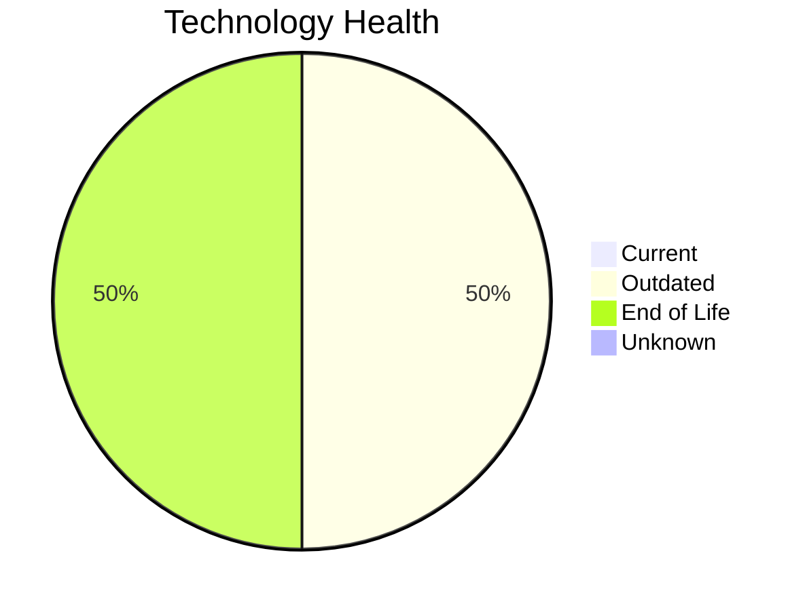

# Application Report: BackupApp-017

**ID:** app017  
**Generated:** 2026-05-15

## Overview

| Attribute | Value |
|-----------|-------|
| Business Unit | IT |
| Deployment | On-Premise |
| Business Criticality | High |
| Users | 45 |
| Solution Type | 3rd party software |
| Architecture | unknown |
| Containerized | No |
| CI/CD | No |
| External Interfaces | 8 |

## Technology Stack

| Component | Technology | Status |
|-----------|-----------|--------|
| Operating System | RHEL 7 | 🔴 EOL |
| Database | Oracle 12c | 🔴 EOL |
| Language | PowerShell | 🟡 Outdated |
| App Server | Payara 5.0 | 🟡 Outdated |

## Complexity Assessment

**Score:** 7/10 — **HIGH**  
**Confidence:** 8

| Factor | Score | Notes |
|--------|-------|-------|
| Technology Age | 7/10 | 2 EOL and 2 outdated components — significant aging |
| Integration | 8/10 | 8 external interfaces, 0 dependencies — highly integrated |
| Infrastructure | 5/10 | 2 server instances, 5 environments |
| Business Criticality | 8/10 | Business criticality: high, 45 users |
| Architecture | 7/10 | not containerized; no CI/CD |
| Data | 5/10 | Oracle DB — complex licensing and migration |

## Modernization Scenarios

### Applicable Scenarios

#### ✅ Operating System Update

- **Priority:** High
- **Effort:** Low
- **Effects:** security
- **One-time Cost:** €1,330
- **Yearly Savings:** €500/year
- **Reasoning:** OS 'RHEL 7' has reached EOL — critical security risk. Immediate OS update required.

#### ✅ Application Migration to Cloud Infrastructure (Lift & Shift)

- **Priority:** High
- **Effort:** Low
- **Effects:** security, agility
- **One-time Cost:** €6,650
- **Yearly Savings:** €2,400/year
- **Reasoning:** Application is fully on-premise. Migration to cloud (Lift & Shift) can reduce infrastructure costs and improve agility.

#### ✅ Upgrade Legacy Databases

- **Priority:** High
- **Effort:** Medium
- **Effects:** security, agility
- **One-time Cost:** €13,300
- **Yearly Savings:** €10,000/year
- **Reasoning:** Database 'Oracle 12c' has reached EOL. Urgent upgrade required to maintain support and security.

#### ✅ Switch DB Engine to open-source database solution

- **Priority:** High
- **Effort:** Medium
- **Effects:** cost
- **One-time Cost:** N/A
- **Yearly Savings:** N/A
- **Reasoning:** Oracle DB has high licensing costs. Migrating to PostgreSQL or MySQL would significantly reduce licensing expenses.

#### ✅ Update outdated components

- **Priority:** High
- **Effort:** High
- **Effects:** security, agility, cost
- **One-time Cost:** N/A
- **Yearly Savings:** N/A
- **Reasoning:** Multiple EOL/outdated components detected (2 EOL, 2 outdated). Systematic update program needed.

### Other Scenarios

| Scenario | Status | Reason |
|----------|--------|--------|
| Switch to standard Linux Operating System | ✔️ Fulfilled | OS 'RHEL 7' is already a standard Linux distribution. |
| Switch to ARM-based CPU | ❓ No Data | On-premise application. CPU architecture not specified in available data. |
| Applications Server replacement | 🚫 Blocked | Third-party or SaaS application — app server managed by vendor, replacement not ... |
| Application Containerization | 🚫 Blocked | Third-party/SaaS application. Containerization not feasible — vendor-managed. |
| Application Refactoring and De-coupling | 🚫 Blocked | Third-party/SaaS application — refactoring not feasible. |

## Business Case Summary

| Metric | Value |
|--------|-------|
| Total One-time Cost | €21,280 |
| Total Yearly Savings | €12,900 |
| ROI Break-even | 1.6 years |
